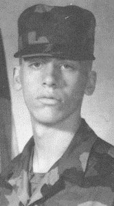
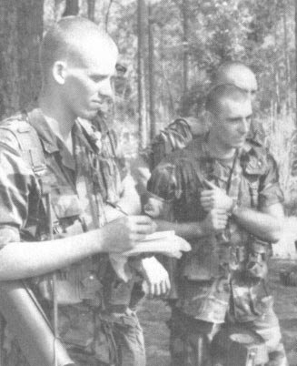

A while back, I invited some *INeedCoffee* contributors to submit stories of their worst cup of coffee ever. Alex Scofield did such a good job on [Alex’s Worst Cup of Coffee Ever](http://ineedcoffee.com/alexs-worst-cup-of-coffee-ever/) that I never told my tale. I think it is time I shared my worst cup of coffee ever story.

I was 17 years old, and I had never tasted coffee. I had no interest in the beverage. I was interested in finding a way to pay for college, so I joined the Army National Guard. My basic training was at Fort Benning, Georgia. On a military base (or at least ours), all the soldiers needed to have their shirt sleeves up or down. We were coming out of summer and heading into the cool autumn, so our sleeves were still up. Each morning got colder and colder.

  
*Future Coffee Fanatic?*

On one bitterly cold morning, all the troops were told to wait outside the barracks. I don’t recall exactly what the vessel carrying the coffee was, but it was a multi-gallon. I had no interest in coffee, but I watched as a few soldiers grabbed a Styrofoam cup and poured a cup of coffee. They sipped the coffee, and it appeared they were warming up. I was still a few months away from my 18th birthday, and that was the first moment of my life when I considered drinking coffee.

  
*Photo of a future coffee drinker (left).*

I didn’t want coffee, but that morning, I was painfully cold and needed to take action. There was no milk or sugar available. My indoctrination would be black coffee. I poured myself a cup and held the cup with both hands. My hands were warming up. I put my head over the rising steam of the coffee. My face was warming up. But I was still cold, so I took my first sip.

My taste buds revolted. It was the most horrific taste of my life. Bitter. Dirt. Poison.

*Is this what coffee tasted like?*

*Is society mad?*

*Do people drink this crap?*

I stepped away from everyone and spit out the coffee. Then I did a few more spits just to remove every drop of the vile substance from my mouth. The coffee in the cup was poured into the ground.

At that moment I vowed never to drink coffee again. Well, we all know how that vow turned out. 🙂