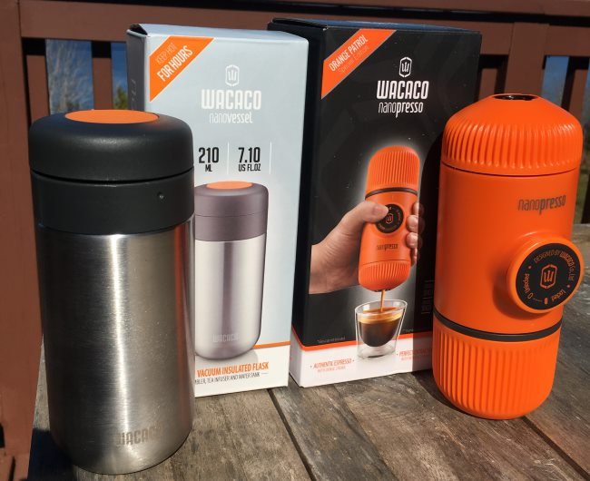
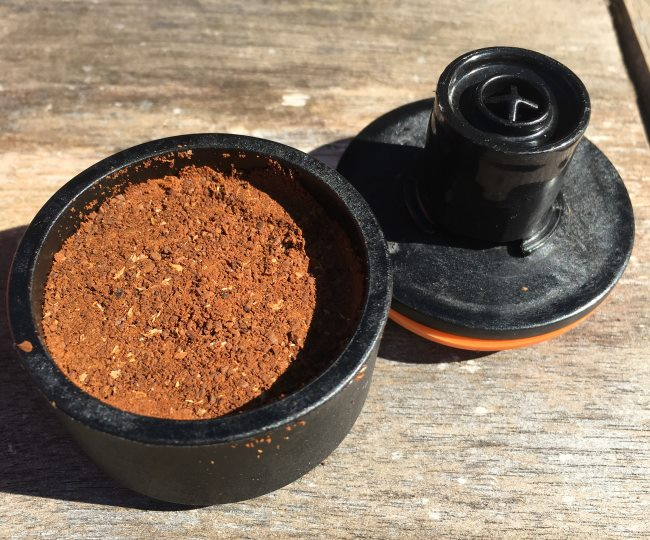
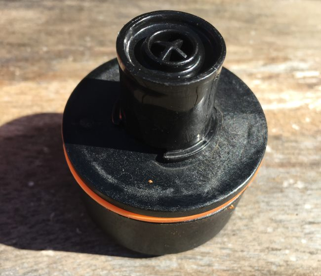
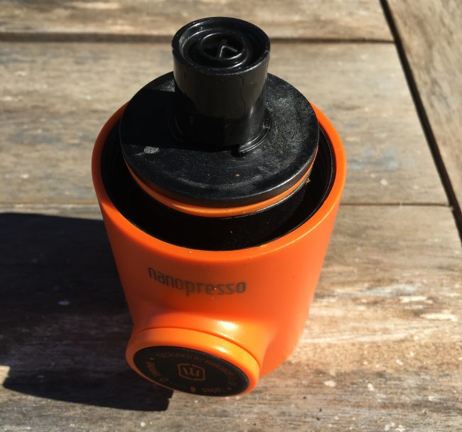
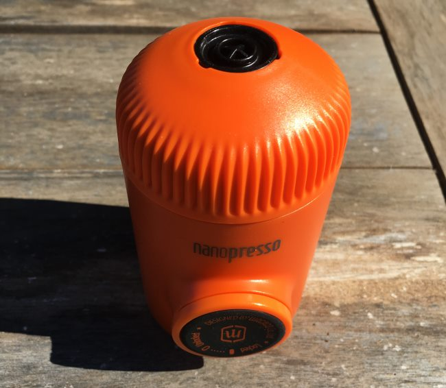
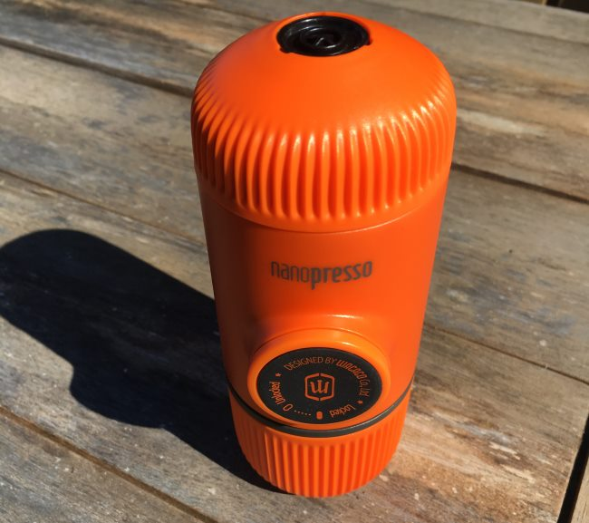
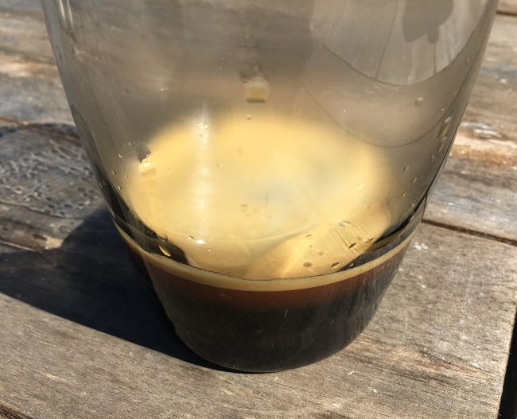

Recently, I received a cool little coffee gadget called the Nanopresso. Without power, this little coffee maker uses a built-in pump to generate enough pressure to make espresso shots. If you are looking for something that makes espresso but are on a budget or don’t have the counter space for a dedicated machine, read on.

The Nanopresso comes in several colors. Since I could see taking this device on a camping trip or backpacking, I opted for a bright orange color. This way, I would have less of a risk of losing it in the darkness, and I just like the color orange.

Some other colors include yellow, red, black, and various colors of “tattoo”.

*Nanovessel and Nanopresso*

Wacaco also makes an attachment called the Nanovessel to store extra hot water for the Nanopresso. It attaches directly to the Nanopresso, so there is no heat loss when pouring hot water.

Let’s make some espresso.

### Before You Brew

Nanopresso recommends running a brewing cycle using just hot water and no coffee to minimize heat loss. Pre-heating your cup with hot water is also a good idea. If you do not preheat everything, you might find the espresso is too cool for your liking and slightly weak due to under-extraction.

### Add Ground Coffee to Basket

Add 8 grams of finely ground coffee to the basket. The Nanopresso ships with a scoop that holds exactly 8 grams, so you don’t need to weigh anything. After filling the scoop, place the filter basket over it. Then flip. The ground coffee will fall directly inside. Then tamp firmly using the bottom of the scoop. Brush away any loose grounds.

### Prep the Coffee For Brewing

Cover the filter basket with the portafilter and then place it on top of the main body of the Nanopresso. Then screw the nozzle firmly to the main body. The nozzle is the name for the entire top part (plastic + portafilter).

### Prep the Water For Brewing

Add boiling water to the water tank. The Nanopresso holds between 50 to 80 ml of water. The lower range would be ideal for darker roasts and ristretto shots. Use the upper range for lighter single-origin coffees.

Screw the main body tightly to the water tank, which fits right below.

### Pull Your Espresso Shot

The first step to pulling a shot is to unlock the piston. This means turning the knob until the espresso pump pops out from the body. At this point, flip the brewer upside-down over a cup. Press once per second. After eight pumps, the espresso will begin flowing. Continue pumping until all the coffee exits the brewer.

### Clean Up

Nanopresso outlines three levels of cleaning in the instruction manual. For normal use, cleaning just involves disassembling the brewer and rinsing with hot water. Every 20th brew, they advise using the brush included with the brewer for a deeper clean. Then every 6 months, pull out your screwdriver to remove the filter mesh to allow cleaning underneath it.

### Overview

Nanopresso uses the person making the coffee’s pressing action to generate enough atmospheres of pressure to make espresso. No electricity is required. It’s pretty cool.

### Resources

[Wacaco – Portable Espresso Machines](https://www.youtube.com/channel/UC-y91EU3KtDG_yZuSxeMI6w?view_as=subscriber) – YouTube channel with recipes and more.

[Prismo Filter Upgrade For AeroPress Review and Tips](http://ineedcoffee.com/prismo-filter-upgrade-for-aeropress-review-and-tips/) – A way to make fake espresso with an AeroPress.

[Coffee Brewing Guide](http://ineedcoffee.com/coffee-brewing-guide/) – INeedCoffee brewing tutorials

[Battle of the Handheld Espresso Makers: Handpresso Wild Hybrid vs Wacaco Minipresso GR](http://ineedcoffee.com/battle-handheld-espresso-makers-handpresso-wild-hybrid-vs-wacaco-minipresso-gr/) – Our 2015 review.

*Disclosure: INeedCoffee received a Nanopresso and a Nanovessel for this tutorial.*