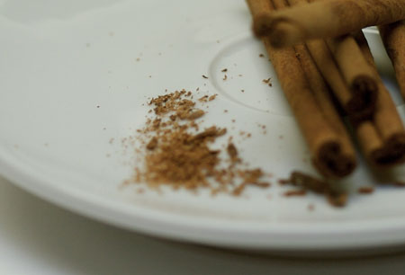
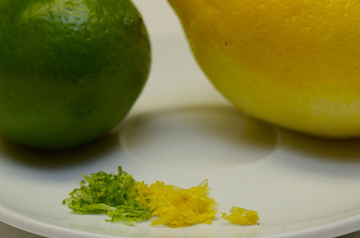

Flavored Coffee. You either love it or hate it. Purists say that traditionally flavored coffees are nothing more than a foo-foo way of covering up and obfuscating the natural flavors of coffee varietals. Others find comfort in Pumpkin Spice drip coffee in November or a Blueberry-Mango iced coffee in July. Whichever camp you are in, read on.

Most of the traditionally flavored coffee beans have flavoring oils sprayed and mixed with the beans after roasting. These coffee flavor oils are many times a combination of natural and synthetic flavor chemicals, which are concocted by professional flavor chemists. Sometimes, certain flavors require nearly 100 different compounds to achieve the desired taste!

  
*Natural Spices are a great option for flavoring coffee.*

If you want these chemicals in your flavored coffee, then just buy any flavored coffee, and you should be good. However, if you are a coffee purist or would like a healthier, natural alternative, read on. You are going to be shown some very interesting 100% natural flavors that can be added to your favorite cup without all those nasty chemicals on the outside of the coffee bean.

There are basically 2 ways to flavor your coffee. You can add certain ingredients to the ground coffee, so the flavors are extracted with the hot water along with the coffee. Typically it works well in a drip machine by adding to the brew basket. Some of the ingredients can also be added to a French Press or [Press Pot](http://ineedcoffee.com/press-pot-tutorial/). The other way is more familiar to some. This involves adding flavors (such as cinnamon or nutmeg) to the cup after brewing. The ingredients can be sprinkled on top for an intense but brief burst of flavor or stirred in to give a more subtle but long-lasting enhanced coffee-drinking experience.

Here is a list of a few suggested recipes taken from the list of ingredients at the bottom. Remember, this is a partial list. Think of anything that might sound good in coffee, and try it – you may be surprised. Generally, no quantities are listed since that is up to you. Also, the types of coffee used are up to you. Some nice choices would be something like a Brazil Daterra, Costa Rica Tarrazu, Sumatra Mandheling, or a Galapagos Island Coffee for the spiced recipes, and perhaps an Ethiopian Sidamo, Guatemala Antigua, or Papua New Guinea for the citrus-based recipes.

### Sweet Home Comfort

-   Coarsely grind pecans and cinnamon, finely chop 1/4 vanilla bean, and add all to the ground coffee for extraction while brewing.
-   Add sweetener (optional).
-   Add a splash of your favorite Bourbon (optional)
-   Sprinkle nutmeg on top
-   Serve hot, and don’t drive.

### Summer Citrus Cafe Cooler

-   Attain the zest of orange, lemon, and lime and add to the ground coffee for extraction while brewing.
-   Add sweetener (optional).
-   Serve iced.

### Cocoa Mint Melody

-   Muddle mint leaves and add them to the ground coffee for extraction while brewing.
-   Stir in ground cocoa and sweetener (optional).
-   Serve hot or iced.

  
*Lemon and Lime zest*

### Suggested Ingredients

-   Real Vanilla Bean
-   Real Cinnamon Stick (ground as needed)
-   Ground Nutmeg
-   Ground Clove
-   Ground Cocoa
-   Ground Almonds
-   Ground Pecans
-   Cardamom
-   Real Fresh Mint or Spearmint
-   Fresh Orange Zest
-   Fresh Lemon Zest
-   Fresh Lime Zest

Now you can drink flavored coffee and not only feel healthier but stand up and proudly say, “I have an addiction…I drink flavored coffee”! And the best part? None of your ristretto-pulling, home coffee roasting, coffee snob friends will be able to say anything. TIP: Use organic coffee to silence all critics…