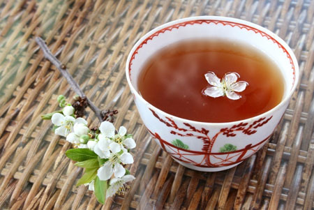

*The full title for this article is **Explosion of Specialty Coffee Shops Creates New Marketing Opportunities for the Tea Industry***

As I travel around the world consulting with coffee retailers, several trends keep coming up: more teas and more exotic choices are on the menu, specialty sources are becoming the norm instead of the exception, and most importantly, the pseudo-adversarial position is now the start of a beautiful friendship of cooperation between the tea and coffee vendors.

Tea has infused the consciousness of the savvy coffee retailer who understands that catering to tea-drinking companions of coffee drinkers can literally double the profits. For both markets, riffs on classics and hot and cold tea “drinks” make everyone happy. Ten years ago, a green tea frappe was unheard of, now it’s a staple for many shops with many delicious interpretations.

  
*Tea Cup*

Each year, the American palate grows more sophisticated as more people explore countries and cultures through conventional travel and electronic journeys through their televisions. Once they taste and learn about different beverages, they seek them close to home. The choices for teas follow in the happy steps of European-style, espresso-based beverages that have become ubiquitous on the coffee house menu. A regular cup ‘o Joe may not be extinct but it embraces the sophisticated specialty coffee niche of the “single-estate” or–at least–country of origin when customers order 100% Kona or Kenyan AA by name instead of black, one sugar…

By duplicating this niche marketing with tea, coffee retailers can go beyond English Breakfast or Earl Grey to serve organic Darjeeling from the Makaibari Estate that’s like apricot nectar or an exclusively organic lushly aromatic Kanro Gyokouro Japanese green that can make tea lovers weep with joy. Even less-adventurous tea drinkers like an iced tea flavored with passionfruit or an Earl Grey with true bergamot essence rather than the harshness of synthetic flavoring.

Retailers can savor strong selling points with tea as they have with coffee. Often, tea provides even greater profits: 30-40 cups per pound of coffee and 180-200 cups per pound of tea means “black” on the bottom line and then some.

Specialty coffee and tea sellers also cash in on the current love affair with organic and Fair Trade (R) choices, whether they’re single estates or beans and leaves from cooperatives. Spectacular value is added beyond the flavor in the cup and the concepts are easy to sell: hand farming, fair trade labor, pricing practices, and the exclusivity of limited supply.

The elegant tea salon is diminishing as tea retailers pursue the casual consciousness of twenty-somethings who like the wireless, hip environment to enjoy who the taste, the meditative qualities, and the variety of tea.

Reaching out to the coffee retailer as a burgeoning market for tea is a fantastic opportunity for the tea vendor and an equal opportunity for the coffee sellers to rethink the menu and enhance it with profitable showplace teas, hot and cold mixed tea drinks, and the specialty niche of organic or single-estate teas. Cross-marketing possibilities between coffee and tea shops are endless and it wouldn’t surprise me if mergers of the two make a multi-beverage shop the retailing center of the future.