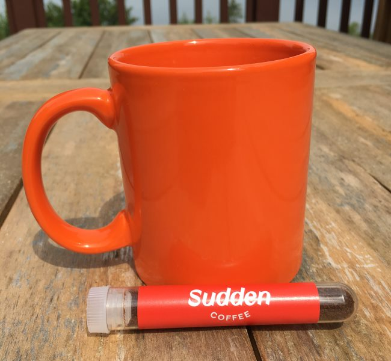
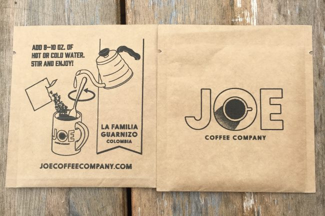

In the early 2000s, I recall reading an article online that made a strong case for why instant coffee didn’t have to suck. I’ve forgotten where I read it, but the core message stuck with me. If one used a really good coffee, it could, in theory, preserve much of the flavor we experience when we brew it normally.

Instant coffee has a long, interesting history, going back as far as 1771. It is a history of innovation. In the 1960s, the freeze-drying method was implemented, and it is still used today. It would be sad if the story of instant coffee ended there.

Thankfully, with rampant innovation in the coffee space, it was just a matter of time before someone made a better instant coffee. In 2009, Starbucks released the VIA “Ready Brew,” an instant version of a few of their coffees. You may or may not like the darker Starbucks roast, but they did an impressive job of capturing the flavor of their coffee with the VIA.

Starbucks demonstrated that you could copy the taste of a darker roast. Could it also be done with a lighter-roasted, higher-quality coffee? Perhaps even single-origin coffee? Third-wave instant coffee?

### Meet Sudden Coffee and Joe Coffee

This month, I’ve had the opportunity to taste the future of instant coffee, and I’m impressed. The article I read many years ago that made the case that instant coffee could be great has come true.

Both Sudden Coffee and Joe Coffee sent me samples of their instant coffees, and both exceeded my expectations for how good an instant coffee could taste. Let’s dive into both products.

#### Sudden Coffee

Sudden Coffee ships its instant coffee in these cute beaker-like capsules. They partner with world-class coffee roasters such as 49th Parallel, Equator, and Intelligensia to source and roast the coffees for their instant offerings.

I tried the Peru Rayos Del Sol, a light sweet roast roasted by Intelligentsia Coffee, and the Colombia Cristalina, a juicy medium roast by Equator Coffee. Both were very tasty. They captured the flavors that I experience when I make pour-over coffee.

Inside each capsule is 5.7 grams of instant coffee. The cap is recyclable, and the beaker part is compostable.

*Sudden Coffee – Getting ready to make a mug of coffee.*

#### Joe Coffee

Joe Coffee uses a traditional paper packet with 4.8 grams of instant coffee. I tried both The Daily House Blend and the La Familia Guarnizo from Colombia. Both were excellent, but I preferred the single-origin Colombian with deep chocolate notes.

*Joe Coffee – 2 packets of instant coffee*

### Instant Iced Coffee

I hadn’t thought about using instant coffee for making iced coffee, but the package that shipped with Joe reminded me that the coffee brews just as well in cold water. So, I tried making iced coffee with both the Sudden and the Joe, and it worked just as well as its hot version.

It’s awesome to be able to carry a few packets of quality instant coffee in your backpack or car, knowing you don’t even need hot water. Just get a cup of ice water, pour in the packet, stir it, and have a tasty iced coffee ready.

### A Winner?

For this review, I asked some friends to vote for their favorite. It was a split decision. We liked both the Sudden Coffee and the Joe Coffee about the same, with half of us giving the edge to Sudden and the other half to Joe.

High-end instant coffee is not cheap. The price per cup ranges from $2.50 to $3.30, depending on the brand and quantity purchased. You could get Starbucks VIA or Trader Joe’s Instant Coffee at a much lower price, but they don’t taste nearly as good.

As a coffee fan, if you can try these next-generation instant coffees, do so. I think you’ll be impressed. The body of instant coffee is not as rich as brewed coffee, nor would I expect it to be. The good news is that the flavor profiles are far better than ever.

### Resources

[The History of Instant Coffee](/the-history-of-instant-coffee/) – INeedCoffee article covering the origins of instant coffee.

[Fearing Starbucks VIA Instant Coffee and My Solution](/fearing-starbucks-via-instant-coffee-and-my-solution/) – INeedCoffee article from 2010.

[Camping Showdown: Steeped Coffee vs The Bripe Coffee Pipe](/camping-showdown-steeped-coffee-vs-bripe-coffee-pipe/) – Steeped Coffee isn’t instant coffee, but it is close, as it uses a “teabag” approach to making brewed coffee.
