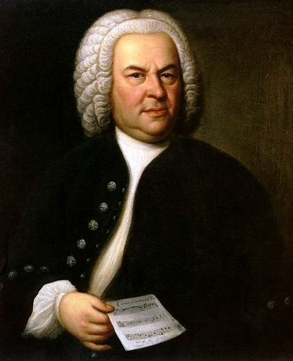
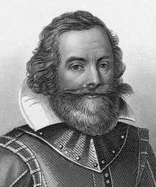

### A Best Friend

And here it sits in front of me my little demitasse cup of bittersweet dark crown mud, my addiction, the best friend of my every lonely night when everyone on earth seems to be asleep and I have to stay up sharp to work, like tonight typing my thousand and one words about Turkish coffee. A sip of inspiration and let it flow…..

### Bach Remembered

….”Ah, how sweet coffee tastes! Lovelier than a thousand kisses, sweeter far than muscatel wine! I must have coffee….” these are the words from KAFFEE KANTATE composed by Johann Sebastian Bach in 1732. True, very true, but, alas, I don’t have his genius to celebrate coffee as well as he did. Instead, I can make a great cup for someone who does…

  
*Johann Sebastian Bach painting by Elias Gottlob Haussman*

### Decaf Doesn’t Count

What does humanity owe coffee besides this wonderful piece of music? I am afraid to even start speculating, or it may look like at least a millennium of our history is the way it is mostly due to the discovery of coffee. So, use your imagination and blame it all on coffee to the extent that you personally drink it. And keep in mind: DECAF DOESN’T COUNT. As for me, I drink it strong and heavy Turkish style, the way it has been drunk by at least twenty generations of devoted coffee drinkers all over the world. But let’s start at the beginning.

### From the Cradle

Coffee came from the same place we now know as the cradle of humanity. Of course, you know ……….Africa. We don’t know much about its history prior to 1000 AD, but not because it had none, but simply because WE don’t know. The only thing that managed to slip into available records is the fact that members of certain Galla tribes in Ethiopia discovered a perfect remedy for lethargy: they took certain berries, ground them up, mixed them up with animal fat, took it and went and did what they were supposed to be doing.

### The dawning of the Coffee Age

About 1000 AD, when some Arabs came traveling through, they must have looked a little too anemic to their African hosts. So, generous Africans supplied them with a good amount of magical berries which industrial Arab traders took back to their homeland and started cultivating the plant for the first time on plantations. Thus the COFFEE AGE BEGAN.

### The First Coffee Shop

Alas, it took another four centuries to figure out that coffee drinking was a communal thing, and the first coffee shop in the world opened. They called it “Kiva Han” and it was opened in Constantinople in 1457 AD. I don’t know how it looked, but I know for sure that the way coffee was made there is exactly the same way I made it in my little cafe in Lexington, Kentucky, 538 years later. They brewed coffee in little pots called ibriks or cezves, invented in Egypt to cook coffee in hot sand but doing pretty good on the stove tops ever since, in Middle Eastern and Greek restaurants and in people’s homes all over the world.

### Importance

You can judge the importance of coffee in 15th-century Turkey from the fact that at the time it became legal for a woman to divorce her husband if he failed to provide her with her daily coffee quota. “For better or for worse” but no morning coffee sounds like too much of a nightmare. Well, our husbands have nothing to fear — we work and earn enough to buy our own coffee, and for as long as they can pay for the rest of the dinner, our marriages are okay. Is coffee still a family value? For a family, it certainly is.

### Coffee Spreads in Europe

For another two centuries, Europeans didn’t have the privilege of having a good conversation over a cup of this delicious stimulant in the company of total strangers until 1645 when the first coffeehouse opened in Italy, in 1652 in England, in 1672 in Paris, in 1721 in Berlin and on, and on, and on until there’s not a spot on the map where coffee doesn’t accompany all sorts of communications from the most intimate confessions to passionate political debates.

### American Grounds

Captain John Smith, who helped found the colony of Virginia at Jamestown in 1607, introduced coffee to North America. Since then, the magic bean has been perfectly naturalized, acquired citizenship, and seems to be doing great business-wise. It has fully fulfilled the American dream of every immigrant: it makes billions of dollars, keeps Congress awake, and thus influences the politics of a major superpower.

  
*Captain John Smith*

### Coffee Changes

Many things have happened to coffee in its long journey through the ages. Every century has delicately added something new to the perfection of the art of coffee drinking until the 20th rushed in with its passion to improve everything to the point when the improved version has nothing to do with the original. Coffee was not the exception. In 1901, Japanese-American chemist Satori Kato of Chicago invented “instant” coffee, and there goes the little hand mill and the impatient waiting of a thirsty connoisseur for the little ibrik pot to boil. Instant coffee is like love-making without foreplay, a rape of taste, a satisfaction of physical urge without love.

Just two years later, in l903, German coffee importer Ludwig Roselius turned a batch of roasted coffee beans over to researchers, who perfected the process of removing caffeine from the beans without destroying the flavor. And here comes Decaf– a zombie drink stripped of its soul. Not all of the innovations were that radical. In 1933, an Italian named Calimani developed an alternative coffee maker that separated coffee grounds from the liquid part of the drink without hurting its strength or flavor: The “presso” coffee maker. In 1946, another Italian, Achille Gaggia, perfected his espresso machine and created cappuccino, named for the color of the robes of the capuchin monks. Well, I use my presso when I am in a hurry, and I make a cappuccino when not on weight loss control.

### Conclusion

Anyway, I am not really writing about all these other coffee drinks, not even the ones on our menu, not a delicious Abbot’s Cappuccino, made with fresh cream instead of milk, not about sweet Chococcino, not about Coffee Zebra or Coffee Kilimanjaro, not about the Dublin Mud made with Irish Cream liquor not about Cappuccino or Borjia shakes and definitely not about our famous Ivan the Terrible, the favorite of those who go for heavy caffeine. Neither am I writing about the history of coffee.

All I was going to do was write a 1001-word passionate hymn of love to the best, the oldest, the most authentic of all, the one “sweeter than a thousand kisses,” to my favorite demitasse cup of Turkish coffee. Alas, I am way over 1001 words and I have not even started. Well, stop by “Natasha’s Cafe” and I’ll simply make you your first cup. Tasting is believing, isn’t it….PS I don’t know when and who designed Mr. Coffee. I don’t want to know. And if you know don’t tell me. This thing has nothing to do with coffee, and if you love coffee, YOU know why…..