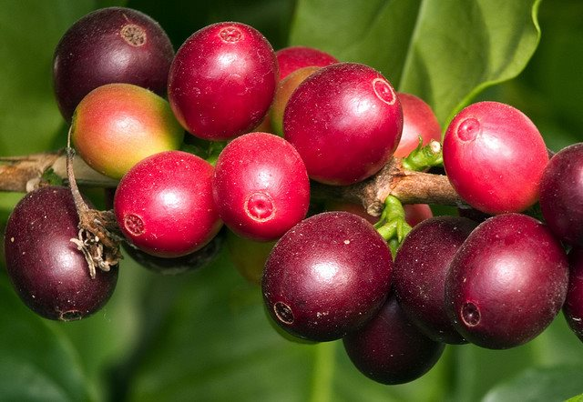

Organic crops, coffee included, are grown without synthetic fertilizer or artificial pesticides. This doesn’t mean though, that the coffee is free of fertilizer or pesticides. Growers just use natural fertilizers and natural insect repellents.

An organic product is essential to many coffee drinkers because coffee is a highly pesticide-sprayed crop. Coffee beans are worth much more per pound than other products like wheat, corn, or soy, so farmers have an incentive to protect their crops and increase output with whatever pesticides and fertilizers work. Also, some pesticides that are banned in the United States and Europe are still used in other coffee-growing countries. Hence, there is a perception that organic coffee is healthy and natural. Many consumers reason that if they’re drinking a few cups a day of anything, it might just as well be pesticide-free.

In his book “Espresso Coffee,” Andrea Lilly claims that the more advanced coffee growers, aware of the need for an environmental-friendly product, are using improved land management, organic fertilizers instead of synthetic ones, reduced pesticides, and reduced water use and pollution during post-harvest handling. These advanced coffee growers are certainly more likely to produce a higher quality product.

### So, should it be certified organic coffee? How about Fair Trade?

Organic coffee is a fast-growing phenomenon. By now it is grown in more than 40 countries, including Hawaii. The fast growth is fueled by the universal organic food trend and by the rapid adoption of fair trade practices. Because of the quality of the farmers adopting fair trade practices, 60% of that coffee is certified organic.

It is essential to note that there are quite a few organic coffees that are actually not certified. The certification procedure is notoriously difficult and expensive and demands certification along the whole food chain including not only the growers but also the roasters and even the truck drivers. Surely, this is way beyond the means of small farmers in developing countries such as Yemen and Ethiopia. Actually, in these countries, the coffee farmers are so poor they tend not to use pesticides or fertilizers at all.

*[Photo](https://www.flickr.com/photos/ljguitar/455706920/) by Larry Jacobsen*

### Is organic coffee really healthier?

Health-wise, you can’t go wrong with organic coffee. That does not mean though, that standard coffee is any worse. There are no studies comparing the health of standard coffee drinkers with organic coffee drinkers. It just might be the case that coffee, grown inside an actual fruit, may not be as vulnerable to synthetic substances, as other fruits.

### Is the quality of the coffee better at all?

So, if you are just looking for a superior cup, certified organic might be the way to go, but there are other (cheaper) ways, too. If you are looking to make a statement, though, certified organic coffee is certainly a good way to do it.

### Sources

OTA – Organic Coffee – (page removed November 2014)

[Are Fair Trade Certified products also certified organic?](https://www.fairtradecertified.org/get-certified/frequently-asked-questions/)
