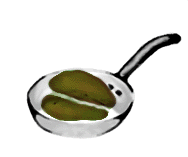

You can admit it here, we won’t laugh. You want to roast your own beans. There now, doesn’t that feel better? It’s not a crazy idea. Green beans are far less expensive than those roasted ahead of time and can be safely stored for up to two years without loss of flavor. By roasting your own you also know you’re getting the freshest possible cup of coffee.

As far as the flavor of your coffee, well that depends a lot on you. If you favor the light roasts you will find it very difficult to approximate their flavors using the pan method. If you favor the darker styles, you stand a good chance of success simply by using a common skillet.

  
*Pan roasting coffee.*

### Want to get started?

Okay, start by selecting from the hundreds of green beans that are available on the Internet. Then take a common skillet and place it on a burner set to high. You need a temperature of approximately 500F to roast coffee. When the skillet has heated sufficiently, pour the beans in and begin shaking. This is the first key – never let the beans come to rest on the pan surface. If you do they will burn. As you shake you will begin to notice the beans changing color, from olive green to a yellow-green hue.

The second key is wrist strength: you will have to keep the beans moving in the skillet for at least six, up to approximately nine minutes, and perhaps much longer (depending on the roast style you prefer). If you can keep the pan shaking at the 6-9 minute mark you will hear the beans begin to pop. This is what the roasters call “First Crack”. Once this crackling stops the beans should have turned a light, golden brown and you may stop. If you do you have what many call a New England Roast. If you’re experimenting go ahead and stop and, when they’ve cooled, grind these freshly roasted beans and sample the results.

Be exact. Precisely measure the amount of ground coffee and water you use, and then take notes on the flavors you perceive in the cup.

If you know you want a darker roast when that first crackling stops keep shaking. The longer you go the easier it is to burn the beans so shake it baby, shake it. The beans will be getting darker and darker and at some point, you will hear the “Second Crack”. Get ready now, when the crackling stops this time you will be at what is called “Full City Roast”.

There was a time when the ‘chore’ of roasting coffee was replaced by the ubiquitous can. In a world where clothes were still scrubbed by hand, anything that lessened the labors of life was seen as an improvement. But today we have the luxury to choose to make our own pasta, bake our own bread, or roast our own coffee. Today we realize that though it is often a lot of work, it is well worth the effort to revisit the days of the home-grown, the hand-made, the home-roasted.
