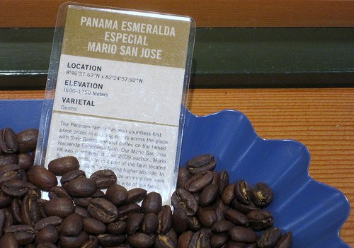

My wife and I are expecting our first child any day. Or any minute. Or any second. I need something to occupy my mind, which is why I am writing this.

Among the many new terms and traditions, I have learned during the pregnancy is ‘The Push Gift’. I had no idea there was such a thing, and honestly I am not sure my wife did either until she started reading the various baby sites online. In a nutshell, this is something that the husband is to give his wife after carrying and pushing the baby through labor.

Not knowing what is an appropriate gift is not a problem. There is no shortage of ‘helpful’ websites that can assist you with ideas. Like most things directed to new parents, most are either too extravagant for our tastes or too impersonal.

One day during the second trimester, my wife, who had given up coffee cold turkey once pregnant, suggested that freshly roasted coffee would be perfect. Of course, I always roast coffee, so I thought I should at least try to find something a bit more special.

I was able to obtain a pound of *Panama Esmeralda Gesha – Lot 2 Caballeriza* green coffee from *Sweet Maria’s* during the summer. It is a rare bean that has received many wonderful tasting reviews. One of the notes on the bag of coffee says, ‘a one-of-a-kind flavor’. Sounds like a winner to me.

  
*Panama Esmeralda @ Stumptown*

Now that our baby is two days late, I thought it would be a good time to roast a small batch in anticipation that she will be ready to drink it soon and that the coffee will be at peak flavor. After over eight months of being deprived of all coffee, I believe that for my wife, this will be the ultimate push gift.

### Addendum

After the baby was born, my wife agreed it was the perfect gift for her and quite possibly the best coffee she has had. I was able to sample it and thought it was up there on my list as well. The only better coffee I ever had was perfectly brewed coffee using a Clover at Intelligentsia in Chicago.
