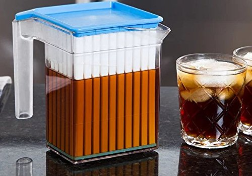
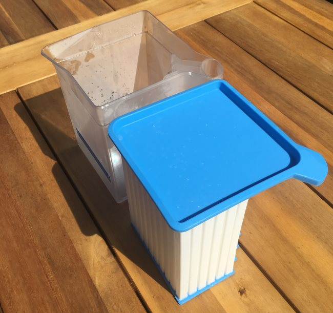
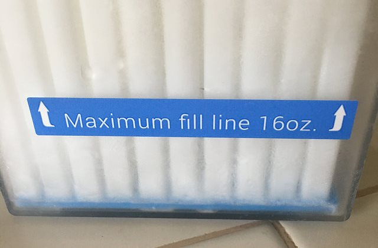
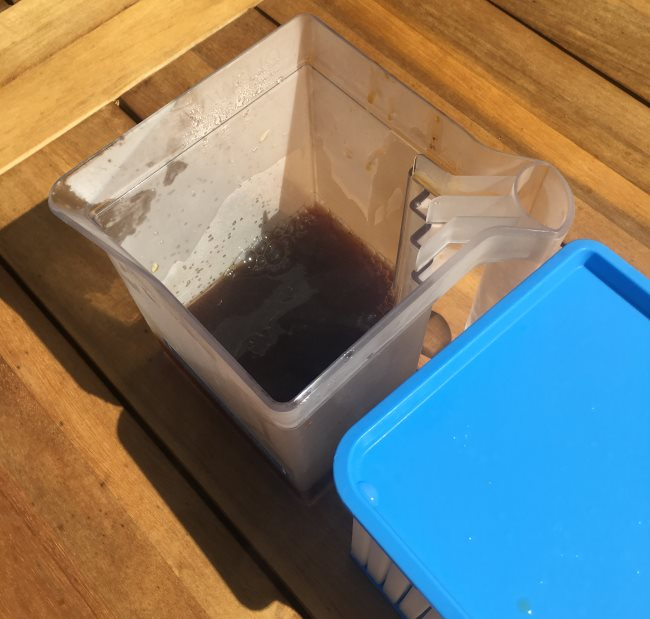
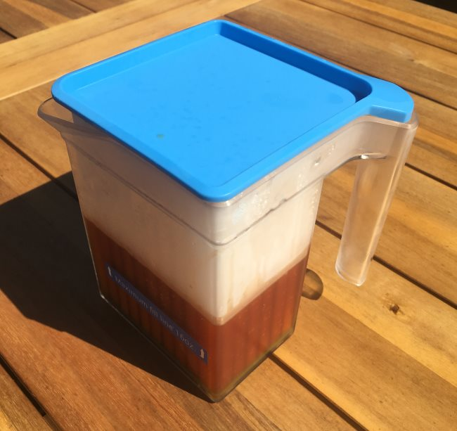
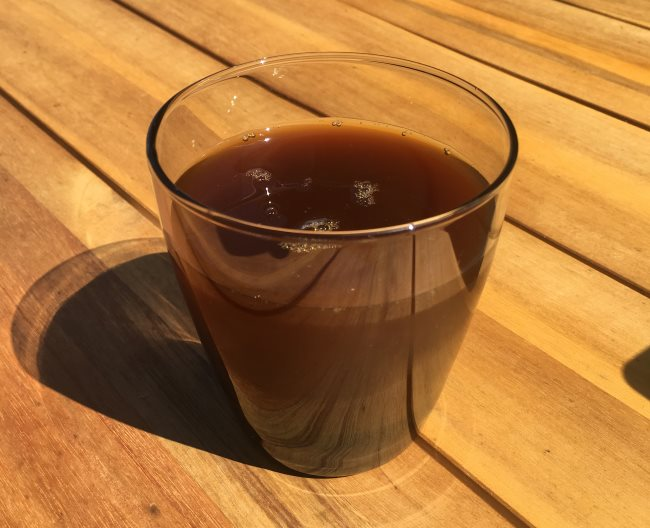

This might be the easiest coffee brewing tutorial ever. Recently, I had an opportunity to make iced coffee using the Coldwave. It is a game-changer if you love iced coffee, but are tired of weighing out ice cubes each time you brew.

*Coldwave Beverage Chiller*

### Iced Coffee vs Cold Brew Coffee

A quick reminder of the difference between iced coffee and cold brew. Cold-brew is far more common these days. It is a lengthy brew process that takes 12-24 hours where coffee grounds are exposed to cold or room temperature water. This method of brewing produces a low-acidity coffee with a smooth body. Cold brewing coffee will alter the taste of the coffee being used. It doesn’t taste like a cold version of the same hot coffee.

That is where iced coffee comes in. Iced coffee is brewed by flash-cooling coffee. The way this is done is by dividing the water used in the brewing process. About half of the hot water that makes contact with the beans. The other half is measured out in ice cubes. When the brewed coffee touches the ice, it is chilled instantly. And the key here is it doesn’t taste watery or weak. If you get your math right, it will taste very close to a cold version of the same coffee brewed hot.

### The Problem With Iced Coffee

To make a really good cup of iced coffee, you will need to get your math right. You’ll be weighing both the hot water added to the brew and the weight of the ice cubes. If you get everything right, which can take some practice, you’ll get a delicious cup of perfectly chilled coffee that tastes just like the cold version of the same beverage brewed hot.

However, if you have too few ice cubes, the coffee might be over-extracted and need additional ice to chill. The coffee will likely taste weak if you use too many ice cubes.

When we brew coffee, we often want the process to be as simple as possible. We don’t want to do any math. We want to wake up.

### Enter the Coldwave Coffee Chiller

Many years ago, I lived in a house in Florida without air conditioning. I’d brew a mug of French Press coffee, and it would take forever to cool down. One morning, I solved the problem by putting the ceramic mug in the freezer and pulling it out after the coffee was finished brewing. When I poured the hot coffee into the frozen mug, the temperature dropped instantly to a manageable level. And unlike adding ice to cool my coffee, my coffee never got watery.

The Coldwave Coffee Chiller is a grander vision of my frozen mug experiment. The Coldwave is a super-fast beverage chiller. We are going to use it for coffee, but it could be used for tea. You can even chill beer quickly, although you may lose some of the carbonation, so pour slowly. The Coldwave is two parts. First, there is an insert which is a collection of rods that are ideal for freezing. The second part is a pitcher.

Let’s make some iced coffee.

### #1 Freeze the Coldwave Chiller

You’ll want to keep the Coldwave Chiller in the freezer, so it is ready to use at any time. The initial freeze can take 8 hours. Refreezing is much quicker and just requires an hour after chilling two batches.

You can store the pitcher in the freezer, but the makers of Coldwave state this will increase the time it takes to freeze. If you do put the pitcher in the freezer, be sure to dry it completely first.

### #2 Brew Coffee However You Like

This is the best part of this brewer. You can make coffee however you like and then make it iced. I got excellent results with both the [AeroPress](http://ineedcoffee.com/upside-aeropress-coffee-brewing-tutorial/) and the [Chemex](http://ineedcoffee.com/chemex-coffee-brewing-history-and-tutorial/). When the coffee has finished brewing, remove the Coldwave from the freezer.

*The Coldwave Beverage Chiller and Pitcher*

### #3 Pour Coffee Into the Pitcher and Add Coldwave Chiller

Pour your brewed coffee into the empty pitcher and then place the Coldwave Chiller inside. The Coldwave is limited to 16 ounces. Don’t overfill, or you’ll create a mess when you add the Coldwave insert.

*Add brewed coffee to Pitcher.* 

### #4 Wait 90 – 120 Seconds, Remove Insert, and Serve

It only takes 90-120 seconds to chill the hot coffee. Touch the side of the pitcher to confirm that the beverage is chilled. Remove the insert and serve the coffee.

*Place the Coldwave Chiller into the Pitcher and wait 90-120 seconds.*

*Enjoy iced coffee.*

### #5 Cleanup and Preparing For the Next Iced Coffee

The final step is to clean the Coldwave and return it to the freezer. A good rinse is all you need most of the time. If you want a more detailed cleaning, you can place it on the top rack of the dishwasher. Once it is clean enough, put it back in the freezer.

### Last Words

If you have enough space in your freezer and love iced coffee, the Coldwave is an awesome way to make iced coffee quickly and easily. This is the coffee device I wish I had had many years ago when I lived in that Florida house without air conditioning.

### Resources

[Coffee Brewing Guide](http://ineedcoffee.com/coffee-brewing-guide/) – A collection of coffee brewing tutorials here on INeedCoffee.

*Disclosure: INeedCoffee received a Coldwave at no cost, which did not affect its review.*