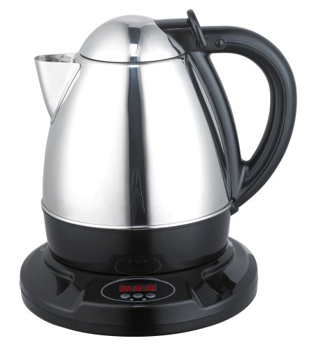

INeedCoffee contributor Eyal Rosen recently created a list of the top 10 accessories for coffee. The page is no longer online. There will be little disagreement on a few items on the list.

-   **Coffee Grinder** – Amen! The path to every great cup of coffee starts with the grinder.
-   **Permanent Gold Coffee Filter** – If you like drip coffee, I agree that this should be on your Top 10 Coffee Accessories list.
-   **French Press** – Penny for penny it is the best coffee brewing system ever invented. No disagreement from me. This belongs on the list.
-   **Espresso machine and coffee maker cleaner powder** – Yes, but with a caveat. I personally \*\*love\*\* espresso, and if a fire broke out, I’d probably grab my espresso machine as I headed out the door. *My guests can walk themselves out.* 🙂 However, I do not like espresso machines under $500. Setting up an espresso savings fund would be a better idea.

I would never include a few on Eyal’s list in the Top 10 Coffee Accessories.

-   **Coffee pods holster for a Keurig coffee maker** – I don’t own, nor desire to ever own, a single-serve pod coffee machine.
-   **Handheld Milk frother** – I had one of these many years ago. Junk. A good espresso machine will make this accessory obsolete.
-   **Handpresso** – I think this was listed as a joke. I’ve never played with one, so I will reserve judgment on how good it is. I suspect it doesn’t belong on a Top 10 Coffee Accessories List. The MyPressi seems like a better option for campers hell-bent on getting espresso shots with enough atmospheric pressure while “roughing it” in the outdoors.

What would I add to my Top 10 Coffee Accessories List that didn’t make Eyal’s list?

-   **Electric Kettle**—It is essential to quickly heat water for coffee. Don’t waste your precious moments on Earth waiting for water to boil. Get a good [electric kettle](/avoiding-plastic-3-stainless-steel-electric-kettle-options/).
-   **Espresso Knock Box**—I have to confess that I went a long time without a knock box. I was a fool. If you have an espresso machine, get a decent knock box.
-   **Eva Solo**—Very few people seem to know about the Eva Solo, my favorite non-Espresso coffee brewer. Check out the [Eva Solo Coffee Brewing Tutorial](/eva-solo-coffee-brewing-tutorial/) to learn more about this brewer.

  
*PINO Digital Kettle Pro  
*

### Resources

Top 10 Coffee Accessories List – Eyal’s original list.

[Eyal Rosen](/by/eyal-rosen/) – Contributor page on INeedCoffee.com.

[Troubleshooting French Press Coffee](/troubleshooting-french-press-coffee/) – My guide to improving your French Press coffee.
