Looking for information on coffee roasting machines, I felt exhausted trying to find the “perfect” popper on eBay, which was out of my price range, or in the local thrift stores, which had not seen a West Bend popper in years. WB Poppery and Poppery II are, by everyone’s estimation, two great modifiable machines that will roast coffee beans. I looked at the post dates on the articles, and most were printed from 2005 to 2011. Here I am in August of 2014, trying to find a roaster. After searching for months, I came across the Presto PopLite, which looked like it could roast coffee. But it was listed as a probable no show by Sweet Maria’s and, if possible, one model to avoid.

I came across the INeedCoffee article [The Poplite Air Popper: a Cheap Home Coffee Roaster](http://ineedcoffee.com/the-poplite-air-popper-a-cheap-home-coffee-roaster/) by Eugene Hanks that said with modification, the PopLite was a good coffee roaster. I read the article several times and within a week had located one in a thrift store for $3.99, my price to try and modify. The model was 4821 (the Orville Redenbacher gourmet).

### Slowing Down the Roast

The first roast in the Orville Redenbacher PopLite was quick. The 1440 watts heated up the beans so quickly to 1st crack and 2nd crack that the roast was over before I had time to evaluate it or really think about it. I noticed a little scorching of the beans in the first minute of the roast.

I read several articles on the PopLite and was amazed at the number of innovations and procedures worked out by roasters to solve the various problems associated with the PopLite roaster.

The first was the speed of the roast. Dropping the voltage by adding an extension cord seemed to work out by prolonging the roasting cycle. I solved this problem by getting a Router Speed Control from Harbor Freight for $17.00 (net price on sale and 20% off coupon). The router control lowered the speed of the fan and heating element, so it takes longer for the beans to roast. The only downside was the lowered fan speed required agitation of the beans in the roasting chamber.

### Preventing Scorching

The next problem was the scorching. The dip in the roasting chamber and lower fan speed were the cause. I solved this by disassembling the popper and inserting a light wire screen to flatten out the bottom of the roasting chamber. The screen fits under the aluminum popping chamber, where it is inserted into the base heating unit. The screen gave an additional half-inch of space between the round heat orifice and the beans at the bottom of the roasting chamber, which allowed the heat to dissipate just enough and not scorch the beans during the first part of the roast. The screen makes the beans easier to stir.

When it was necessary to agitate the beans with the top on the popper, it seemed to require three hands, and agitation was necessary as the beans needed to be stirred or agitated during the first few minutes of the roast cycle while the beans were still heavy with moisture. The roasters at Browngrounds.com used gloves to manhandle and shake the hot PopLite popper during this part of the roasting cycle to agitate the beans. This solved the problem for them and gave them a nice even repeatable roast.

The top also needed to be in place later in the roasting cycle to keep the beans from being blown out of the roasting chamber, as the beans lost moisture and became lighter. I solved both of these problems with a 5 by 7-inch plate display hanger from Home Depot ($2.98). I cut the hanger wire into two separate spring holders and hooked it on each side of the PopLite to hold the top on.

### Measuring Roast Temperature

During the first days of my roasting adventure, I used a thermometer to check the heat of the roasting chamber and learned what, when, and where the 1st and 2nd cracks occurred. The thermometer was located in the chamber against the aluminum sleeve. It registered cooler than the ambient temperature of the beans but gave a reliable indication of what was happening during the roast. I was able, with observation, to find out when 1st and 2nd cracks occurred and relate this in a chart to the information from Sweet Maria’s and others as to what kind of roast I was getting.

By having control over the heat and fan and the ability to agitate when needed, I am able to use the Orville Redenbacher PopLite to achieve a repeatable roast to the level I desire, all for less than $25.00 and no unusual modifications to speak of.

The photographs are commented on, but If you have any questions, let me know.

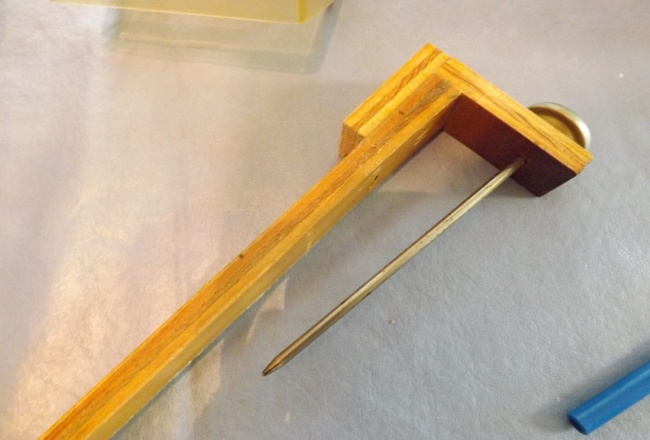

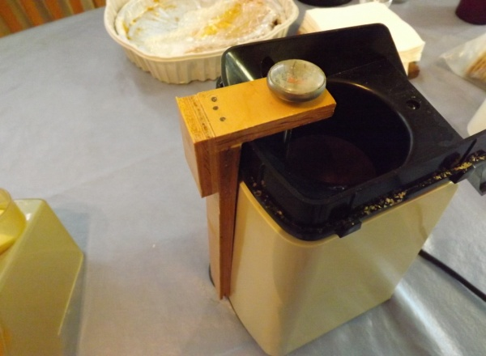

I wanted to mount a thermometer without having to bore a hole in the Orville Redenbacher PopLite. I used a wooden batten to mount the thermometer inside the chamber as shown. The pocket thermometer is a 50-550 deg F unit I got for $5.00 sometime before and have used it in roasting coffee and my BBQ pit.

### The Modification

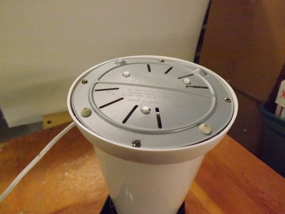

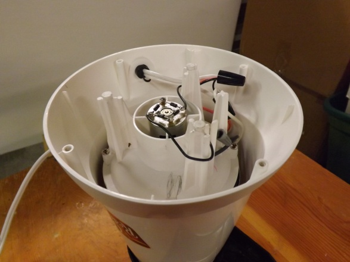

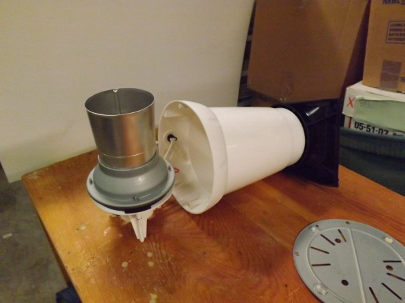

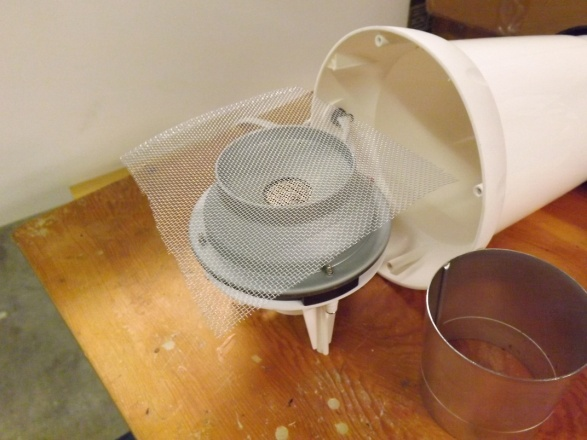

The seemingly most difficult part of fixing up the Orville Redenbacher PopLite is putting a screen at the bottom of the roasting chamber. You do not need to do this if you are not scorching beans.

Take out the four screws on the bottom. Mark the orientation of the bottom of the plate for reassembly (so you will know how to put the popper back together). The heating and fan are shown in the second photograph. Carefully take out the unit. It is not necessary to disconnect the electrical cord. Carefully twist the cord around and set the unit on the table. Holding the bottom unit, twist and remove the aluminum roasting chamber from the heating and fan unit.

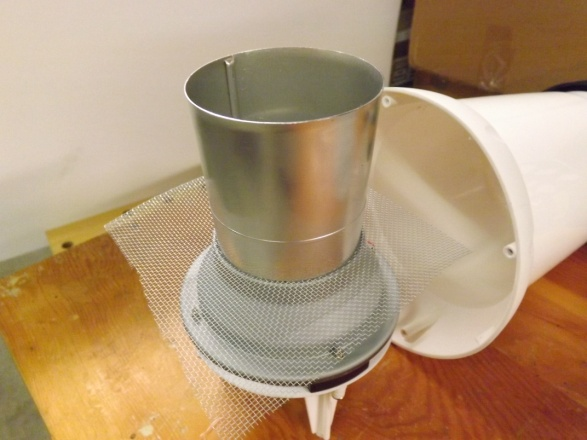

Take a light piece of aluminum (uncoated) screen wire material and place it over the heating and fan unit. Replace the aluminum roasting chamber over the screen and with a little pressure reseat the chamber into the heating and fan unit.

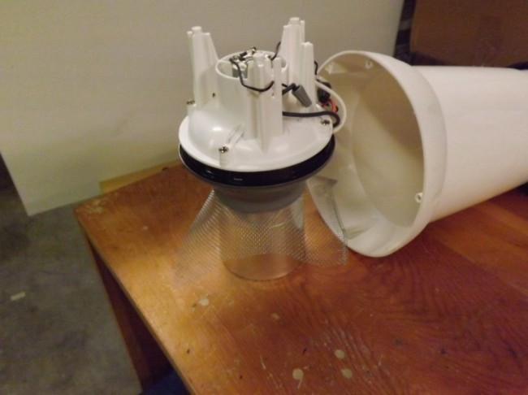

It may be necessary to invert the unit and apply pressure to make sure the chamber unit is reseated and the screen wire is tight in the bottom.

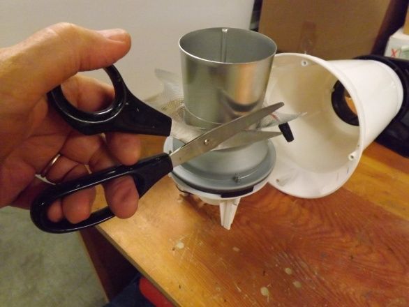

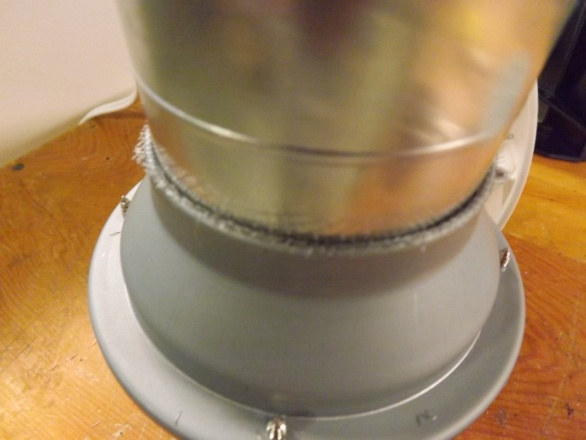

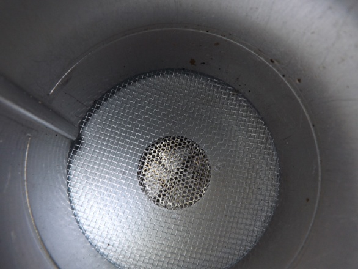

Trim the screen wire close to the outside of the chamber and reassemble the unit. Take care to make sure the unit is put back together with the way it was taken apart.

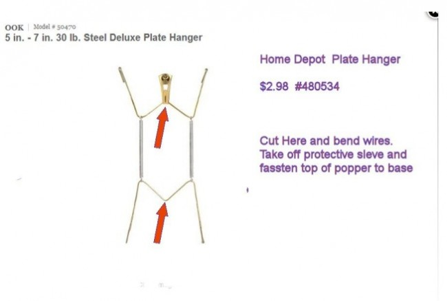

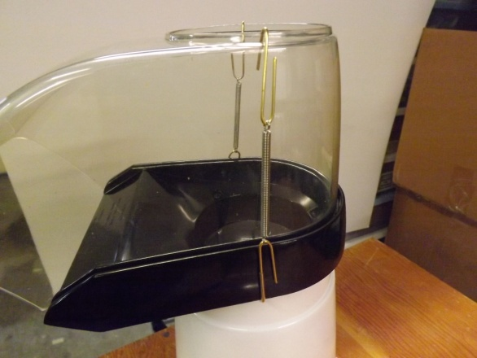

The plate holder wire is cut in two places. One wire is bent down and the other end up to retain the spring. Clip the unit under the lip of the top of the roaster and over the top of the clear plastic guard.

### Variable Power

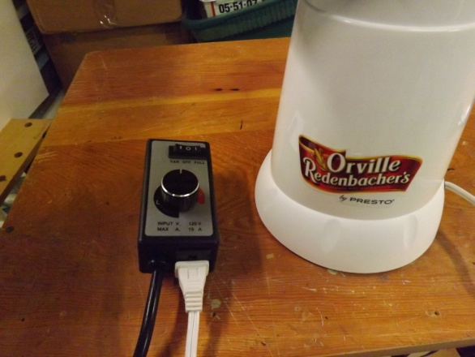

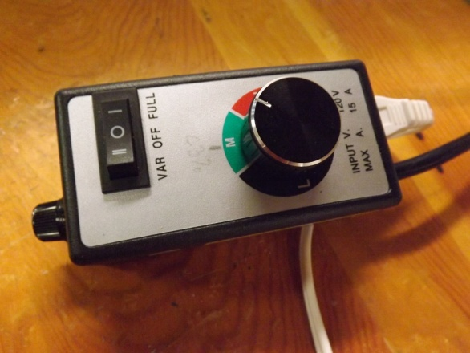

The heating and fan are controlled by a router speed control unit from Harbor Freight. This unit is really neat in that you can, with the flick of a switch; change from full power to variable power. One thing to note: the line between black and green is 50% power. The line between green and red is 75% power. The unit is rated for 15 amps and should support any popper with which you wish to roast.

The beans will probably need to be agitated (stirred) when the fan power is reduced to prevent scorching or burning. Agitation also allows the chaff to separate from the beans, so stirring during the complete roasting cycle does wonders for your beans and evens out the roast. The more you agitate the better. You can use a small flashlight to view the beans while roasting.

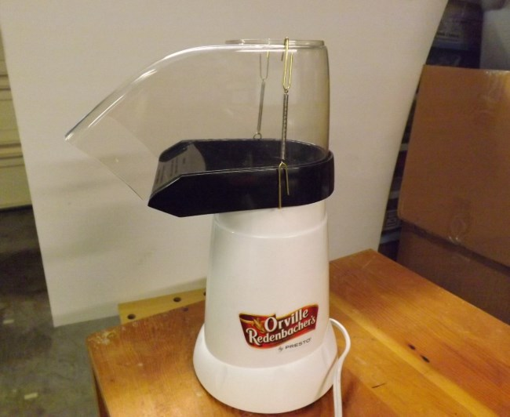

The completed roaster is ready for duty, and many good roasts are to come.

**Do not operate a roster that is unattended! If you walk away, turn the unit off!**

### Supporting PDFs

Here are 3 PDFs with supporting time, temperature, and amp data. Once you learn where 1st crack ends and 2nd crack starts, you will know these places by heart (or at least by sight and smell).

PDF 1: [Roast Times and Temperature](http://ineedcoffee.com/wp-content/uploads/2014/08/poplite-1-roast-times-temps.pdf)  
PDF 2: [Sweet Maria’s – Wikipedia – Sammy](http://ineedcoffee.com/wp-content/uploads/2014/08/poplite-2-rosetta-stone.pdf)  
PDF 3: [Amps](http://ineedcoffee.com/wp-content/uploads/2014/08/poplite-3-amps.pdf)

### Resources

[The Poplite Air Popper: a Cheap Home Coffee Roaster](http://ineedcoffee.com/the-poplite-air-popper-a-cheap-home-coffee-roaster/) – The original PopLite tutorial by Eugene Hanks.

Router Speed Control from Harbor Freight