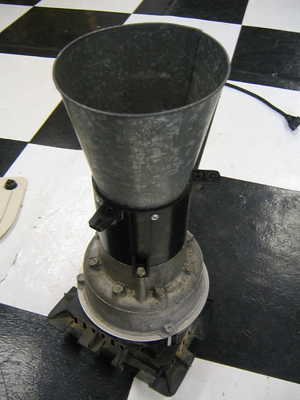
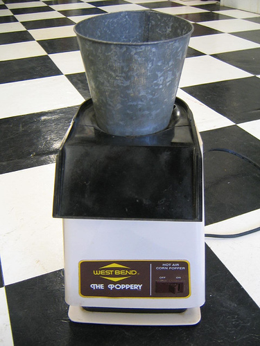

**Background: [Roasting Coffee in a Popcorn Popper](http://ineedcoffee.com/roasting-coffee-in-a-popcorn-popper/)**

I picked up a 1500 Watt West Bend Poppery on eBay a year ago to roast my own coffee in the backyard (roasting generates tons of chaff and smoke, so if you go ghetto with a popcorn popper, a backyard is a must.) I’m largely pleased with it. The cooler months require a [little extra insulation](http://ineedcoffee.com/cold-weather-coffee-roasting/), by way of a giant box enclosing the whole assembly, in order to reach proper temperature.

The hopper/chamber was designed to eject the popcorn into a bowl once it became light enough, which is sort of problematic with coffee. An unmodified Poppery will lose maybe 5-10% of the beans over the course of the roast when roasting 4 ounces at a time. Sitting next to the roaster and quickly tossing ejectees back into the chamber became tiresome, so I cut the top and bottom off a soup can and crammed it in to act as a chimney. Bean-overboard problem fixed, but the friction fit can be ugly and always shifting around.

While cleaning out the garage today, I came across a **tin flower pot** (the kind you see for a few dollars at Trader Joe’s) I was about to toss it into the recycle bin when I realized it was the ideal shape for a Poppery chimney! A quick dry-fit later showed it was indeed the ideal size and shape- all that was needed was to chop off the bottom and secure it to the Poppery.

In my excitement, I didn’t think to take more photos of the process, but it’s really straightforward. Use tinsnips to remove the bottom of the pot, about 1/2″ above the bottom for this particular diameter tin. Remove the plastic housing from the Poppery. Drill and pop rivet the tin to the chamber:

  
*Add the rivet into the chamber.*

I toyed with the idea of leaving it “naked” since it looks so industrial and cool, but dealing with a 400F+ chamber and having to fashion a new place to mount the on/off switch was enough to convince me not to. Perhaps someday I’ll swing by Tap Plastics and fashion a clear housing. The finished product:

  
*Poppery with Hopper Modification*