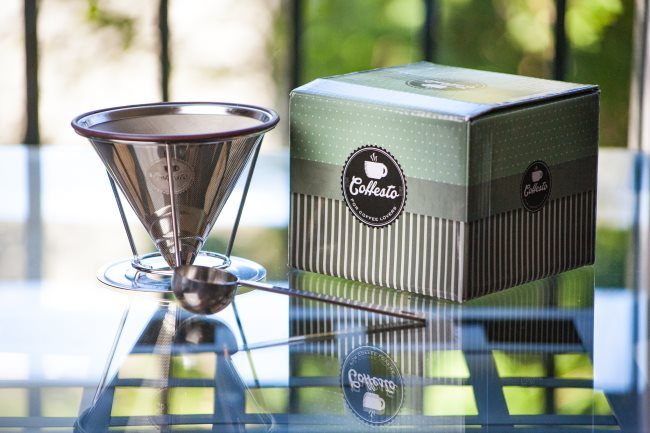
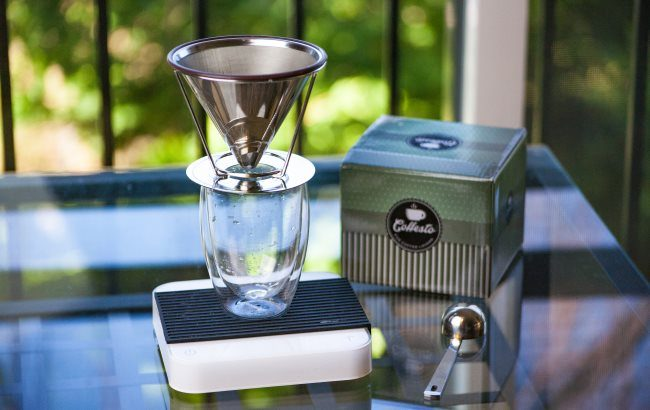
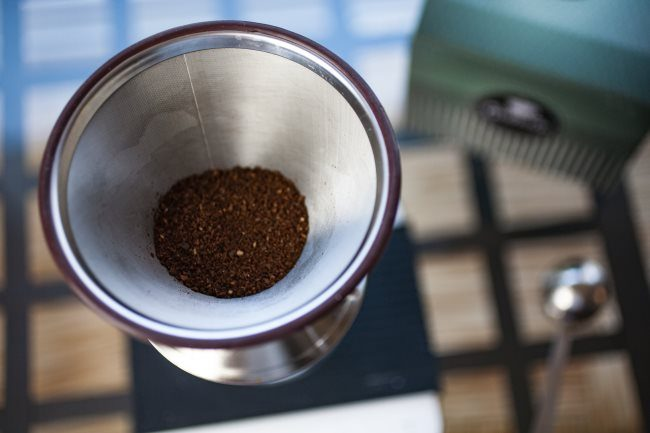
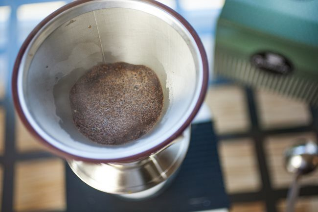
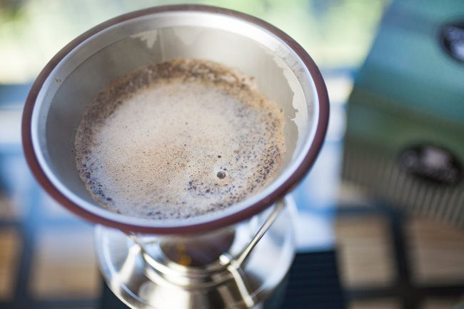
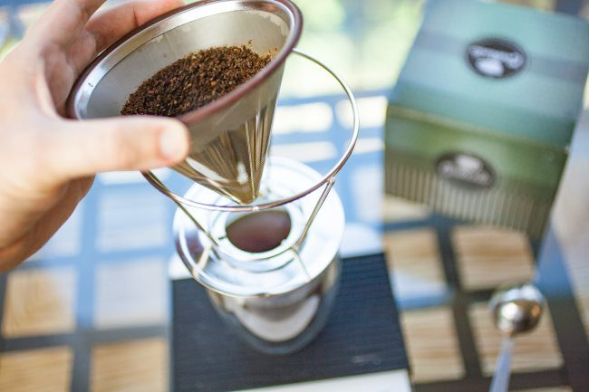

In this tutorial, we will be making pour-over coffee using the Coffesto Pour Over. The Coffesto is an inexpensive stainless steel pour-over brewer that does not require a paper filter. Although we will be using the Coffesto, the principles in this tutorial can be applied to other pour-over brewers.

### Brewing Setup

The Coffesto filter will rest inside a holder placed directly above whatever you wish to brew your coffee into. I’ll be using an electric kettle and a digital scale, but I also provide guidance should you not have a scale. Included with the brewer is a one-tablespoon scoop.

-   21 grams of coffee (or three level scoops)
-   310 grams of water (11 ounces)

### #1 Heat Water

Fill your kettle with clean water. I love the *Bonavita Gooseneck* kettle for two reasons. First, I can set the exact temperature I want to use, and second, the gooseneck spout provides me with excellent control over the water flow. This means I can distribute the hot water evenly over the coffee grounds.

### #2 Hot Water Rinse the Brewer and Your Mug

Give the brewer and your mug a hot water rinse to minimize heat loss.

### #3 Setup the Brewer

Place the stand over your mug and then the filter inside the stand. A 12-ounce mug will be ideal, although you can always brew less and use a smaller mug.

### #4 Add Ground Coffee to Brewer

Add three scoops or 21 grams of [medium-fine](http://ineedcoffee.com/coffee-grind-chart/) ground coffee inside the pour-over.

### #5 Add Enough Hot Water to Bloom

A rule of thumb I use for brewing temperature is higher for lighter roasts and lower for darker roasts. I explain this more in the article [Hacking Dark Roast – Tips on Brewing a Better Bold Coffee](http://ineedcoffee.com/hacking-dark-roast-tips-on-brewing-a-better-bold-coffee/).

-   205 F – light roasts
-   200 F – medium roasts
-   195 F – dark roasts

Initially, you will pour just enough water to cover the beans. This typically works out to 2-3 times the weight of the ground coffee, for this example, 42-63 grams of water. You will see the coffee bloom as the gas escapes the beans. When you do this, pour and try your best to cover all the ground coffee. Ideally, there should be no dry clumps of coffee. It is better to add a little more water than to have dry clumps.

Wait 30 seconds.

### #6 Continue Adding Hot Water Slowly

Slowly pour the remainder of the water over the ground coffee. The entire brewing process will take 2:30 – 4 minutes. Darker roasted coffees tend to brew faster, while lighter coffees tend to brew slower.

### #7 Remove Brewer and Enjoy

Once the water has passed through the brewer, remove it, and your coffee is ready to enjoy.

### #8 Cleanup

Once the brewer has had a few minutes to cool, you can empty the used grounds into a compost bin or set them aside for your gardening needs. You can wash the filter with hot, soapy water or rinse thoroughly. It is also dishwasher-friendly. However, I would remove the rubber seal first as it could become damaged.

### Resources

[Coffee Brewing Guide](http://ineedcoffee.com/coffee-brewing-guide/) – INeedCoffee guide to several coffee brewing methods.

[Clever Coffee Dripper](http://ineedcoffee.com/clever-coffee-dripper-review/)—If you prefer more control over the steep time, check out the Clever Dripper, a full-immersion brew method.

*Disclosure: INeedCoffee was sent this product at no cost.* 

*Brewing photos by Joseph Robertson of Extracted Magazine, a digital coffee magazine published for iOS and Android.  
*