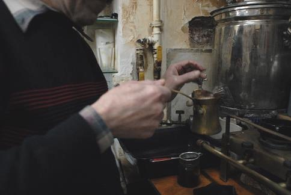
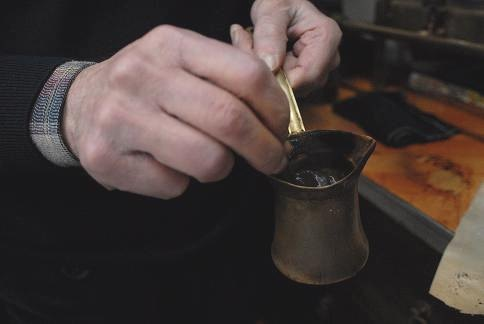
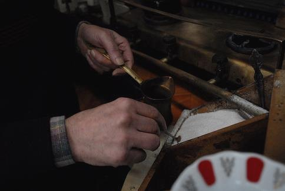
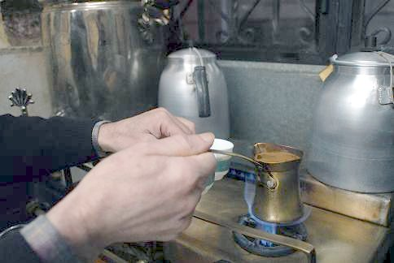
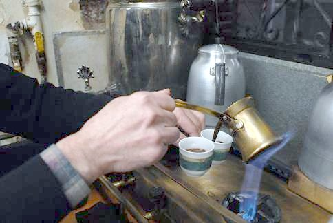
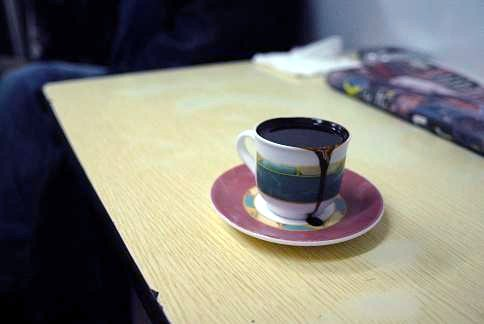

During my recent travel to Istanbul, I researched tens of coffeehouses and found the perfect cup in the centuries-old Ali Pasha coffee house. The Ottomans invented Kahve, Turkish coffee hundreds of years ago.

The exceptional taste, body, aroma, preparation, and presentation associated with Turkish coffee lend it an exclusive identity that is infused with time-honored tradition. Made with high-quality Arabica beans from Central America and Brazil, the coffee is first blended, then roasted to a medium-light level, and finally ground into an extra-fine grind.

### Turkish coffee preparation (one cup):

Pour water into a small Turkish coffee cup called a fincan (about 1.7oz) and dispense it into a small brass cezve coffee pot.

  
*Pour Water into a Turkish Coffee Cup*

Add two teaspoons of Turkish coffee. The grinds should be much finer than those of espresso so that they will ultimately sink to the bottom.

  
*Add Turkish Coffee*

Add up to 2 teaspoons of sugar (If desired).

  
*Add sugar*

Tip: while making the Turkish coffee, keep the fincan filled with hot water so that it keeps hot. Empty the cup just prior to pouring in the coffee.

On a small flame, stir for about one minute. Then, without stirring, let the coffee come to a boil. This should take 3-4 minutes.

  
*Let coffee boil*

Pour the coffee into the fincan in one swift movement so that all the foam is smoothly transferred.

  
*Pour the coffee into the fincan*

Serve with a small cup of fresh water (as traditionally done in Turkey).

  
*Serve Turkish Coffee*

Take a small sip of water to clear the palate and then, once the coffee grinds have sunk to the bottom, little by little, drink the coffee.

Don’t drink the grinds at the bottom. These may be used to tell your future. When you have finished your coffee, turn the cup over. Wait a few moments to let the formed coffee patterns to solid and then take a stab at fortune-telling.

### Resources

[Coffee Fortune Telling With a Turkish Coffee Pot](http://ineedcoffee.com/coffee-fortune-telling-with-a-turkish-coffee-pot/) – Fortune telling with Turkish Coffee.

[The World’s First Coffee Pot: Turkish Coffee](http://ineedcoffee.com/the-worlds-first-coffee-pot-turkish-coffee/) – Additional tips on making Turkish coffee.