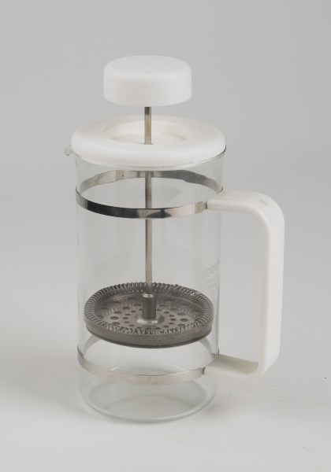
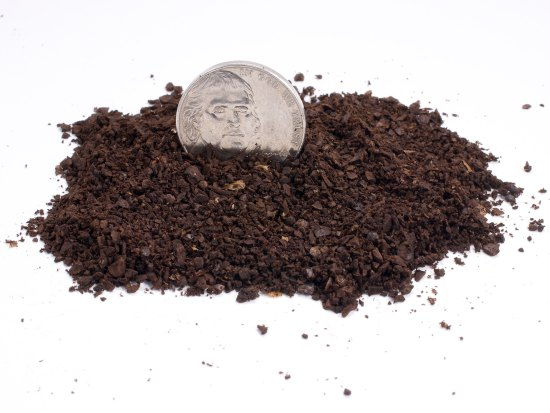
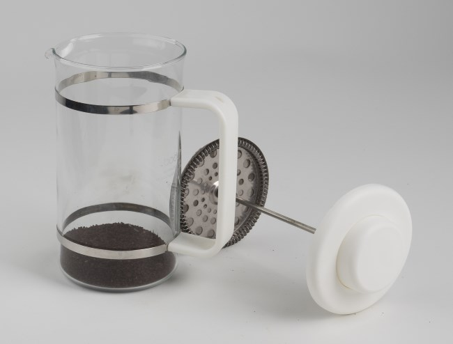
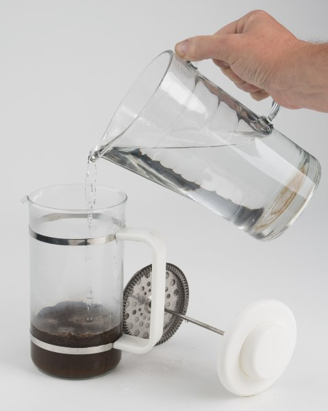
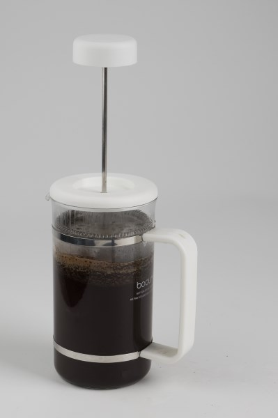
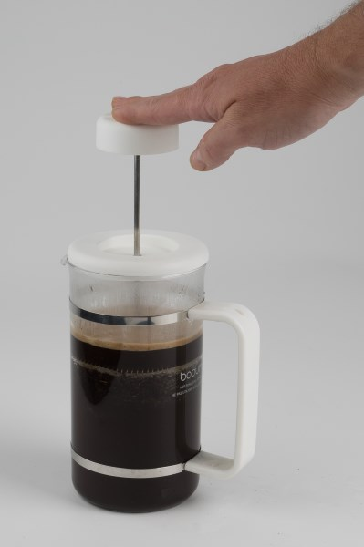
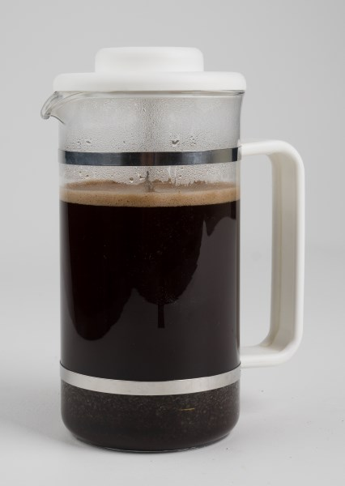
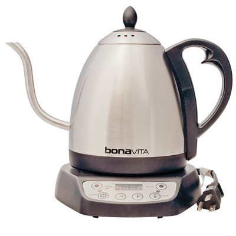

Of all the different coffee brewing methods, the one I’ve used the most is the French Press. Also known as a press pot or Melior, the French Press is a simple way to make a rich, delicious cup of coffee.

The French Press is a low-tech portable coffee brewing method. Let hot water steep over coarsely ground coffee for 3-4 minutes before pressing down the filter and serving. It doesn’t get more simple than that. This tutorial will go into the grind, water temperature, steep time, and fixing common issues when the brew is less than perfect.

### #1 Dosing The Coffee

By weight or by volume? Weighing will give you more repeatable results than using volume, as there can be more variance measuring when using tablespoons than a gram scale. However, the French Press is forgiving, so either method is satisfactory. We will cover both methods.

#### Measure By Weight

There is no consensus on the ideal brewing ratio for the French Press. Before putting this tutorial together, I visited the recommendations of many roasters and discovered ratios between 10:1 and 18:1. When I threw out the outliers and averaged the rest. The ratio came out to 15.5:1. That means 15.5 grams of water for every 1 gram of coffee.

The ranges were so different, which suggests that French Press coffee can taste great using different measurements and that precision is less important than in other brewing methods.

#### Measure By Volume

Going by volume, a good starting point is to use one tablespoon of coffee for every four fluid ounces of water. Some stronger recipes say one tablespoon of coffee for every 3 ounces. You may increase the amount of coffee to your desired taste. Below is a general range to get you started.

-   Bodum 3 cup (12 oz) = 3-4 tablespoons
-   Bodum 4 cup (17 oz) = 4-5 tablespoons
-   Bodum 8 cup (34 oz) = 9-10 tablespoons
-   Bodum 12 cup (51 oz) = 13-15 tablespoons

### #2 Grind Coffee and Heat Water

Before you start grinding the coffee, heat some water.

The French Press uses a coarse grind. See the photo below.

*From the [Coffee Grind Chart](http://ineedcoffee.com/coffee-grind-chart/)*

### #3 Add Coffee and Water to French Press

Add the ground coffee to the French Press. Once the water reaches a boil, wait about 30 seconds before pouring it onto the coffee. This will lower the temperature from boiling to around 200° F, which is ideal for brewing.

Start a timer and pour water onto the coffee grounds.

When you pour the water into the French Press, there may be a bloom at the top where the coffee is either clumped or does not make contact with the water. You can minimize that by pouring slowly and controlled.

### #4 Stir (or not)

Even if you pour slowly, coffee grounds might clump at the top and not be in contact with water. A gentle stir will solve that problem.

I used to stir the entire French Press. That is not necessary. Just stir the top inch. Use a chopstick or spoon. Some will advise using a wooden spoon as there have been cases where a metal spoon has cracked the glass of the French Press. But if you are gentle, that shouldn’t be a concern. The goal here is to get all the coffee-making contact with water.

After this, place the plunger on top of the coffee pot in the up position. This will minimize heat loss. Don’t press down yet.

### #5 After 3-4 Minutes, Press Down Slowly

The recommended brew time for the French Press ranges from 2.5 to 6 minutes, with 4 minutes being the most commonly cited time.

I have brewed thousands of French Press pots and prefer 3.5 minutes. It is full extraction and rich without being too heavy. Fellow INeedCoffee contributor Chris Arnold likes 2.5 minutes. At the other end of the spectrum, Seattle Coffee Works advises a 6-minute steep for Indonesian coffees (4 minutes for other beans). This will come down to personal preference.

Beyond all the debates about optimal brewing times, the reality is that in the kitchen, we can easily become distracted while waiting for our coffee to finish brewing. The longer the brew time, the more opportunities for distraction. Aiming for a 3—to 3.5-minute brew time has worked much better for me than the 4—to 6-minute range.

When it comes time to press the plunger down, be gentle, slow, and even. It should have some resistance, but not too much. You might need to grind a little finer if there is no resistance. If it is too hard to press down, use a coarser grind.

### #6 Serve Coffee

Pour and enjoy. French Press coffee will have some sediment. I usually leave 1/2-1 inch of coffee in the press pot to minimize getting that grit. I also don’t drink the last mouthful of each mug. The sediment doesn’t bother me, but I’d like to end each mug of coffee where the first sip tastes as good as the last sip, so I avoid the last few drops.

### Troubleshooting Bad Coffee

Beginners can make some mistakes early on that may result in less-than-optimal coffee. Below is a list of some common press pot problems and my solution.

#### Coffee Tastes Weak

The grind is most likely too coarse. Grind the coffee a little finer. Also, make sure you allow the coffee to steep for 3-4 minutes.

#### Coffee Tastes Bitter

The coffee may have been ground too fine. Next time, use a coarser grind. If the coffee is dark roasted, make sure it is fresh and lower the brewing temperature to 195 F.

#### Coffee Taste Too Strong

Use a 3-minute steep. Don’t let the brewed coffee sit inside the glass beaker brewing. Move it from the press pot to a thermal container, or brew what you need. Also, if you’ve been accustomed to drinking drip coffee, press pot coffee will taste richer at first.

#### Gritty/Thick Sediment

This could be a problem with the filter. Coffee sediment will go into the upper chamber if the filter doesn’t fit snugly against the glass. Filters can become damaged. You can purchase replacement filters.

#### Sediment Woes

If everything tastes right but the sediment is bothering you, consider purchasing the Espro Press, which has a tighter filter than traditional French Press coffee brewers. Another option is to cut up a paper filter, as shown in this hack.

#### Water Takes Too Long to Boil

I feel your pain. Boil only the amount needed for your press pot—don’t completely fill your kettle. If heating the water takes too long, consider getting an electric kettle. An electric kettle is one of the best investments you can make.

*Bonavita Electric Kettle  
*

#### Inconsistent Grind

My guess is you have one of those $20 blade grinders. Some of the coffee is coarsely ground, and some are fine ground. Getting an excellent grind from a blade grinder takes practice. Buying a burr grinder is ultimately a better solution.

*This discussion has been expanded into a full article: [Troubleshooting French Press Coffee](http://ineedcoffee.com/troubleshooting-french-press-coffee/).*

### Cleaning

The stainless steel French press is easy to disassemble and clean. Although it’s unnecessary to disassemble before cleaning, every so often, you would want to give your press pot a complete cleaning. For more instructions, read [Keeping Your French Press Clean](http://ineedcoffee.com/keeping-your-french-press-clean/). For day-to-day cleaning, I give my brewer a quick rinse. Occasionally, I will disassemble the parts and do a more thorough cleaning.

### Final Thoughts

Once you’ve dialed in the grind and the dosage, the French Press is a straightforward way to make great coffee. if you don’t have a French Press already, check out [Buying a French Press – Picking the Right One](http://ineedcoffee.com/buying-a-french-press-picking-the-right-one/). You can also use the French Press to make [Cold Brew Coffee](http://ineedcoffee.com/making-cold-brew-coffee-french-press/).