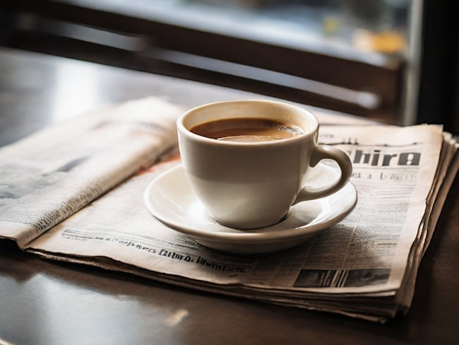

Nick Cho tirelessly advances the concept of coffee’s Third Wave. He chairs the United States Barista Championship, and he is the former owner of Murky Coffee in Washington, D.C., and Arlington, VA. One of Cho’s training techniques illustrates how he moved beyond Starbucks and the Second Wave — former Murky barista Jacob Grier describes how Cho gave his new employees money to buy their favorite coffee-based drink at Starbucks. Said newbies would then return to Murky, where Cho would make the same beverage. From *Murkey Remberences*:

> I’d consumed thousands of coffee beverages and spent countless nights in coffee shops, but I’d never paid close attention to what was in the cups. This all changed when I watched Nick deftly pour perfectly textured milk into espresso, a lovely rosetta forming on the surface of the cappuccino as if by magic. I’d never seen or tasted anything like it.

Cho closed up shop at Murky in May 2009, but last week he helped open *Chinatown Coffee Company* in Washington. Even during Chinatown Coffee’s inaugural week, Cho took the time to field some questions on the cafe economy, espresso contenders and pretenders, and the next chapter of Cho’s life with Chinatown Coffee.

**INEEDCOFFEE:** From your observation, has the economic downturn impacted business for coffeehouses?

**NICK CHO:** I’m hearing through industry channels that the shops that are quality-focused have actually done just fine, if not better than ever. When people have less money to spend they either spend less money (obviously), or they are more selective about the money that they do spend. That’s what I’ve been hearing informally.

Great quality coffee is still a very affordable luxury. A glass of the most famously expensive wine in the world can cost a few thousand dollars. A perfect cup of the most famously expensive coffee is still available for under $10.

**INC:** Are there any ways you recommend to distinguish a real coffeehouse from a pretender, without first plunking down the money for an espresso-based beverage?

**CHO:** Not really. It’s part of the state of the coffee culture right now, and hopefully, it’ll get better. I’ve seen a bunch of attempts at making a checklist of things to look for, but I can always think of a ton of exceptions that render that list irrelevant. This is the latest, and probably the best list I’ve seen: [TheShot’s Common Cues for Recognizing Good and Bad Espresso](https://web.archive.org/web/20190730172730/http://theshot.coffeeratings.com/2009/07/espresso-quality-signs/), but the same thing — I disagree with a bunch of them.

Actually, come to think of it, maybe there is something. I think that the best indicator is to watch the baristas themselves. Are they working and moving with real purpose? Are their eyes focused on their grinding, dosing, and tamping, or are they waving the portafilter around as they’re talking to their co-worker about last night’s party? Do they show the signs of people who are approaching the coffee with passion and professionalism, or could they just as well be working in a highway toll-booth?

**INC:** What’s your favorite coffee or espresso drink?

**CHO:** I have no favorite drink. As I’ve said for years: I don’t actually *love* coffee. I’m extremely passionate about coffee. I spend more time during the day thinking about coffee than I think about my kids. It’s because I want to show love for the people that are going to drink it… the coffee is going to become a part of their bodies after all, and that’s a huge responsibility. I’m in the people business, and coffee is my chosen tool.

**INC:** Do you remember trying coffee for the first time? About how old were you?

**CHO:** I was probably about 7, and it was an instant coffee. As an adult, I learned that for Koreans, the phrase “She makes a GREAT cup of coffee!” means that they mix a good proportion of freeze-dried granules, non-dairy powdered creamer, and sugar.

**CH:** Tell us about Chinatown Coffee Company. Besides the location, what are some ways it will be different from Murky?

**CHO:** To be clear, I don’t own Chinatown Coffee. This is a great opportunity to work with some great people in a really cool shop. Murky Coffee’s two shops were both taken over from previous businesses and being chronically underfunded, we never really got to do what we wanted to do facilities-wise. We definitely built a fan base who grew attached to the weird grunginess that was murky, but with Chinatown, I’m sort of in a new chapter in my life and career in more ways than one. Having the chance to build a shop from scratch and see it open has been a uniquely rewarding experience for me, especially because I’ve been fortunate to travel enough to become a sort of student of coffee shops around the world.

What’s different? We’ve opened in a much more mature coffee culture here in D.C. than when I started the murky shops back in 2002 and 2004. We can be even more quality-focused than before, and the response from our customers this first week has been phenomenal. Oh, and also the air-conditioning actually works and works well!

**INC:** The $64,000 question: Will *triple espresso on the rocks* be on the menu at Chinatown Coffee Company?

**CHO:** How self-absorbedly snarky will your resulting blog post be if you order it and you’re denied? 😉

### Sources

[Murky remembrances](https://web.archive.org/web/20160623192338/http://www.jacobgrier.com/blog/archives/2105.html) – by Jacob Grier

[Espresso, Extra Bitter](https://web.archive.org/web/20240806173228/https://www.washingtonpost.com/wp-dyn/content/article/2008/07/16/AR2008071602018.html) – By Joe Heim – Washington Post Staff Writer July 17, 2008