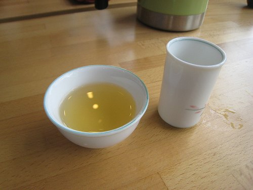

While reading up on the H1N1 virus, I found an interesting study measuring how tea could prevent influenza. You don’t even have to drink the tea. You can just gargle it. The study *Gargling with tea catechin extracts for the prevention of influenza infection in elderly nursing home residents,* which came out in 2006, took 124 elderly residents and divided them into two groups.

-   Tea Catechin Group – Gargled 3 times a day with a tea catechin extract solution.
-   Control Group – Gargled 3 times a day with a solution that had no tea catechin extract.
-   The study took place over 3 months.
-   Both groups were vaccinated with an influenza vaccine.

What was the result?

-   The Tea Catechin Group had a 1.3% infection rate.
-   The Control Group had a 10.0% infection rate.

That is a reduction in the infection rate of 87%. I’m guessing this is encouraging news for those people sensitive to caffeine who wish to get health benefits from tea catechins. Just gargle away! According to the Wikipedia page on Catechins, other health benefits include:

-   Reduced risk of stroke, heart failure, cancer, and diabetes.
-   Skin protection from UV radiation-induced damage and tumor formation.
-   Antibiotic properties.

  
*Tea Tasting – White Peony*

How bad could the flu season get this year? One measure is to look at places in the Southern Hemisphere that are going through winter. From *The Human Condition* blog on Newsweek:

> In Argentina, 20 to 25 percent of the population has been attacked by the flu over a three-week period. That could  easily occur in the United States, where pandemics typically attack between 25 percent and 40 percent of the population.

I’m making some tea right now. Not that I fear H1N1. Any flu is to be avoided. No gargling for me though. Tea is too tasty not to consume as intended.

### Sources

[Gargling with tea catechin extracts for the prevention of influenza infection in elderly nursing home residents](https://pubmed.ncbi.nlm.nih.gov/16970537/) – Medical study abstract.

[Catechin Wikipedia page](https://en.wikipedia.org/wiki/Catechin#Health_benefits_of_catechins) – Health benefits listed.

[You (Probably) Won’t Die From Swine Flu: Putting H1N1 in Perspective](https://www.newsweek.com/you-probably-wont-die-swine-flu-putting-h1n1-perspective-222162) – Human Condition blog post.