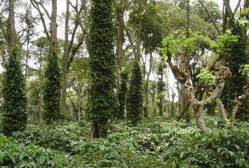

Shade Grown coffee has become synonymous with quality coffee. It refers to a method of growing coffee in a natural environment that includes shade trees and songbirds. Traditionally, coffee was always grown this way. Proponents of the product will say that growing coffee in this manner will protect the natural rainforests and that modern-day growing practices have resulted in an ecological disaster that can serve to eliminate certain animal species.

### A Canopy of Protection

Traditionally, coffee was grown under a canopy of shade trees. The natural shade provided several important environmental factors that allowed the coffee to grow:

-   Protection from the sun. This was important because prior to the use of “technified” plants, which exist today, coffee would not grow well under direct sunlight.
-   A natural home for migratory birds. Not only did these birds have a home, but they just so happen to prey on some of the pests that cause damage to the coffee crop.
-   Nitrogen fixation in the soil. This makes the coffee more sustainable and enhances its ability to grow without the need for additional fertilizer.

  
*Shade Grown Coffee Plantation*

### Technified Plants

As more aggressive farming practices took hold, however, this method fell to the wayside. Farmers discovered methods of being able to grow coffee in what seemed to be a more economical way. First, “technified” coffee plants were developed which were able to grow in direct sunlight. With this new ability, the shade plants could be eliminated, leaving more room for the coffee plant. Of course, with the elimination of the shade trees, comes the elimination of natural protection from pests and the lack of nitrogen fixation in the soil. No problem: all that is needed is some fertilizer and pesticides. Yet another seeming benefit of “shadeless” coffee is that coffee grows faster this way and thus returns a higher yield.

### A Return to Days Gone By

More recently, farmers have been returning to traditional methods of farming for several reasons.

-   Consumers are demanding organic coffee more and more.
-   Some have found that it is actually more economical to grow coffee using the “traditional” method. In addition to reduced cost, some of the variations of growing shade coffee allow for increased profits through crop diversification. There are, theoretically at least, fewer costs because you reduce fertilizer and pesticide usage. Not only do these chemical treatments cost money, but they also cost labor dollars to utilize.
-   This method is not as harsh on the land and increases the likelihood of continued crops.
-   Since it is perceived as more environmentally friendly (and it is) it provides a great marketing tool with which to sell to conscientious consumers.

### Is It Worth The Fuss?

Farmers are finding out that growing technified coffee is not as economical as once thought and has become a burden on the growing soils. It is a short-term success in a long-term commodity. If one plans on being successful indefinitely, then one must make sure that the commodity will prosper.

An obvious question that must be raised at this point is, ‘Is shade-grown coffee merely hype? Perhaps. Just how special is it to buy coffee that has not had any fancy chemicals or genetic engineering to it? Is this technologically inferior coffee worth the extra money? Will it alone prevent ecological disasters?

### A Taste Improvement

As to whether or not the coffee is special without chemicals, consider that shade-grown coffee takes longer to grow than the technified variety and this results in a richer, more mellow cup. There is a definite perceived taste difference, though I will abstain from saying one is better than the other. However, the flavor profile is different.

### Supply And Demand

When judging the value of shade-grown coffee, the laws of supply and demand are at work. Coffee that takes longer to grow will be more limited in supply than coffee that can be harvested faster. But there are, according to one source, fewer costs associated with growing shade-grown coffee. In addition, one can’t deny that there is a perceived health benefit to drinking coffee that has not been grown with the use of chemicals. Furthermore, some people don’t mind paying a little more for something that supports ecologically sound growing practices.

### Not All Shade-Grown Coffees Are the Same

There are several methods of growing shade coffee. Not all of them are exactly natural, and not all of them are as ecologically sound as the others. Below, I will briefly review the four basic types.

1.  **Rustic:** This style involves clearing out the low-level growth in a forest and replacing it with coffee. The more elevated shade trees remain to provide protection to the coffee tree. While this method allows coffee to be grown without the use of chemicals, it does eliminate other wildlife.
2.  **Traditional Polyculture:** This involves choosing certain species of trees which will grow alongside the coffee. A technique that has benefited farmers is to grow other cash crops such as orange and banana trees with coffee. If this method is managed carefully, farmers can increase the yield of all crops that are being grown.
3.  **Commercial Polyculture:** This system of coffee farming includes selecting a variety of shade canopy trees that protect an understory that is only coffee.
4.  **Specialized Shade:** Specialized shade method utilizes only one type of shade canopy tree with which to protect the coffee. While the Commercial Polyculture and Specialized Shade seem more like planned forests than natural, they still provide habitat for wildlife.

### Finding Shade-Grown Coffee

Many of the major players in the coffee industry are offering some sort of shade-grown coffee. Many of them are blends and many are straight varietals. The good news is that there is a minimal price difference between coffee grown this way and a more conventionally grown equivalent, about a dollar or two per pound.

In order to make sure you are getting a true shade-grown coffee, you should check with your roaster to ensure the coffee is certified as shade-grown. Without the certification, you may not be getting the coffee you thought you were. The coffee industry has, on several occasions, become prey to shysters out to make a quick buck. Simply put, be aware. Furthermore, many coffees labeled organic are actually shade-grown themselves. A little investigation could reveal a good find.

### Conclusion

Deciding whether or not shade-grown is simply the latest hype or a valid product worthy of praise is yet to be determined. At the outset, however, it certainly seems to embody the idealisms of nature itself. Ultimately, the consumers must decide if it is worth their hard-earned dollars.
