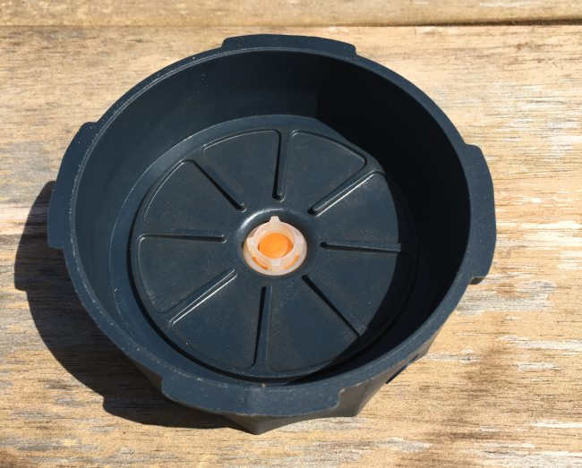
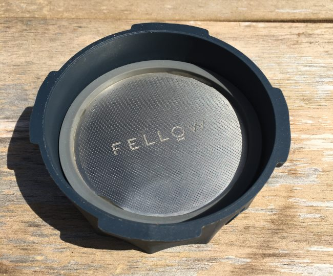
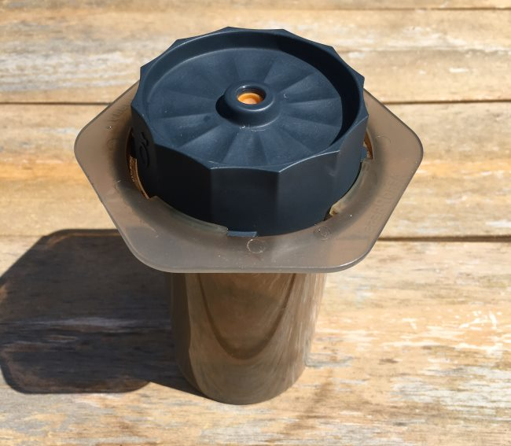
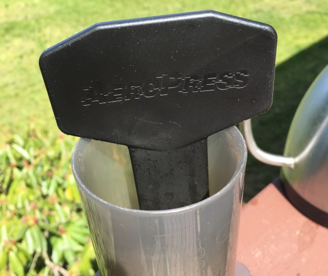
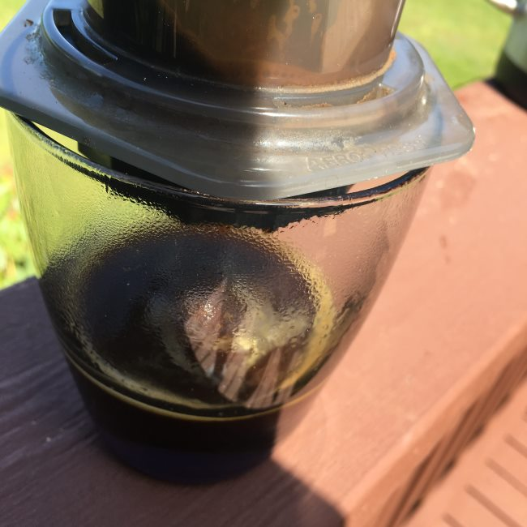
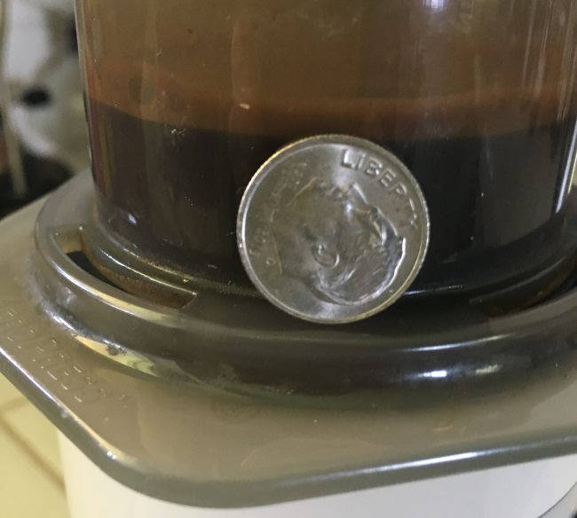

Fellow recently developed the Prismo, a custom AeroPress filter for making espresso shots. Is it possible to make espresso shots with the Prismo filter for the AeroPress?

I have been trying to get my AeroPress to make something closer to a true espresso shot for almost two years. While I know that an AeroPress can never match a commercial espresso machine that can generate 9 bars of pressure, that hasn’t stopped me from trying.

With my AeroPress, I can make concentrated coffee “shots” with characteristics similar to those found in espresso. Not every “shot” impresses me. Some beans work better than others, and some beans don’t work at all. It is a game, and I play it daily.

When it comes to making “shots” with the AeroPress, I have discovered that I can get closer to replicating lungo (longer) shots made from lighter roasted single-origin coffees. The AeroPress doesn’t come close to the deep, syrupy tastes one can get from a true espresso machine for traditional espressos or ristrettos.

If the Prismo could improve my shots by 10%, it would pay for itself quickly. Every shot I make at home is one fewer shot I purchase at the coffee shop.

Before the review, let me show you how the Prismo works.

### Brewing Coffee with the Prismo

The Prismo replaces the filter that ships with the AeroPress, so the original filter can be set aside.

Add the metal filter inside the insert with the Fellow logo facing up.

Attach the Prismo to the AeroPress chamber. If you are used to making AeroPress using the Inverted (aka [Upside-Down method](/upside-aeropress-coffee-brewing-tutorial/)), you do not need to do that with the Prismo. The Prismo will hold all the coffee in the brewing chamber until pressed, thus giving you a full immersion brew.

Fellow recommends using 20 grams of finely ground “espresso blend or darkly roasted coffee”. They also recommend adding 50 ml of water taken to 212 F. I disagree with this recipe and will go into more detail about why later in the article.

But for now, let’s get back to brewing.

It is very important to stir the coffee so that all the grounds are making contact with the hot water. Fresh coffee tends to form clumps, and when you stir, you want to break up those clumps.

After one minute, push the plunger down. It will put up a bit more resistance than the standard AeroPress. And now you have your Prismo AeroPress shot.

In the photo above, I used a glass. That was just for this tutorial. Normally, I use a ceramic mug and rinse it with hot water before plunging. This prevents the coffee from cooling too fast.

### Fixing the Prismo Recipe

As I hinted above, I disagree with the recipe that ships with the Prismo.

#### Water Temperature

Boiling water is too hot for brewing coffee. If you do boil the water, let it cool a bit before you pour it into the AeroPress. How long? It depends. Use a thermometer, or a better idea is to get an electric kettle, where you can dial in the exact temperature you need. For the Prismo, I use 202 F.

#### Style of Coffee

I was not able to get anything close to espresso when using darker-roasted coffee. All I could get was bitter coffee that lacked that mouthfeel one gets when they have a ristretto-style espresso, which is common with darker-roasted coffee. Espresso blends that were medium-roasted fared better. Sometimes, they were fine, and sometimes, they were flat. It was hit or miss.

I got the best results with medium-light roasted single-origin coffees. They were closer in flavor and texture to the longer single-origin shots being pulled at the newer coffee shops in Seattle, Portland, and San Francisco. During my tests, I had better and more consistent results with washed coffees (Colombia, Kenya) than naturally processed coffees (Peru, Oahu, Ethiopia).

#### Espresso Extraction

Fellow’s ratio is for dark-roasted coffee. If you are going to take my advice and go lighter, you’ll need to adjust that ratio. As I mentioned earlier, lighter coffees, when pulled as espresso, have more volume. The reason for this is that the bean is less porous than a darker-roasted coffee, so it requires more effort for the water to make contact with the bean. You could increase the steep time or increase the water volume.

Starter recipes for 20 grams of coffee.

-   50-55 grams of water for darker roasts
-   60-65 grams of water for medium roasts
-   70-75 grams of water for lighter roasts

*If you do not have a scale to weigh the water, the above photo shows 20 grams of coffee and 70 grams of water with a US Dime. The dime is slightly leaning.*

### Tips

You can use the Prismo to brew regular-strength coffee. Just use a normal grind size. You’ll save money on paper filters and have rich, full-immersion coffee without needing to brew inverted.

The Prismo makes a tighter connection than the standard filter. As a result, it is a little harder to lock into place and much harder to take off. I advise removing the filter just after brewing while it is still warm. If it cools, it can take tremendous effort to come off.

One idea to help you grip the Prismo better is to cut a custom-sized piece of non-adhesive shelf liner, such as the one by Duck Brand.

### The Verdict

I’ve never been more unsure about a coffee product. Personally, the Prismo does seem to slightly improve the flavor of my “shots” compared to the shots I make when brewing with the AeroPress regular style. However, when I brew inverted, that edge disappears.

Prismo does well by holding all the coffee in the brewing chamber until the plunger is pressed. Anyone with an AeroPress that brews regular-style knows that some of the coffee exits the chamber throughout the brew. As your AeroPress ages and the seal gets looser, that process can accelerate, so some of the coffee is likely under-extracted. This is something you may not notice with brewed coffee but will with espresso-style shots.

Who will benefit from the Prismo?

-   If you like a richer full-immersion coffee, but do not want to brew inverted (flipping the AeroPress from an upside-down position).
-   The Prismo also eliminates the need to buy paper filters. If you are tired of running out or ordering new paper filters, the Prismo may pay for itself.
-   If you have tried making espresso “shots” without the Prismo and feel like you are almost there and that you just need to improve the shot a little, the Prismo will be a must-have.
-   Fans of lighter-roasted single-origin espresso wanting to save some money they would have spent in the coffee shops. The Prismo won’t make true espresso like a cafe, but it might be close enough for your tastes.

Who won’t benefit from the Prismo?

-   Someone who is already proficient and comfortable brewing with AeroPress using the inverted method. You might experience a slight improvement, but it will be much less than those that brew regular style.
-   If you have tried making espresso shots before with the AeroPress and feel it isn’t even close to the espresso machines, don’t expect magic from the Prismo. If a 10% improvement is not enough, save your money.
-   If your coffee grinder doesn’t grind finely and consistently, save your money for a better grinder. A better grinder will improve your coffee quality more than a Prismo.
-   People with weaker grips. See Tip #2 above.

I will keep brewing with my Prismo, and if I discover any more valuable tips, I will update this article.

### Resources

[The Upside Down AeroPress Coffee Brewing Tutorial](/upside-aeropress-coffee-brewing-tutorial/) – How to brew AeroPress coffee using the inverted method.

[AeroPress Coffee Maker Tutorial](/aeropress-coffee-maker-tutorial/) – Original INeedCoffee tutorial.

[Making Lattes Without an Espresso Machine](/making-lattes-without-espresso-machine/) – Which brewing method came closest to espresso?

*Disclosure: INeedCoffee was sent this product at no cost, which did not affect its review.*
