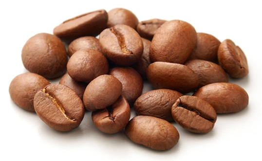
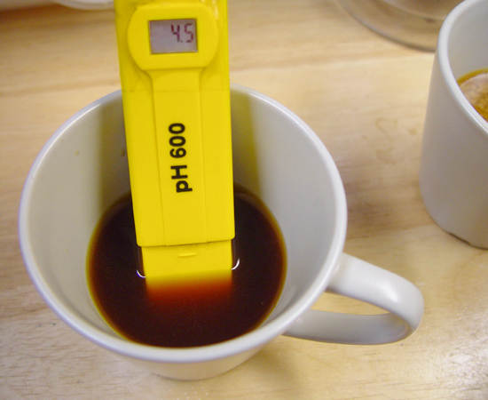
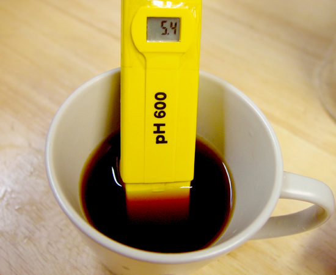
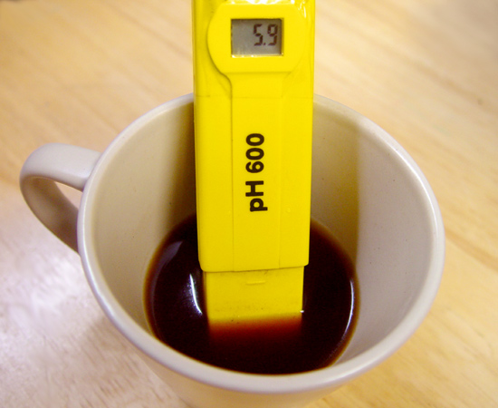

Blonde roasts are one of the fashionable trends in coffee, and while it seems that many consumers do have an appetite for these, we see a lot of confusion in print and media about this “lighter than Light” roast level. We also have concerns about the high levels of acidity seen in extra-light roasts and wonder, “Are they even healthy?”

In the past, this level of roast has often been called Cinnamon Roast, but that term has fallen out of favor because too many consumers confuse the word Cinnamon with a flavoring and not just a color.

While Starbucks® promotes the term Blonde Roast, they define it in their advertising as not related to color so much as “light-bodied and flavorful – our easiest-drinking coffee” and “a true light roast”, yet when we pour the beans onto any number of standard roast charts, they match more to a Medium Roast level. And we see many roasters offering what we would call a true Blonde, yet they either do not provide a term for that roast level or seem to make up their own.

So, for the sake of defining a roast genre here and possibly reducing confusion in the print media, we are defining Blonde as beans roasted to the very light level shown in the opening picture and defined in roasting terms later in this article. This level of roast results in higher acidity and a very different taste profile from other roasts because certain physical changes have not taken place in the beans, which would take place further along in the roast time for darker roasts.

### What is the Attraction of Blonde Roasts?

Human beings vary greatly in the makeup of their tasting apparatus. Just as some people are “color-blind”, and some people are “tone-deaf”, we find that people have a wide spectrum of taste preferences and sensitivity levels. Some like hot and spicy food, while some recoil from it, for instance. And it seems that people prefer a widely different level of acidity.

Blond roasts will always be more acidic than darker roasts of the same coffee simply because heat breaks down the acidity more as it roasts longer and hotter. The high acidity of Blonde Roast is generally perceived as a lemony, citrusy, or sour taste, and seems to be craved by some people. Darker roasts experience more of the “Maillard reaction”, which primarily refers to the caramelization of sugar and reactions with the beans’ amino acids that produce buttery, caramel tones, while the citrusy notes are being reduced.

Why would some people crave a citrusy character in coffee that others may find unappealing?

### The “Tongue Map” and Why People Taste Differently

Research shows that the historical “Tongue Map” first presented and popularized by German scientist David P Hänig in a 1901 paper titled Zur Psychophysik des Geschmackssinnes is not really accurate, even though we see these diagrams in Physiology classrooms even today. The Tongue Map defined regions of the tongue that are highly specialized in how they respond to essential components of taste such as sweetness, sourness, bitterness, etc.

More modern research shows that although different parts of our taste apparatus seem more responsive than others to particular taste elements, if we block a region, its “assigned” sensitivity will still be perceived by other parts of the sensory apparatus, which includes not just the tongue but the nose and throat. We also know that some of the population are what is called “supertasters”, with 3-4 times more sensitivity than “non-tasters”, the 25% of the population with very low taste sensitivity.\[1\]

Not only does our strength of taste perception vary tremendously, but some people are super-sensitive to some taste elements and not to others. Let’s also add in the fact that people who favor the front palate tasting apparatus (includes most of the nasal aroma detection) are approximately half of the population versus people who favor the anterior sensory apparatus (including the sensors on the back of the tongue and throat that are more closely associated with taste recall in the insular cortex of the brain).\[2\]

Front-palate people will tend to prefer coffee strains like Arabica Typica, Ethiopians, etc., that are high in aroma and acidity, whereas back-palate people will prefer strains like Robusta, Catimor, or Arabicas such as Bourbon or Caturra, which are higher in body and generally lower in acidity.

We (and probably you) have friends and acquaintances who love to suck on lemons and other sour foods, while others aggressively reject food with any acidity or sourness in it. It would appear to be a normal distribution of diversity in terms of not only sensitivity level but also preference based on experience (their past diet and culinary heritage).

Considering this landscape of human deviation, how can any coffee pundit even attempt to declare that any one type of coffee or roast is The Best, or is right for everybody, and expect us all to learn to love it even though we may not like it at all? That’s the fundamental concept of a uni-dimensional approach to what makes coffee “good” or “right”.

In over 30,000 blind taste tests we have performed among the general public, we have seen that people’s taste preferences in coffee run all the way across the board in every regard, including roast level, species of coffee, and flavor attributes.

### The Roast Chart

We look at roast charts and use assign names to colors of roasts, but oftentimes we can understand more how a roast will taste when we define them by roast time and what is taking place in the beans.

Note on the roast chart that we created for our own use, and is reproduced here, we have simplified what is often a complex listing of 9 or more levels to the ones most easily understood in coffee jargon by consumers and hobby roasters. We personally dispensed with distinctions like “Full City ++” as being ridiculous in practical use because no two coffee roasters ever assign the exact same color or temperature to designations like that, so it tends to be meaningful only when comparing offerings from the same roaster.

So here we show six stages from Light to French Roast. Note that there is no “Blonde” or “Italian” or “Spanish” Roast on our chart. We chose to show roasts from Light to French Roast because these are the ones we think the largest percentage of the population can perceive and appreciate best, and also due to safety and health concerns. Beyond French are roasts that are hazardous to the roaster (they particularly present a serious danger of fire when home roasting), but also, French Roast is the point at which you begin to burn the sugars and oils in the beans, rendering them (in our opinion) unhealthy as a food… creating excess amounts of polycyclic aromatic hydrocarbons and acrylamide, etc.

The AMA and most health organizations have come around after years of persecution of coffee to believe that the net result of consuming up to 4 or 5 cups of coffee a day is a lot more positive than negative, protecting against many forms of cancer and other illnesses, but beyond a certain dark roast level, the balance tips the other way. Basically, burnt food is not good for you!

### Are Blonde Roasts Also Outside of the “Healthy Range”?

Let’s talk about what happens on the other end of the roast scale. Notwithstanding taste and flavor profiles and preferences, is Blonde Roast healthy?

In referring to the scale we show here (and simplifying greatly), Light Roast is generally the point at which a phenomenon called “First Crack” is fully achieved on the beans… and if we had Blonde on this chart, it would be defined as air roaster temperature of ~415°F and the color achieved before First Crack., or shortly after the beginning of First Crack. The first crack is basically similar to popcorn when it pops – the moisture inside the beans turns to steam and expands suddenly and forcefully, creating a strong “popping” sound.

If you do not turn the heat off after First Crack you pass through various stages prior to reaching Second Crack, which is when the beans pop again. At Second Crack, the sound is much quieter, generally referred to as a crackling sound, that is more like pouring milk on puffed crispy rice cereal. Second Crack may come fairly close on the heels of First Crack or it may take several minutes, depending on the beans.

The stages shown on our chart as City, Medium, and Full City occur between First and Second Crack. Generally, as Second Crack starts, you leave Full City territory and enter Dark Roast territory. If you wait until the end of Second Crack, you generally have a Dark Roast. French Roast is usually achieved by going anywhere from 30 seconds or so beyond Second Crack until there is a point at which smoke from the roaster increases exponentially. If you quit 10-20 seconds after you see this rise in smoke, you will be in the neighborhood of French Roast. If you wait too long you will quickly pass into Italian/Spanish Roast territory, which basically translates into “burnt coffee beans”, then quickly enter the danger zone known as “Conflagration Roast”, at which point the beans burst into flame and the fire department learns that there is another Newbie Roaster in the neighborhood.

*(By the way, there is no such designation as “Conflagration Roast”; this is a joking term to define the range in which a fire is more likely to break out in your roaster.)*

So if the Blonde or Cinnamon Roast level is basically what you have before you enter or finish First Crack, what is happening inside the beans? They do not pop, which makes the beans, as a food, significantly different in taste and biological composition from beans that have been through First Crack. Some of the characteristics:

1.  The beans are very hard. They couldn’t be used in chocolate-covered bean confections and they may even wear down a small grinder over time due to their hardness. The cracking of the bean and the length of time exposed to heat in the roaster lowers the density of the bean, but less expansion and drying occurs in Blonde Roast.
2.  Many of the flavor compounds we traditionally associate with the taste of coffee are not converted from sugars to those buttery or caramel tones. Many of the aromatics that give the coffee a fruity and sweet note do not burn off at this roast level, so there may be a plethora of these tones, which some people really enjoy. It is said that there are over 800 flavor components in coffee, which are continually being expressed at different stages of aging, roasting, time resting after brewing, etc.\[3\] It is a common conceit to say that Blonde Roast showcases the “real” flavor or nature of the bean… but all roast levels showcase a complex process affected by the quality of the bean and what it has extracted from the soil and converted from sunlight.
3.  The acidity of the beans is not reduced anywhere near as much as with darker roasts. And acidity of coffee is a health issue for many people who will suffer medical symptoms if they consume liquids with high acidity like tomato juice… or Blonde-Roast coffee.

### How Acidic is a Blonde Roast?

A quick overview of the acid-base scale shows us numbers with a range of 0-14, with base or alkalinity at the higher numbers and acidity at the lower numbers, and the scale is logarithmic, meaning that each whole digit is a multiple of 10 of the one below it in terms of acid ions. This means that a level of 4.0 has 10 times as many acid ions as a level of 5.0.

Readings from cups of brewed coffee showing a Blonde Roast purchased from a local roaster, our own Medium Roast, and our own Dark Roast, in that order:

*(Readings were taken using a simple, inexpensive lab PH meter, in this case, a Milwaukee Instruments ph600 unit … consider getting one if you are at all interested in the acidity of the coffee – and other liquids – you consume. You will get accurate readings if you start each session by calibrating to a known liquid-like distilled water first.)*

*4.5 – Blonde roast coffee*

*5.4 – Medium roast coffee*

*5.9 – Dark roasted coffee*

For easily understood reference, here are a few acid/base numbers for foods we recognize:

**9.0:** Tap water adjusted for high alkalinity to avoid leaching of lead and other metals from the pipes

**8.0:** Seawater

**7.0:** A common “neutral” reference point for distilled water, etc., often used to calibrate the PH sensors

**6.3:** Naturally occurring water as found in mountain streams and many springs (not hot springs or springs coming from limestone)

**5.9:** A common reading for ripe-bean brewed Dark Roast coffee (see picture 3 above)

**5.4:** A common reading for ripe-bean brewed Medium Roast coffee (see picture 2 above)

**4.7 – 4.9:** A common reading for brewed coffee from commercial coffee brands that use a significant percentage of unripe coffee beans (we will not name names).

**4.4 – 4.6:** A common reading for ripe-bean brewed Blonde Roasts (see picture 1 above)

**4.4:** Tomato juice

**3.0:** Vinegar (ranges from 2.0 to 3.5 depending on type and concentration)

**1.0:** Battery acid

The level at which a food or drink can start to have adverse effects on stomach acid is anywhere under the 5.0 range. Our bodies expect food to be in a certain acid range, and we adjust our stomach acid levels to compensate for and produce the right acidity during digestion. When foods have an acidity level below 5,0, many individuals will experience stress from being unable to keep the acid level of the stomach in a good balance for health. Side effects include acid stomach, stomach ache, cramps, heart palpitations (not related to burnt elements), esophageal spasms, and other symptoms of GERD.

One great indicator of coffee acidity: Soy milk or soy creamer. Soy milk curdles easily in most coffee, but soy creamer is more stable. When you add soy creamer to coffees that are above the 4.8 range, the soy will not curdle. When you add soy creamer to coffee below that PH, you get this:

*Soy creamer added to an acidic coffee.*

Unfortunately, acidity at this level has to generally be considered not very healthy for people, especially if consumed on an empty stomach.

Some Blond Roasts have 10,000 more acid ions per ounce than PH-adjusted tap water, and are closer in acidity to vinegar than they are to most Dark Roast coffees!

### The Effects of Brew Temperature and Extraction on Acidity

Despite a lot of common myths about extraction ratios, brewing temperatures, and brewing methods, we found acidity concentrations to remain very consistent in the tests we performed for this article.

Tests were done using a French Press, a Vietnamese drip brewer, a standard drip brewer, an espresso machine at the highest temperature and pressure, and a cold brew performed at several variations in concentration from 1:3 coffee to water to 1:4 coffee to water. Brew temperatures ranged from 70° (for the “cold brew”) to 205°F for the espresso. The variance in all cases was under .2 on the meter for all tests. We found the commonly held belief that cold brew is less acidic to be largely inaccurate… although there was a .1 – .2 drop in acidity for the cold brew, we can’t really call that significant.

Our conclusion: The main variables for acidity are the coffee variety and the roast level. The roast level could change the acidity by 3000%, whereas other variables were under 20%.

### Some Benefits of Blonde Roasts

Recent research has pointed out the awesome anti-oxidation benefits of coffee in general, and also something that was not generally known: The “silverskin” of the coffee bean has health properties similar in nature to ascorbic acid (Vitamin C) and up to 400 times the efficacy of Vitamin C pound-for-pound! Researchers and developers are looking at ways to harness the anti-oxidation and health benefits of coffee silverskin as a food supplement for populations suffering from lack of naturally occurring Vitamin C or other anti-oxidants. The great thing about this substance is that it is not destroyed by the heat of brewing, even though it is reduced. Even discarded coffee grounds contain a large number of antioxidants.\[4\]

The lower the roast level, the higher the amount of many of the beneficial substances of coffee. However, there is a limit. Green, unroasted coffee beans actually have no antioxidant effect. The beans need to be heated to 170° or more to create the chemical change that activates these antioxidants. Also, green beans have many substances that are not healthy, and can even cause nausea and other strong effects. These substances are converted to other molecular structures that are not harmful when coffee is heated, which is why it is generally recognized that green bean extract should not be made from uncooked beans, but rather from beans boiled for at least 12 minutes.

Blonde Roast coffee has significantly more antioxidant potential than darker roasts, so there is a health benefit there.

### Summary

Whether or not you enjoy the taste of Blonde Roast coffee, you should be aware of the high acidity of Blonde Roasts and adjust your consumption to fit your own sensitivities to acid. Fully ripe high-quality beans produce less acidic brews (a subsequent comparison Blonde Roast of our own Nicaragua Matagalpa Catimor tested at 4.8, about 25% less acidic than the original test Blonde).

Since higher temperature roasts reduce the amount and benefit of many of the substances that make coffee great for your health and disease resistance, Blonde Roasts carry more benefits in this regard.

The acidity of Blonde Roasts may get negative reviews from many people, who will perceive them as “sour” or acidic-tasting. However, can there be an objective “right” or “wrong” for coffee, considering the tremendous diversity of the population’s tasting physiology?

In the end, aside from the negative of high acidity, whether Blondes have more fun dancing on your tongue versus the Brunette Roasts is largely a matter of personal palate preferences. Our research in performing over 30,000 blind taste tests in public settings has led us to believe that fewer than 20% of the population will prefer the taste of a coffee that is outside the “Light” to “French Roast” range, but for those who do, *vive la différence.*

### References

1\. [Physiology of taste, online reference](http://web.archive.org/web/20170323164848/http://arbl.cvmbs.colostate.edu/hbooks/pathphys/digestion/pregastric/taste.html) – Colorado State University

2\. Physiologie du goût (The Physiology of Taste), published in December 1825 – Jean Anthelme Brillat-Savarin

3\. [Coffee Flavor Chemistry](https://www.wiley.com/en-us/Coffee+Flavor+Chemistry-p-9780471720386) – Ivon Flament  
ISBN: 978-0-471-72038-6  
November 2001

4\. [Food Chem. 2012 Dec 1;135(3):943-9. doi: 10.1016/j.foodchem.2012.05.078](https://pubmed.ncbi.nlm.nih.gov/22953809/). Epub 2012 May 28.  
High antioxidant activity of coffee silverskin extracts obtained by the treatment of coffee silverskin with subcritical water.  
Narita Y1, Inouye K.