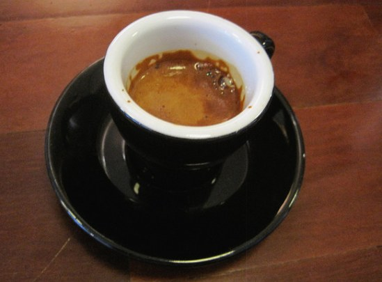
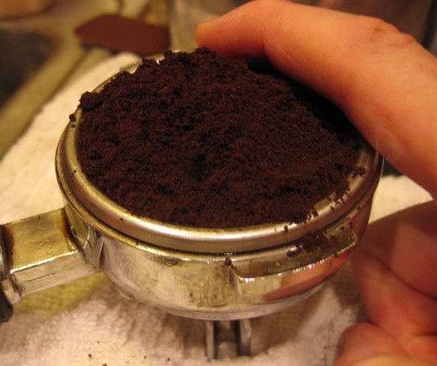

Not all espresso makers are the same, so you need to know what type of machine you have.

Do you have a machine where you pour fresh water on top and then screw the lid down? Then, chances are that you will have a steam-driven machine. If your machine has a huge reservoir and makes all sorts of noises when you push a series of buttons that look like some kind of computer panel, you have a pump-driven machine.

  
*Espresso Shot*

### The Grind

Coffee should be ground for your type of espresso machine.

Grinding for pump-driven machines is slightly longer than for steam-driven machines; the coffee must be fine ground because steam-driven machines don’t have as much “oomph” to push water through. The grind for pump-driven model machines should be shorter and, therefore, more coarse.

Other factors that make a difference are heat, humidity, and where your coffee is stored. Now, I’m not trying to bore you, but these items can be vital if you are trying to achieve consistently perfect espresso shots.

### Pulling The Shot

Once you know what machine you have and the coffee is ground, it is time to pull shots.

1.  The actual measure should be a tablespoon of espresso ground coffee for every 1 ounce of liquid. For you techies, that’s 7 grams per ounce.
2.  Put the ground coffee in your portafilter.
3.  Carefully tamp the ground coffee, and then wipe any excess grounds from the rim of the filter.
4.  Place your filter in the machine’s group and place the shot glass or glasses underneath.

  
*Level Espresso*

The Trick: Get an inexpensive timer or use your stopwatch (the one you had to have for your New Year’s Day resolution that you will train with) and learn to “time” a shot.

A good espresso machine should yield an ounce of liquid between 18 and 23 seconds. You can get away with a 17-second “sweet” shot, but NEVER exceed 23 seconds. The longer, the more bitter; the shorter, the less flavor you taste. If your shots pull too quickly, your grind is too coarse. If the shot is too slow, then the grind was too fine.

### Tips For Consistency

How do you get consistent shots?

-   Buy enough coffee for only one week. This may sound silly, but coffee starts to “air” out after seven days. So, as time goes by, the quality and flavor diminish.
-   Keep the coffee in a sealed container. Store in a cool, dry place. Heat and humidity negatively affect coffee!
-   Try to grind the coffee yourself. The best thing to do is to grind the coffee right before you pull the shot and only grind enough coffee for an ounce or two. This will allow you to make any necessary adjustments to the grind for future shots. Grinding the coffee at home ensures that your coffee has that “just ground” flavor you would experience at a coffee house.

### A Work Of Art

Just how is it supposed to look and taste? The perfect shot has a sweet yet intense flavor, and it should have a beautiful caramel look at the top. A shot has three parts: the crema, the body, and the heart. The crema, the foamy part of the shot, should be sweet. The visual clues of the other two parts will help you understand how the shot will taste. As you pull the shot, notice how the layers separate as the liquid gets to the “ounce” mark on the glass. It looks as if an artist was at work! And you are!!
