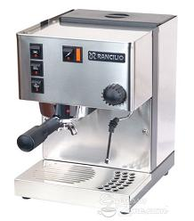
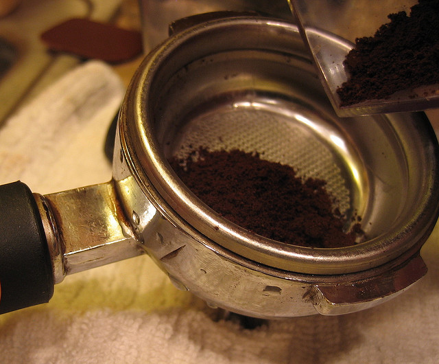
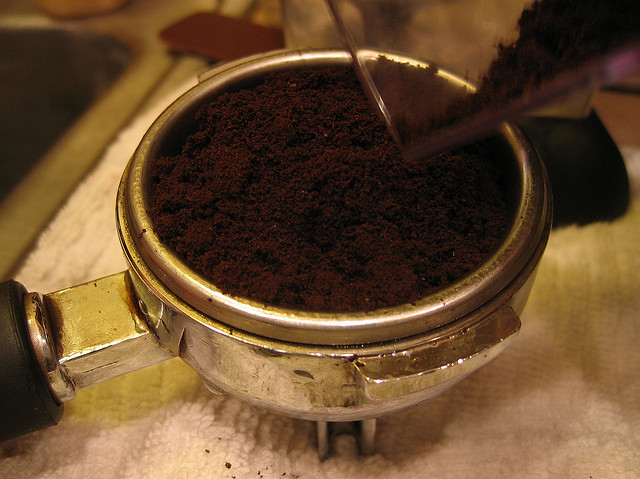
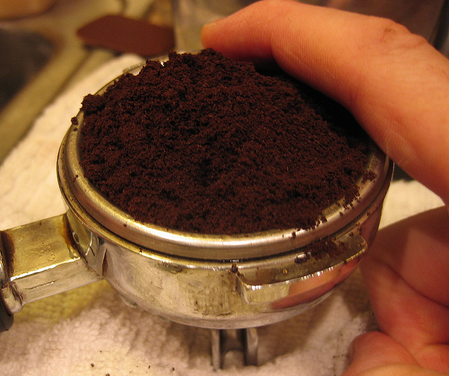
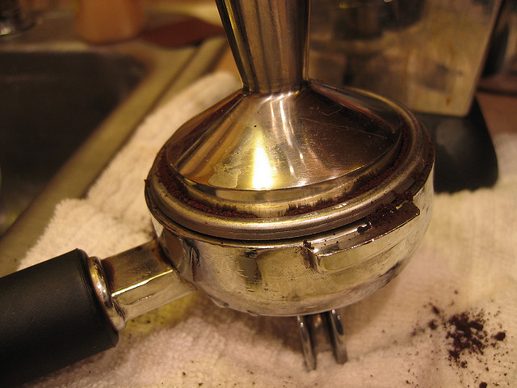
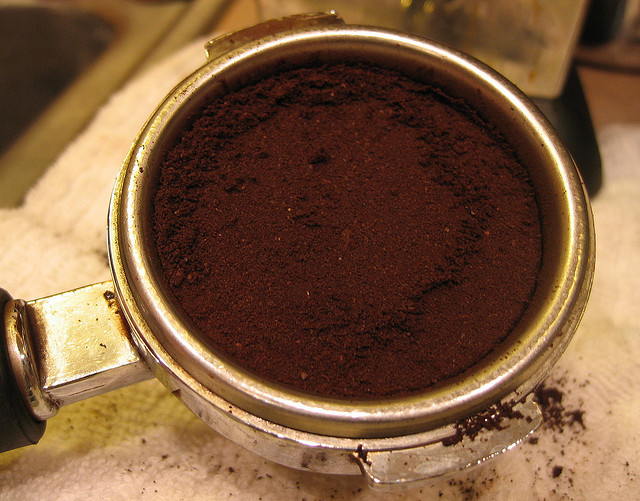
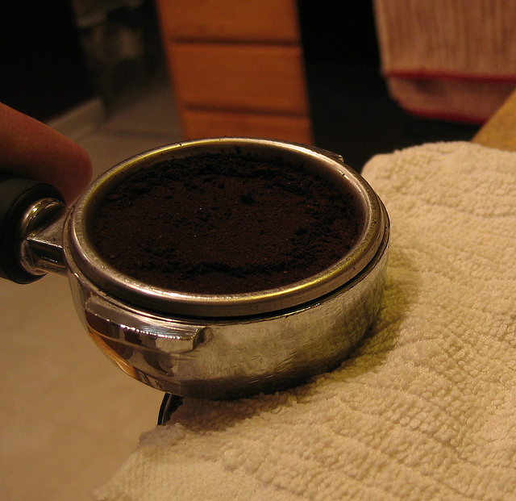
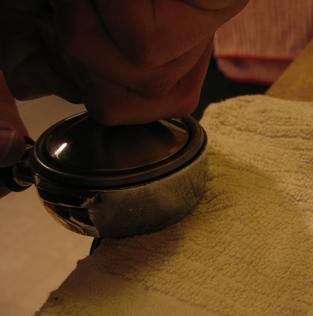
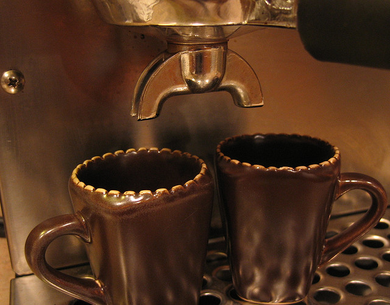
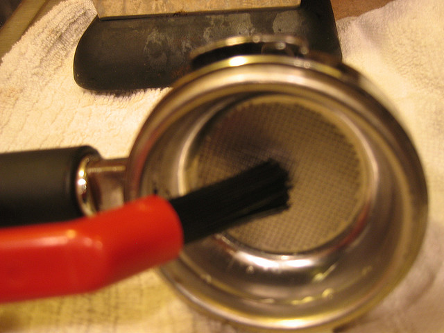

Using the Rancilio Silvia Espresso machine can be a bit intimidating if you have never used an espresso machine at all or even if you have previously used a machine that controlled a lot of the variables for you. The machine to a large degree assumes you know what you are doing. If you don’t, it can’t compensate for your mistakes. Below are some tips I have learned from others and from personal experience.

### Heating the Machine

It takes a bit of time for the machine to come up to temperature. When you turn the machine on, a light will turn on indicating that it is heating and once the light goes away you are left with the impression that the machine is up to temperature. It isn’t quite the case. If you do nothing else, the machine will be at a good temperature in about 20 minutes — but I really don’t like waiting.

There are two general ways to improve this that I am aware of:

1.  **Leave the machine on all the time:** This method is pretty much as straightforward as it sounds, but doing this can cause the gaskets in your machine to dry out and crack prematurely. That said, my understanding is that if you choose this method and leave the portafilter in the group, it will help prevent the drying condition immensely.
2.  **Force more heating cycles:** After initially turning the machine on, the light turns on, indicating the start of a heating cycle. Once it turns off, brew an empty shot through the portafilter. Typically, at the end of this, the light will kick on again for another cycle. This is a good time to dose and tamp our espresso and insert it into the portafilter. Now, put a water pitcher under the steam wand, turn on the hot water, and open the valve. Again, let this happen until the light turns on. At this point, you can brew your first shot. Some people swear by more cycles, but I find this to work quite well. As a point of clarification, you only need to cycle the machine upon first turning it on. Subsequent shots should be fine at this point.

  
*Rancilio Silvia Espresso Machine*

### Grinding the Espresso

The Silvia is a fairly advanced home espresso machine and as such is very unforgiving to poor grind and tamping. You’ll have to step your game up a notch. I found that my Starbucks Barista burr grinder just wasn’t adequate anymore, but I did find out it could be [recalibrated with a little work](http://ineedcoffee.com/hacking-the-starbucks-barista-grinder/). Certainly, you will want a capable burr grinder — there are many to choose from with varying degrees of settings. What is important is to make sure you have fine enough settings for espresso. Another consideration here is if you can grind directly into the portafilter. That feature will help on the tamping side a bit.

### Tamping the Espresso

You need a good tamper. I really am fond of the heavy stainless steel tampers sized perfectly for the Silvia. Some technique helps also. I found the following steps to really help my tamps.

Dose as directly into the portafilter as possible. If you can’t grind directly into your portafilter, use your grind collection basket to dose from. The idea here is to prevent inconsistencies in the puck that might happen from scooping or any other activity that sort of packs the grind prematurely (i.e. before it is in the portafilter).

Overflow the portafilter just slightly using this method and then do a curved finger sweep to lightly spread the grounds. Again, the emphasis on the light sweep is to prevent premature packing of the espresso. This step also allows you to rid the portafilter of excess grounds.

Now, take your heavy tamper and allow the weight to naturally settle into the portafilter which does a pre-pack.

To prepare for the final tamp, we will be applying a lot of pressure downward. I like to use the edge of a counter and allow the rounded bottom of the portafilter to rest on the edge. This is more stable and less damaging to the counter than pressing down on the portafilter spouts.

Now, apply firm, even pressure down into the portafilter and release. The general recommendation is 30 lbs. of force, and the general recommendation for learning what that feels like is to push your tamper onto a bathroom scale until it registers 30 lbs. You should see a very smooth and level puck. You are now ready to insert this into the group and begin brewing.

### Brewing

After placing the portafilter in the group, lock it into place such that the two spouts line up square to the machine.

Press the brew button and time your shot. What we are seeking is to brew ~2 oz in 20-25 seconds.

Enjoy your shot in your favorite espresso beverage – mine is plain old espresso.

Between shots, I like to use a group cleaning brush to loosen any stray grinds in the portafilter prior to rinsing under hot water.

### Resources

[A Rancilio Silvia Espresso Machine Tutorial For the Caffeine-Inclined](http://ineedcoffee.com/a-rancilio-silvia-espresso-machine-tutorial-for-the-caffeine-inclined/) – Step-by-step tutorial on using the Rancilio Silvia Espresso Machine.

[Hacking the Starbucks Barista Grinder](http://ineedcoffee.com/hacking-the-starbucks-barista-grinder/) – How to get an espresso grind from a popular coffee grinder.