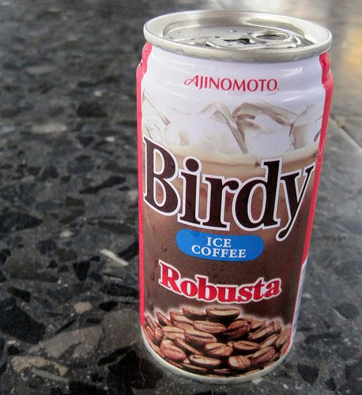
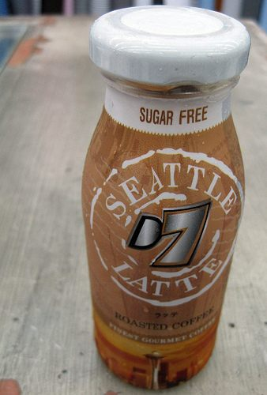

Imagine, a flawless shot of espresso; pulled for what will become lusciousness of the blended kind. What do you call a perfect marriage of ice, chilled milk, orange-flavored syrup, and espresso? Introducing the “Borgia Latte”. Born of the mother of invention and the father of Wall Street marketing, sister of ingenuity and brother of practicality; an inauspicious occasion to be sure, yet as significant as the very birth of the blues.

The espresso purists of any age would like to see espresso stay espresso; it’s as the Beatles said: Let it be. Even the espresso purist admits the demand for specialty coffee has grown to include espresso-based drinks. Today the popular market demand dictates the addition of a blender, milk, ice, and a wide cornucopia of flavorings. We all know that ice has been around since the dawn of time and coffee has been consumed in one form or another for thousands of years. Who’s to say that the Capuchin monks didn’t take imported chunks of ice from the frozen places near their cloisters and add shavings or chunks of mountain spring ice to their brewed coffee and milk for refreshment after vespers.

  
*Birdy Ice Coffee is an RTD espresso drink sold in Thailand.*

The reality is that the courtship of specialty coffee, with iced milk and exotic flavors, first developed decades ago when the visionary coffee men of yesteryear began thinking outside of the hot cup. Their legacies are with us today in the chilled coffee realm of the new class of drinks known in the specialty coffee industry as RTD (Ready To Drink) iced tea, coffee, or espresso beverages.

According to Matt Brandenburger, Vice President of Sales at Torani Syrups, whose grandfather once worked for General Mills, decades ago granddad “Brandy” suggested to his bosses that they market a chilled coffee drink, something like a latte but flavored with fruit. As with Marconi and his wireless, they all laughed and suggested he put his time to better use further developing instant coffee uses. Along the way, he invented the Borgia Latte!

In addition to unique varieties of iced teas or chilled coffee/espresso beverages, another class of RTD beverages are the fortified teas and citrus coolers that boost energy while providing vitamins, and performance-enhancing herbs, and revitalizing neutraceuticals to power up RTD consumers like never before.

### Trends

The cause for this new wave of RTD products in terms of variety and popularity has been a nearly decade-long growth of U.S. economic prosperity that affords American consumers to pay the higher prices for premium beverages they perceive to be of deserved bonus value or inherent luxury. Even fine dining establishments have found their customers are expecting an equally memorable cup of coffee to conclude a memorable dining experience. In the words of Bruce Mullins, Vice President of Coffee Bean International, “…specialty coffee consumers tend to have unspoken higher expectations for products and services than other people.” In the Specialty coffee marketplace, the largest age group with many of those higher expectations is the 18-24 age group. This group of coffee consumers rose 25% in 2000 from 23% in 1999. These young adults tend toward the larger 9.0-ounce cup sizes and tend toward out-of-home consumption so that even 7-Elevens carry a Cappuccino Frappe.

In the early 1990s, the added burden with RTD beverages was the challenge of marketing a beverage to a public that previously didn’t perceive iced coffee as a traditionally refreshing beverage. When it comes to specialty coffee knowledge the American consumer has become savvy and their tastes more sophisticated. Not only have they been given more Specialty coffee choices than ten years ago, but the proliferating larger corporate coffeehouses and smaller independent coffee retailers both have also helped to further educate and illuminate the tastes of the coffee consumer. More so than ever before Americans are in a position to demand quality specialty coffee beverages from the marketplace.

  
*This RTD drink which sports the Seattle name was also sold in Thailand.*

The real key to RTD popularity has been the successful spin in the marketing of RTD Frappe drinks and other RTD chilled coffee beverages. These RTD have been promoted as something other than simply sweetened cold coffee/espresso with milk. Consumers substitute these beverages as stand-alone drinks or as snack beverages, thusly creating a new category unto itself.

Historically, the American RTD coffee market category has been limited because of its higher price point and consumer perception as a non-refreshment beverage. In revving up this product the US market has worked out the marketing of RTD to the active and affluent lifestyles; creating new consumers in a brand new market niche, all due to the impacting popularity of RTD coffees and teas.

In the U.S., and especially abroad in the U.K. where there’s less of the sunshine and leisure lifestyle to help sell cold and iced blended beverages, retailers are relying more on their staff to be sales, promotions, and marketing experts when it comes to their iced espresso/tea/frappe business. According to Jeffrey O’Brian, UK Distributor for Tazo Teas, Stash, and Arizona Beverages, the marketing of RTD beverages at the retail level has evolved to include the customer in promotions such as signature blended drinks, specialty iced teas, thereby creating an event and a sense of adventure with the added bonus of refreshment of iced-over hot. Jeffrey admits that the UK customers have cottoned to their iced coffee, but they still need education about iced espresso and lattes. The UK businessmen, like their US counterparts, have come to embrace the iced espresso drink trend as a great source of added revenue in their menus. Jeffrey says, “Trends (like iced coffee beverages) are either led by the market or led by the consumer.” For iced and blended RTD it appears that both consumers and retailers synergize the industry, as new drinks are introduced and consumer tastes broaden to include iced coffee.

Since coffee is the number one drink on this planet, it’s no surprise that US consumption has reached a new all-time record of 79% of the American population. This means that more than 160 million coffee drinkers have consumed coffee with a total retail value of 18.5 billion, according to the National Coffee Association. The 1997 RTD Tea & Coffee in the U.S. report from the Beverage Marketing Corporation, states that ready-to-drink consumption volume has jumped forward 147.3 percent to a growth of 41.2 million gallons over the previous year. In the years ahead look for more major food and beverage companies to get behind the RTD iced coffee and tea beverage trend and submit more variety of drinks for the thirsty consumer.

### Conclusion

The average coffee drinker now consumes an average of 3.1 cups of coffee per day. Shouldn’t one of these cups be an Iced Latte or a blended Raspberry Mocha? It’s obvious that the Ready to Drink Iced Coffee / Tea trend is here to stay, with enough variety to satisfy every taste. The key for retailers will be to create interest and generate and innovate drinks that meet the coffee consumer’s demanding tastes and lifestyles. Meanwhile, I’ll order another Iced Vanilla Latte.
