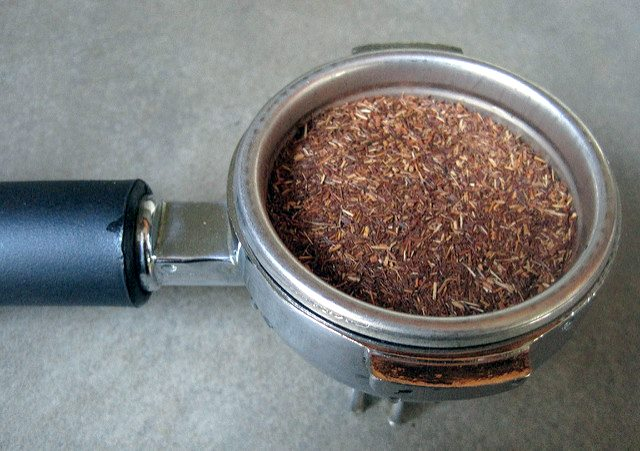
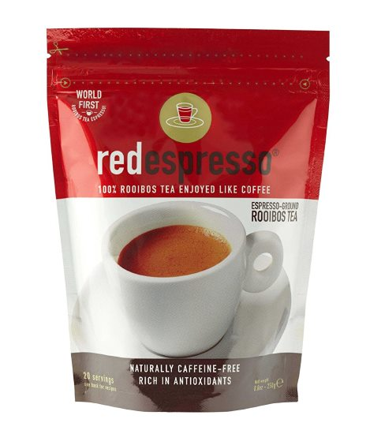
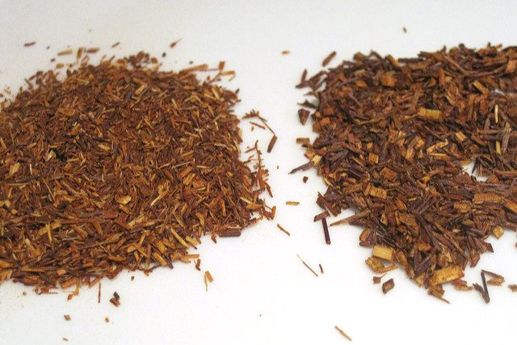
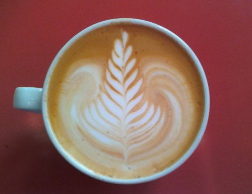
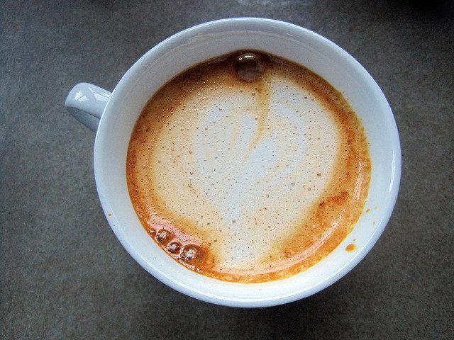
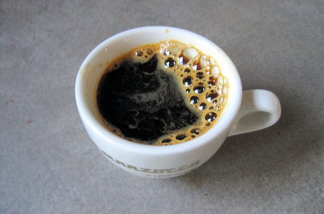

I recently received something interesting to review. It is a product called *Red Espresso*. *Red Espresso* is a finely ground rooibos, which can be used to make a concentrated “espresso.” Before I begin the review, let us bring everyone up on rooibos.

Rooibos is not a coffee—nor, technically, is it a tea, although it is sometimes known as “bush tea” or “red tea” or “redbush tea.” Tea comes from the camellia sinensis plant, while Rooibos comes from the legume family. It originates in South Africa, and it has no caffeine and an antioxidant level that far exceeds that of tea or coffee.

  
*Prepare the Red Espresso Shot*

If you’ve never had rooibos before, it has a rich, sweet taste similar to tea or even a sports drink. It tastes good, hot and cold. Although I am not a parent, I could see serving cold-brewed rooibos to kids instead of the sugar-based drinks typically handed to children.

Back to *Red Espresso*. *Red Espresso* is a finely ground version of pure rooibos, which makes it possible to pull espresso shots. As a fan of rooibos and an espresso fanatic, I was excited to try this product. It delivered. I pulled several shots of espresso and experimented with dosage and tamping. Here is what I learned.

1.  Only tamp enough to level out the shot. You are not packing it like regular espresso.
2.  Because you aren’t packing the shot, don’t overfill. It just needs to be level.

*Red Espresso* delivered a rich, full, espresso-like taste with rooibos. I made shots for several rooibos fans, most of whom were not coffee drinkers, and they all enjoyed the rich flavor. It was a hit.

  
*Red Espresso Ground Rooibos Tea*

Before completing my tests, I decided to pull espresso shots of regular rooibos tea that had not been ground as fine as *Red Espresso*. It was a mess and failed to yield the same rich flavor. Stick with *Red Espresso*. I did not experiment with grinding my rooibos. There is no way I’m putting rooibos in my Rocky grinder.

*Red Espresso vs Regular Rooibos*

I also experimented with making lattes and latte art using Red Espresso. I’m not that good at latte art, so my attempt looked like someone mutilated the old Cingular logo. I contacted Red Espresso to ask if they had been successful in making latte art with their product. They have and forwarded me the photo below. Pretty sweet.

  
*Red Espresso Latte Art*

*My “latte art” attempt. Yikes.* 

I am a fan of rooibos and espresso. Now, I am a fan of Red Espresso. It brings the depth of espresso taste to rooibos. The fact that it has no caffeine makes it an ideal drink for late in the day.

  
*Red Espresso Shot*

### Resources

[A Coffee Lover’s Guide to Tea](/a-coffee-lovers-guide-to-tea/) – INeedCoffee article on tea written for coffee fans.

[Coffee a top source of healthy antioxidants](https://web.archive.org/web/20150706011614/http://www.nbcnews.com/id/9105892/) – MSNBC article.

[Roobios](https://en.wikipedia.org/wiki/Rooibos) – Wikipedia page on Roobios.

***Disclosure:** The author of this article received this product in exchange for this review.*
