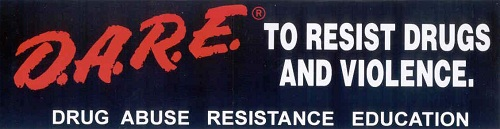
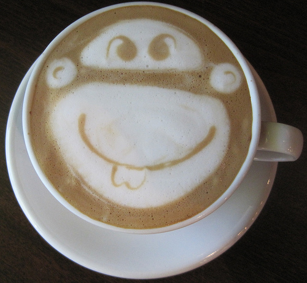

I know several people who don’t like coffee, and I’m OK with that. But every so often, I’ll meet someone who, after learning about my love for coffee, wants to rant to me about how awful the beverage is and that they would never drink it. I learned how to respond to these people one day during my junior year of high school.

I sat in a study hall when a fellow student sat beside me. This guy was known to smoke lots of pot, or so I thought, yet there on the cover of his *Trapper Keeper* notebook was a huge DARE sticker. D.A.R.E. is an anti-drug educational program for kids. The fact *that Mr. Pot Smoker had this sticker on this notebook struck me as odd, so I pointed at it* and asked him about it.

  
*DARE sticker*

He responded to me with dead seriousness and stated, “You shouldn’t do drugs.” Then, after a long pause, he smiled and said, “More for me.” That day, I learned an important lesson. Whenever someone starts preaching to me about the evils of coffee, I just smile and say, “More for me.”

  
*Monkey Latte Art*
