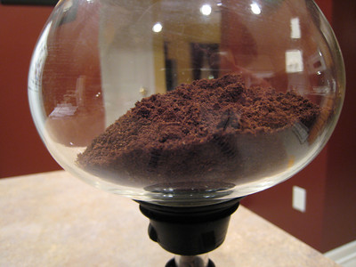

I love vac pot coffee. What’s not to love? It’s fun to brew and the coffee is as good as brewed coffee can be, without the sediment you get with a press pot.

I also love to buy old vac pots, but as pretty as they are, if the rubber gasket is old and hard, they are just dust-catchers on the shelf because they don’t create a seal. Without the seal, air escapes around the gasket and you don’t get the vacuum necessary to pull the coffee back into the lower decanter. I broke an upper bowl on one that was difficult to remove after brewing. What a mess that was!

  
*Vac Pot Coffee by [Ryan Jacobs](/by/ryan-jacobs/)*

I recently ran across a solution for the gasket problem. Go to the auto parts store and get a can of transmission stop leak. This stuff works on the seals and gaskets in the transmission just as it works on your vac pot gasket. Take the gasket off the upper bowl of the vac pot and soak it in the stop leak for 2 or 3 days. I have had good results on one of my gaskets, and I am now soaking the others. I don’t know if it will work on cracked gaskets.

It won’t make them as new but will soften the old rubber just enough to make the seal. It may not work on all, but for about $4, it’s worth the try.

The stuff stinks, so don’t put it in the kitchen. It’s hard to wash off, but the rubber doesn’t come in contact with the coffee, so it’s safe.

*This article originally appeared in Badgett’s Coffee eJournal*
