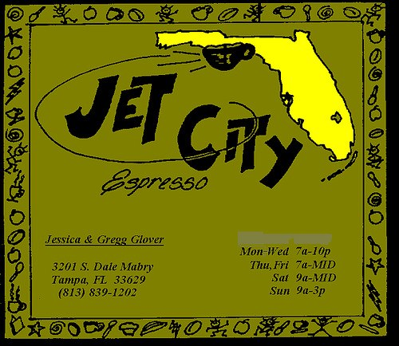

For the past few years, my coffee drink of choice has been the straight espresso shot. All my other coffee equipment has either been packed away or is gathering dust. For me, it is all about espresso now. The ristretto is a very short shot of espresso. On a given day, half the shots I pull for myself are ristretto shots. Yes, I, too, love the ristretto. Yet, as perfect as the ristretto can be, there can be problems.

### My First Ristretto

It must have been 1996. I was living in South Tampa then, and the area finally had a great coffee house. The place was Jet City Espresso. Don’t go looking for it. It is no longer there. As the name implies, the owner, Jessica, was from Seattle and shared her coffee knowledge with her customers.

After ordering numerous americanos and espressos, Jessica thought it was time I tried a ristretto. I expected the short pull of the espresso shot would result in a more bitter flavor. To my delight, the shot was actually a sweeter and more intense version of her espresso blend.

  
*Jet City Espresso – Tampa 1996*

After leaving the Tampa Bay area and moving away from Jet City Espresso, I would not be served a ristretto again for years.

### The Rise of the Ristretto

Now, I’ve arrived in the Seattle area. In this town, the ristretto rules, whether you like it or not. Most cafes in the Seattle area will serve you a ristretto when you order an espresso. My guess is the roaster has determined that the blend tastes optimal when pulled as a ristretto. The first thought I have is positive. If they have tweaked their blend to perfection and then trained their baristas on pulling ristrettos, then the odds are that the drink you are about to get will be amazing.

Yet, I’ve been continually disappointed by the ristrettos served here in Seattle. To minimize disappointment, I’d like to share a few rules with the cafes.

  
*Ristretto*

### Ristretto Rules

1.  **Ristretto or Espresso** – Let that customer know if a customer orders an espresso and your cafe serves ristrettos as the default. Perhaps ask, *Is a ristretto fine?* If I peek down and see what appears to be a single shot, when I clearly ordered and was charged for a double shot, I’m either going to inquire or walk away feeling ripped off. A sign prominently displayed can clear up confusion. One cafe buries that information in a newspaper article framed on the wall away from the menu.
2.  **Make It Quick**—The time between pouring the ristretto and handing it over to the customer must be quick. A ristretto cools much faster than espresso, so serving it at a less-than-optimal temperature undermines the entire quality of the drink.
3.  **Register First, Drink Second** – Nothing is more annoying than when the barista gets ahead of the person working the register. Now, this won’t make any difference for the latte drinkers, but if I’m waiting for change for a $10 bill and my ristretto is cooling on the pick-up stand, I’m not going to be happy.
4.  **Heat the Demitasse**—Never pour a ristretto (or espresso) into a cold demitasse. The drink’s temperature will drop instantly.

### The Caffe Calabria Solution

[Caffe Calabria](http://ineedcoffee.com/meeting-the-roaster-arne-holt-of-caffe-calabria/) of San Diego has tweaked its espresso blend to taste best as a ristretto. They will serve you a ristretto if you order an espresso. However, they will serve you two ristrettos. The result is that you taste the bold sweetness of the ristretto with the volume of an espresso. The drink isn’t cold, and the customer never feels shortchanged.