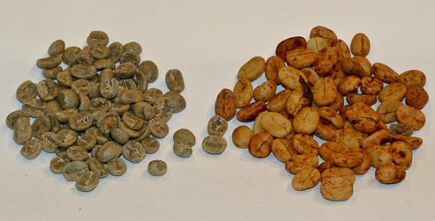
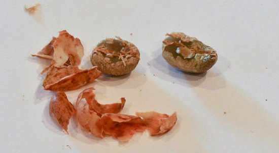
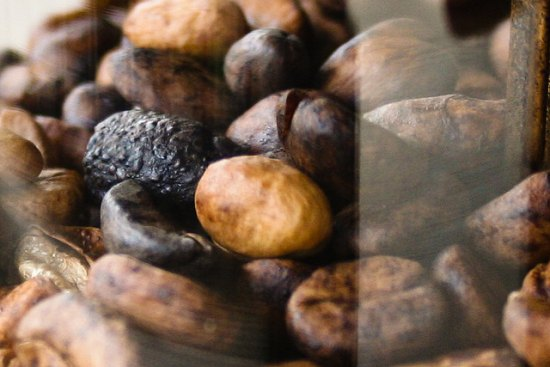
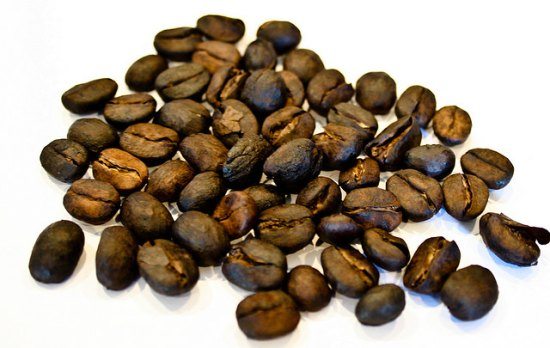

RIP coffee has nothing to do with wishing your coffee a peaceful death. Rather, it is short for Roast In Parchment. It means pretty much what you would expect – the coffee bean is roasted while still in its parchment, and then it is ground and brewed in parchment.

Typically, home roasters work with processed coffee to remove the cherry and the parchment surrounding the green bean. Since RIP coffee leaves the parchment in place, there is now another layer between the roasting heat source and the green part of the coffee bean.

To roast coffee in parchment, you will use the same technique and equipment as you already do. This may seem fairly obvious, and indeed, you may wonder why you are calling attention to this type of bean. After all, many beans have unique roast profiles and roast quite differently. The reason this is worth calling out is that the parchment has the effect of dulling your traditional roast-monitoring senses. If so, they need to be recalibrated.

If you have ever roasted Indian Monsooned Malabar, RIP coffee probably comes closest to this bean. Both are low-density with low chaff output. In some roasters, you may not have enough room to roast without spillover if you are measuring by weight, meaning you’ll need to lower the amount a bit or measure by volume.

The photo below shows the two unroasted coffees side by side. On the left side is a typical green varietal, and on the right is the parchment-covered coffee. Not all parchment coffees have the same color or pattern as the example you see here. The color and pattern remind me of a Jelly Belly. Top Banana crossed with Toasted Marshmallow perhaps?

  
*(left) Typical green coffee (right), parchment-covered coffee.*

Inside the reddish parchment, there is actually a green coffee bean. If you remove the parchment, you will find the green bean inside. The photo below shows the green bean that has been liberated from the parchment. You can now see that you would have a regular green coffee bean with just a bit of polishing. It probably goes without saying, but you won’t be removing the outer parchment during the process – it would defeat the whole purpose. However, the picture does give you some sense of the thickness of the parchment – it is about the thickness of a fingernail.

  
*Roast in Parchment*

That extra layer of parchment turns out to be a pretty big deal. Virtually everything you will read on home coffee roasting is based on the premise of roasting just the green bean. Advice on listening for sounds, looking for color changes, and even the sense of smell is geared toward the green bean. Apart from the roast process, the flavor is different, and the grind is affected.

### Sound Differences

In traditional coffee roasting, listening for the first and second cracks is commonplace. In RIP coffee, this is still the case. However, the added layer of parchment muffles the sound of the cracking, making it harder to hear. It is quieter and less crisp.

I found it much more difficult to pick up on the cracking sounds while using my Hearthware II roaster, which has a very loud fan mechanism. Switching to the Poppery II, which has a fan that is relatively quiet compared to the Hearthware, made it much easier to distinguish the sounds. Your mileage may vary depending on your roasting device.

### Visual Differences

Just as there are differences in sounds in RIP coffee roasting, so are the visual differences. The biggest thing to get used to is that what you are actually viewing during the darkening process is the parchment, not the green coffee. While it does darken, it doesn’t do so at the same rate or in the same manner as green coffee. For example, a RIP coffee at Vienna Roast doesn’t appear oily on the outside – the oils are on the inside of the parchment. Instead, I found that some parchment would bubble up like a burned marshmallow. You can sort of get a sense of that in the photos below.

  
*Parchment Covered Roast*

  
*Completed Parchment Covered Roast*

Because the parchment prevents you from seeing the development of the actual coffee bean inside the parchment, I found that the more reliable way to determine the roast level was by listening for cracks over the appearance of the parchment. Over time, as your senses are recalibrated, it will be easier to determine the roast level visually.

### Worth the Effort?

I don’t think it is by accident that we don’t normally roast, grind, and brew parchment with the coffee. I didn’t think that the coffee as a single note knocked my socks off, but I could see where some of the earthy notes would work well in an espresso blend. Unfortunately, I found it practically impossible to grind properly for espresso. It works much better as a blend for coffee destined for French Press or vac pot.

Personally, I am not convinced that the juice was worth the squeeze purely on a flavor benchmark. On the other hand, it is by no means the worst coffee I have ever roasted and there is a certain novelty to working with coffee in the parchment. If I ever come across something called RIC Coffee, as in Roasted in Cherry I’ll have to pass. Someone else can get ‘RIC Rolled’.
