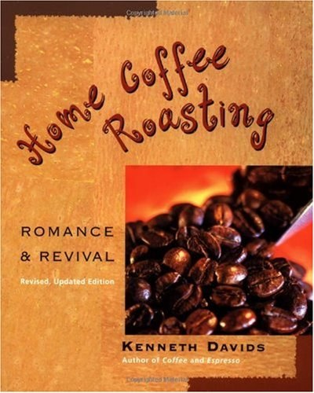

For years, the idea of roasting your own coffee beans has been kept a mystery by the coffee roasting industry. It had been deemed “too hard” or “too complicated”. Well these are new times and the truth is out; it’s easy, fun, and economical and can be done in a number of ways using items you probably already own!

There is nothing like a cup of coffee, which has been freshly roasted, ground, and brewed to perfection. There are a growing number of enthusiasts who are roasting their own coffee beans and enjoying the benefits of truly fresh coffee at about one-third to one-half the price of beans from your local coffee shop.

All that is needed to roast your own coffee beans at home is green coffee beans, available from a number of sources, an oven, cookie sheet, oven mitt, metal colander, and a wooden spoon. Preheat your oven to 500F, spread raw beans evenly one layer deep on a cookie sheet, place them on the middle rack of a preheated oven and watch them roast.

In about 8-10 minutes there will be a crackling noise and smoke with coffee essence. At this point, the roast moves quickly and you need to pay close attention. About 2-3 minutes after the crackling, your coffee beans should be in the shade you like them.

Carefully (using the oven mitt) remove the cookie sheet from the oven and pour the beans into the metal colander. Stir the beans with a wooden spoon to help them cool quickly. Do this over a sink or outside, as there is chaff that comes off the beans during roasting. And remember: NEVER leave your roasting coffee beans unattended.

Almost any appliance used to pop popcorn can be used to roast coffee beans. The [hot air poppers](/roasting-coffee-in-a-popcorn-popper/) are great, however, you may want to roast outside or in your garage as they blow the chaff out and can be messy. There are a number of manufacturers of home coffee roasters, including several that use a gas grill and rotisserie. The internet is full of sources to purchase raw beans, but you want to make certain the supplier you use knows their beans and “cups” their coffee before selling it to you (see resources below). Many other sources can be found using your favorite search engine. If you’re interested in using a gas grill to roast your beans there are several manufacturers of drums fitted for gas grills that work great (see resources below).

Green, raw coffee beans last for years when properly stored. This allows you to build a collection of fine coffees to choose from as well as buy larger amounts of the great coffees and save more money. Keep your bean collection in a cool, dry place out of any direct sunlight and they will last until you roast them. As coffee ages, it loses acidity and becomes more mellow. Many like the rich mild cup of coffee that has had a couple of years to rest and mellow. More important than the year of the crop is the quality of the bean, the preparation at origin, transportation, and warehousing in the country of consumption. If all of these things are done correctly, your green coffee will last for years.

Suppliers who know how to cup samples of coffee beans are able to determine if all of these criteria are done correctly before they purchase the beans.

Home roasting is one of the fastest-growing hobbies in the country and for good reason. It’s fun, easy, saves you money, and delivers a cup of coffee like you never thought was possible. Join in the fun and start roasting your own coffee beans.

### Resources

[Home Roasting Coffee in an Oven](/home-roasting-coffee-in-an-oven/) – Tutorial on roasting coffee at home using an oven.

[Roasting Coffee in a Popcorn Popper](/roasting-coffee-in-a-popcorn-popper/) – Tutorial on home roasting coffee using a popcorn popper.
