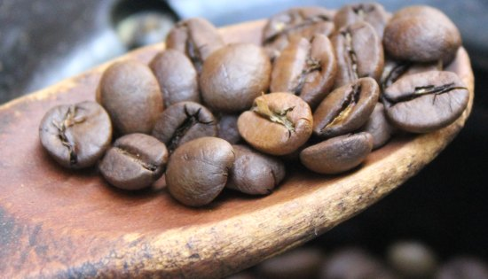

Roasting your own coffee is not only personally satisfying, but it is also relatively easy. You don’t really need the expense of a Probat or Diedrich roaster to begin this craft. Using nothing more than a hot air popcorn popper, you can achieve a very high level of freshness and control your roast level. You’ll even save some money along the way.

In this article, I will break down the basic steps into categories:

1.  What you should know before beginning
2.  Selecting your equipment
3.  Selecting your beans
4.  The actual roasting process
5.  Cooling and storing the beans.

### What You Should Know Before Beginning

Roasting your own coffee gives you virtually unlimited possibilities in your quest for making the perfect cup. You are able to make espresso roasts or bring your beans to a nice full city roast. You can blend your different roasted beans or blend them before roasting. It’s up to you. Do you want to be able to drink five varieties a week without having your coffee go stale? Since you roast only what you need, you can do this with ease. In a nutshell, you’ll be able to drink better coffee for less money.

Green coffee will store well for over a year without a loss in character whereas roasted coffee will be best consumed within a week or two. Buying your beans green will allow you to make larger purchases without worrying about the beans going bad.

Roasting coffee in a popcorn popper can be a messy venture. During the roasting process, pieces of green coffee called chaff will blow off while producing a great amount of smoke. While the smoke smells great initially, it will find its way into everything in your homestead, and once stale, it stinks. In the beginning, the easiest course of action is to find a place to roast outside, such as a garage, porch, or balcony. Along the way, you may upgrade your equipment to devices such as the [Hearthware iRoast2](http://ineedcoffee.com/roasting-coffee-in-a-popcorn-popper/) with a built-in chaff filter or the [HotTop](http://ineedcoffee.com/hottop-kn-8828p-coffee-bean-roaster-first-look/) with a built-in smoke filter.

  
*Green Coffee Beans*

### Equipment and Coffee Bean Selection

First, you will want to purchase a roaster. You want a device that will heat the beans to at least 400 degrees F and be able to do this in an even manner. You may be thinking of your oven, and while that will work, it is somewhat difficult to gauge the roast level visually, and usually will set off your smoke detector if you don’t have good air filtration. It also produces scorched beans since one side of them is in constant contact with the hot metal of the sheet pan.

A good device to start with is a West Bend Poppery II. For a tutorial on roasting coffee using the original Poppery see the tutorial [Roasting Coffee in a Popcorn Popper](http://ineedcoffee.com/roasting-coffee-in-a-popcorn-popper/). This little hot air popcorn popper makes a great coffee roaster. The reason this is a good unit is that it allows for good visual inspection of the roast level, and it actually moves the beans around in a circular fashion, which prevents scorching. The hot air blowing the beans around is commonly referred to as *fluid-bed* roasting. The Poppery II is often available at thrift stores for a few bucks.

After you get a roaster, you should have a cooling pan, a stirrer, and a scale. For the cooling pan, you want something that will allow a mass of hot beans to cool as quickly as possible. I use an aluminum pasta strainer. The holes let air through for more rapid cooling. You may also use a simple cookie sheet.

Even though the popper rotates the beans, you will still need something to help stir beans and even to pull samples out for closer inspection. For stirring use a wooden spoon. Make certain it is wooden or you could get an electrical shock.

A measuring device for coffee would be best done with a scale. You can use an inexpensive food scale found almost anywhere, such as Wal-Mart or Target. Some of the newer digital scales offer excellent taring features and give you a better gauge resolution than the really cheap analog types. The primary reason for measuring by weight over volume is that your popper can only move so much weight at a time, and you will find that different beans have different densities. The only way to get consistent results is to measure the coffee by weight. For the West Bend, four oz. is your target weight.

  
*Westbend Popper II: terrible for popcorn, but good for home coffee roasting.*

### Coffee Bean Selection:

The beans you select ultimately define your taste preferences, and if the flavor is at the top of your list, you will want to choose an Arabica coffee bean. To be very simplistic, a good bean is generally uniform in shape and color. You will find that these normally roast evenly and without many “clinkers” or bad beans.

If you are just beginning, you should ask other home roasters what they have had luck with. From experience, Colombian and Costa Rican coffees, along with many Guatemalans, roast pretty easily. Sumatra coffees roast nicely, but you must believe the imperfections will work out in the roasting process.

### Starting The Roast

Now that everything is together, you should plug your “roaster” in and pour your beans in. You should immediately begin stirring the coffee beans.

As you stir, you will notice the coffee beans turn from green to light brown and continually darken. Also, part of the bean called chaff will begin blowing off the bean. Keep stirring until the beans move on their own upward (not just circularly). This will take about a minute. Now, you will hear a series of small “cracking” noises. This is what is known as the first crack. This will soon subside.

*Pour the green coffee beans into the popcorn popper roaster.*

  
*Early in the roast, slowly stir coffee beans with a wooden spoon.*

### Monitoring The Roast

Now, monitor the coffee beans and watch for the color of beans you desire. Pay attention to the smells as well. If you let your roast continue long enough, you will notice the second series of cracks. This is known as (you guessed it) the second crack. Little tiny black chips will start blowing off the bean during this phase. To achieve a full city roast, you should normally stop at the beginning of this series of cracks.

If you would like the darker roast of a typical Espresso blend or a French or Vienna roast, you should keep the beans roasting. You will notice the beans becoming shiny and a thicker cloud of smoke coming from the roast chamber. The sheen comes from the oils of the bean, which are coming to the surface.

  
*Color progression in the coffee roast inside the popcorn popper.*

  
*Using the wooden spoon, periodically take samples to judge the progress of the coffee roast.*

### The Cooling Process

The main objective of the cooling process is to stop the roasting dead in its tracks as fast as possible. Simply dump the coffee beans into your cooling pan, which will allow them to lie in a single layer. Using a pan with holes, such as a metal colander, will aid this. If you live in a hot climate, you might consider using a [light mist of water](http://ineedcoffee.com/popper-roasting-tips/) from a spray bottle.

  
*This technique uses two colanders to cool the coffee beans rapidly.*

Once the roasted coffee beans have cooled, they should be stored properly in an [airtight container](http://ineedcoffee.com/coffee-storage/).

### Conclusion

Once you’ve assembled the tools, you will find roasting your own coffee from home as easy as boiling eggs. Grab that popcorn popper and start roasting! FYI: Once you’ve roasted coffee beans in the popper, use something else for your popcorn.

### Resources

[Roasting Coffee in a Popcorn Popper](http://ineedcoffee.com/roasting-coffee-in-a-popcorn-popper/) – INeedCoffee tutorial on roasting coffee in the Westbend Poppery.

[Why Home Roast Coffee?](http://ineedcoffee.com/why-home-roast/) – In the event you didn’t know.

[Popper Roasting Tips](http://ineedcoffee.com/popper-roasting-tips/) – Some tips that apply to popcorn popper roasting in general.