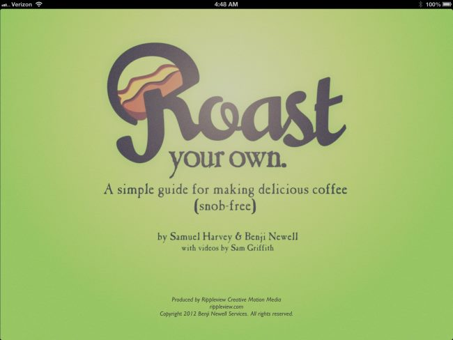

As an experienced Home Coffee Roaster, I was interested in an eBook for the iPad titled *“Roast your own. A simple guide for making delicious coffee (snob-free)”*  by Samuel Harvey and Benji Newell with videos by Sam Griffith. At this time, this title is only available for the iPad.

  
*Roast your own. A simple guide for making delicious coffee (snob-free)*

First of all, at 64 pages and embedded videos, I would not call this a “simple guide”. It might be explained simply, but there is a lot of information to take in for the beginner. I can tell you that most of the advice is spot-on.

One point: the eBook on the iPad is very slow as you scroll through pages, and it tends to show the loading icon often. I need to get in contact with the authors as to why, but I suspect it is because of the media-rich content they chose to include.

The book is nicely broken down into the following chapters:

-   Author’s Note
-   Why Roast Your Own?
-   Beans
-   Roasting
-   Grinding
-   Brewing
-   And Then What?

This going to be a mini-review, which means for each chapter, I will make a comment or two, along with a screenshot.

### Author’s Note

The author’s story intro is brief but gives a nice background on what got these guys into coffee. They sound like the rest of us, which I think is great. It definitely draws you in.

### Why Roast Your Own?

I do like how they explain the typical user and how much they spend on coffee, and then go on to let us know that it is easy and cheap to roast your own, with even better quality than what you can typically get at the store.

The 6 points of “Coffee Priorities” are nice:

1.  Get the best coffee you can afford
2.  Brew with water that is hot enough
3.  Grind coffee right before you brew
4.  Pre-warm the cups and brewing vessel
5.  Use a consistent grind
6.  Use filtered water

  
*Coffee Priorities*

I think the diagram “Interactive B” is a little confusing, and takes away rather than adds. Fortunately, this is the exception, as most other diagrams are excellent.

  
*Time and effort*

### Beans

They do have a video of Sweet Maria’s, touted by the authors as “Our favorite provider of green specialty coffee”. Some other vendors that get a nod are Burman Coffee, Coffee Bean Corral, and Coffee Bean Direct. I have purchased from all of them, and they are all decent retailers. One aspect of green coffee bean buying they did not explore is the Co-Op scene. See the article [Green Coffee Buying Club (aka GCBC)](/meeting-up-with-the-green-coffee-buying-club/) for more info.

  
*“Your final cup will only be as good as your beans.”*

### Roasting

I like the Basic Roast Levels diagram. It really makes things crystal clear.

  
*Basic Roast Levels*

I found the home methods they suggest interesting: [Popcorn popper](/roasting-coffee-in-a-popcorn-popper/), [Heat gun](/roasting-coffee-with-a-heat-gun-a-top-down-approach/), and [Whirley pop](/stovetop-roasting-with-the-whirley-pop/). I have used them all, and while they do work, using them inevitably leads to commercially produced consumer coffee roasters that provide more volume, better temp control, smoke suppressors, etc. I wish they would have delved into some of those consumer machines, that also won’t break the bank. Or at least whet our appetite for another eBook when you are ready to spend some more money.

  
*Home Roasting Methods*

### Grinding

They do show two levels of grind (French Press and Filter) as compared to a dime. Would have liked to have seen Aeropress or some others just for comparison. See the article [Coffee Grind Chart](/coffee-grind-chart/) for more comparisons of grind sizes.

  
*Grinding*

They only show two types of [gri](/choosing-the-right-coffee-grinder/)n[ders](/choosing-the-right-coffee-grinder/) (burr hand mill and spice blender). Again, there are machines out there that can do a great job, offer more volume, do it quicker, and don’t break the bank.

### Brewing

They show [French Press](/press-pot-tutorial/), [Clever Coffee Dripper](/the-clever-coffee-dripper/), and Automatic Drip. They make excuses for why they didn’t include pour-over, [vac pots](/vacuum-pot-brewing/), or espresso. And I agree with that. But what about the [Aeropress](/aeropress-coffee-maker-tutorial/)?

While this eBook really focuses on roasting, with other aspects being secondary, I found the FREE Intelligentsia app, more useful for the preparation of coffee, as well as more expansive. See the article [Intelligentsia iPhone App Review](/intelligentsia-iphone-app-review/) for more information on that application.

### And Then What?

They give some nice reference material for Tasting, Coffee Terms, Troubleshooting, and even a roast chart.

  
*Coffee Terms*

### Conclusion

**Pros**

-   Great info for the beginner, explaining home roasting, brewing, and beyond
-   Nicely done diagrams and embedded videos

**Cons**

-   Performance is slow and takes away from an otherwise great resource

### Resourses

[Meeting Up With The Green Coffee Buying Club](/meeting-up-with-the-green-coffee-buying-club/) – The interview topic is how green coffee buying cooperative clubs work.

[Intelligentsia iPhone App Review](/intelligentsia-iphone-app-review/) – Coffee brewing application by coffee roaster Intelligentsia.
