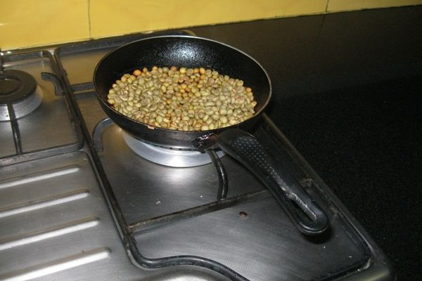
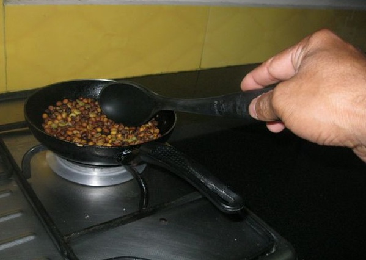
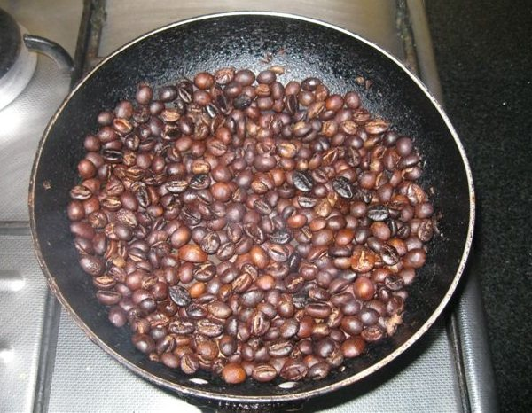
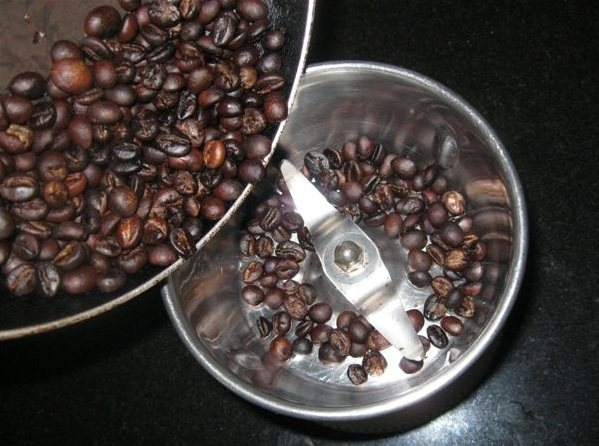
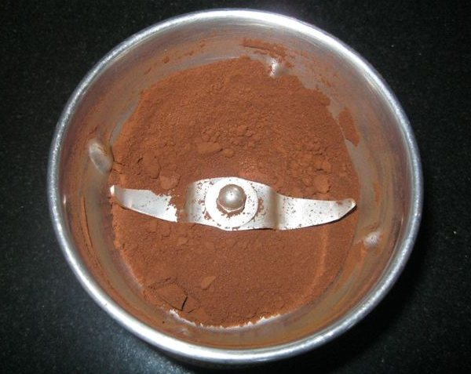
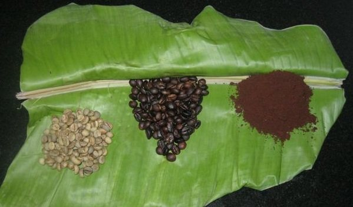

*For background information on Toddy Cat Coffee, please read [Toddy Cat Coffee Beans](https://ecofriendlycoffee.org/toddy-cat-coffee-beans/) and [Toddy Cat Coffee Bean Process](https://ecofriendlycoffee.org/toddy-cat-coffee-bean-process/).*

One of the most critical steps in normal coffee and Toddy-Civet Cat coffee production is the roasting process. It has implications on coffee taste, aroma, and colour, and therefore has an overall effect on the quality of the coffee.

Although all steps are important, roasting is a key element in the process used to obtain coffee because this process gives the beans the aspect known by consumers. The taste and the aroma are acquired by roasting the beans. This is the reason why it is said that brands obtain different coffees even when they use the same type of bean. There are several ways to roast coffee: one is by using a simple pan, the other is the gas rotary drum roaster, and the last one is the hot air roaster. We use a simple process of roasting the Toddy-Civet Cat beans on a hot pan and powdering the beans using a simple electric mixer.

Below, find the Steps to Prepare the Roasted Toddy-Civet Cat ROBUSTA Coffee Bean Powder.

*Roast the dried coffee beans in a Hot Pan*

*Roast the coffee beans until dark brown*

*Verify the coffee beans are emitting the coffee fragrance.*

*Grind the coffee beans to a fine powder.*

*The Toddy-Civet Cat Robusta Coffee Bean Powder Is Ready To Be Used*

*The Three Roasting Stages*

The powdered Robusta Coffee powder (Toddy-Civet Cat Coffee Powder) is now ready.

### Preparation Simplified Method

1.  Take a 500 ml Hot water flask and pour in boiling water.
2.  Take 2 Tablespoons of Toddy-Civet Cat Coffee powder and pour it into boiling water.
3.  Cap the flask and wait for 20 minutes.
4.  Turn the flask upside down in between the 20 minutes around 2 times with an interval of 5 minutes and wait for the particles of Coffee to settle down to the bottom of the flask.
5.  Open the lid of the flask, and now your PIPING HOT CUP OF UNIQUE TODDY CAT COFFEE is ready to be relished.
6.  Pour the Coffee into a cup.
7.  Serve Coffee for 4 with milk and sugar as desired.

### Roasting With Hot Air

A hot-air roaster is an efficient process since the beans have no contact with any metal hot part, which can roast some beans more than others. The advantage of this roaster is that as the control process is electronic, all roasting steps can be set electronically having a repeatable uniform result. The disadvantage of the gas rotary roaster is that it cannot roast in small quantities (but there are some home models that do the job). In the case of Toddy-Civet Cat, it is essential to have a roaster that can work in small quantities because this coffee is not a product of massive consumption. The beans should be roasted when ordered by customers so that they can always have freshly roasted Toddy-Civet Cat coffee.

Coming back to the roasting process, coffee needs to be roasted at a temperature between 220⁰ C and 230⁰ C (440⁰ F). While coffee is being roasted, it releases oil and sugar, it grows in size and it loses humidity, and its final weight reduces by 20%. The chemical components of the bean suffer from important transformations both at a quantity and quality level. Sugar, fat, proteins, non-protein nitrogenous substances, acids, etc; In fact, everything suffers from a transformation due to the high temperatures that the beans are exposed to.

Like other coffee types, Toddy-Civet Cat is medium roasted, as not to destroy the complex flavors acquired during both processes. Afterward, the beans need to be cooled quickly to stop the roasting process and to allow the aroma to be fixed and the oil substances to be condensed. It is recommended to grind them and prepare the coffee, not before 12 hours of having been roasted.

### Video Tutorial

[How To Make Roasted Coffee Home Made](https://www.youtube.com/watch?v=0JxPWE-2Hdk) (YouTube 7 minutes)

### References

Thank you to Errol Pais (Coffee Planter) from “Pais Estate” Siddapur and Dr. Anand Titus Pereira. Additional thanks to Leona Gerald Pais who supported and helped during the entire intense process of preparing the coffee powder. If the Toddy Cat Coffee Dropping Process Bean Powder is of interest to you, kindly contact me at allenjpais@gmail.com.
