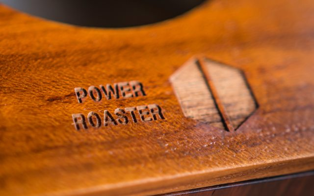
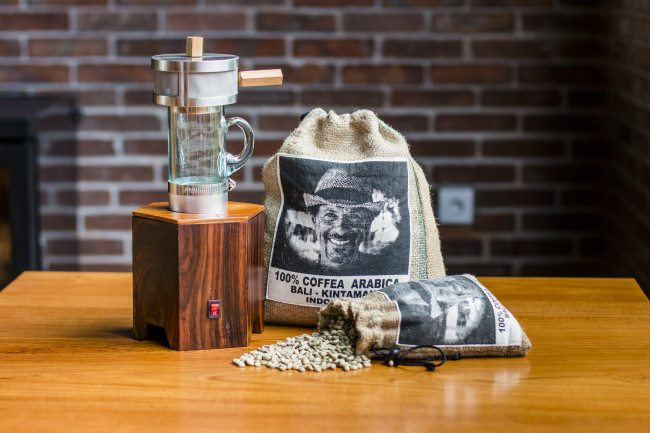

#### Become a Master Coffee Roaster right in your own kitchen.

Bali coffee guru Asher Yaron and business partner Raymond Lay have just launched a revolutionary new home coffee roaster.

“We’re making home coffee roasting a simple and affordable practice,” said Yaron. “This roaster is designed to significantly change coffee making and drinking habits around the world.”

Starting with green coffee beans and using the Fluid Bed Roasting technique, the power roaster has a capacity of 120 grams per batch at an average of six minutes per roast. It operates with a simple on/off switch and is much quicker and cleaner than traditional drum roasters. The beans are roasted until the desired color is achieved: light, medium, or dark.

“What we’re seeing is the emergence of the Fourth Wave in coffee,” Yaron said, referencing the transition in coffee epochs. “Coffee drinkers are finally starting to care about the effect of the drink — the energy and the clarity it gives them — as much as they do about taste. Roasting, brewing, and then drinking coffee in quick succession improves the effects significantly.”

At a price point of USD $300 (which includes 1 kilo — 2.2 lbs. — of green coffee), it is estimated that a typical retail café customer will see an average savings of more than $1000 annually. The machine, aptly named the Power Roaster, is being offered in a Kickstarter Campaign.

**www.kickstarter.com/projects/2017098884/coffee-roasting-in-your-own-kitchen-with-the-power**

Backers in the Campaign will receive Early Bird Discounts as well as free shipping. After Kickstarter, the Power Roaster, accessories, and green coffee will be offered for sale on the website, **www.powerroaster.com** (August 2021: site offline)

_Disclosure: This post was sponsored. INeedCoffee received equipment and compensation for this article._
