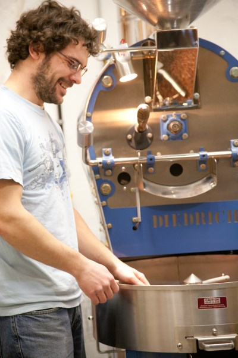

Visiting a coffee roaster is an amazing opportunity to widen the coffee experience.

At Conduit Coffee Roasters, Jesse has the bags of green coffee stored in the same room that he roasts – a tiny room of perhaps 60 square feet, but with tall 15-foot ceilings. He has in the ‘entrance’ to the room a loft built above the door, which serves as extra storage space. Underneath are huge bags of green coffee off the ground on a wood platform, and shelves with freshly roasted coffee in bins.

The bags are large – probably about 4 feet high and perhaps 2 feet in diameter sitting, with 152 pounds of green coffee beans inside (69 kilos). They are typically burlap sacks, often with green plastic liners. Sometimes the beans are delivered without a liner, but typically if the coffee is more expensive, it will be double bagged for extra protection (though at some cost of airflow, which I understand is important).

Today I had the opportunity for the first time to fully inhale a fresh bag full of green coffee. The experience is phenomenal. The assault upon my senses was magnificent, in a way that cannot possibly be truly communicated by words alone. But let me have a go at it.

We opened a bag from Nicaragua, and I stooped over with my face right near the green coffee beans and inhaled deeply through my nose. I instantly felt like I was in a forest surrounded by coffee plants. You can really smell the aroma of freshness coming off the beans – like any other type of fresh produce. These Nicaraguan beans are very well grown – and more on the expensive side — so they have a very distinct, strong aroma (and when roasted well, they retain a similar flavor).

With this particular bag, my first impression was that of fruity dark chocolate. That is what instantly popped into my mind – it was as if I had shoved my head in a bag of dark chocolate bars. I couldn’t really put a finger on what the fruit was – and often it turns out that is the case. The smell is incredibly powerful coming right off the raw beans – you can almost taste it.

The second bag that we opened was from Ethiopia. After a full inhale, my first impression was ‘bananas’. Really what we were experiencing was just an incredibly strong fruit aroma – even though the Nicaraguan struck me as fruity chocolate, it was more of a cacao aroma. The Ethiopian beans, on the other hand, were full-on fruit – as if I were picking a banana fresh off the tree. I couldn’t say exactly why it smelled of bananas – and Jesse didn’t have an answer either – but that was my impression.

Roasting is as much an art as it is a science. There are ‘rules of thumb’ that a roaster follows, but they are by no means the be all end all. In order to achieve a certain flavor after roasting, it is often simply a matter of following some general guidelines and using the initial aroma as a sense of what the coffee perhaps ‘should’ taste like in the end. So it is ok at the beginning when you can’t pinpoint exactly what an aroma is – it’s more about the whole experience.

This brings up another point that is of interest to me – you may have wondered why coffee often smells better than it tastes. I’ve even seen articles that go on to try to explain this phenomenon, looking at how our smell receptors treat aroma differently after we have swallowed the beverage and how that impacts flavor. Thus far my reaction to this phenomenon is simple: if the coffee doesn’t taste as good as it smells, you are either drinking coffee that is not grown well, not roasted well, or not prepared well in the end. There are so many different factors that go into creating a coffee that a misstep at any point can affect this experience. I’ve had the pleasure of a cup of coffee that truly tastes as good as it smells.

Let me take you through the roasting process – as this is the first time I’ve ever visited a roaster, I got a first-hand look, and I hope to share that with you. Future visits will no doubt uncover subtle nuances, but today I want to share with you what I learned from Conduit Coffee Roasters.

First, we start with green coffee. Something you may not know (though it makes sense) is that coffee is seasonal. Not all coffees are available at all times. For example, what is in season right now (February/March) are coffees from high-altitude Central and South American countries – Nicaragua, for example.

This doesn’t mean you can’t get coffee from other regions at different times of the year – green coffee tends to store fairly well, from between 6 to 12 months. According to Jesse here at Conduit, some coffees even improve after sitting for a period of time. There are natural changes that happen to the green coffee as it sits. So just because one coffee is not in season, doesn’t mean it’s not available.

The roasting process itself is somewhat simple, yet potentially infinitely complex. The basic concept: green coffee is placed in the hopper at the top of the roaster – typically Jesse roasts in 10-pound batches. The roaster itself is preheated, and then the coffee is added. The roaster rotates the beans around vertically, then after a predetermined period of time (in Jesse’s case, that is often around 15 minutes), they spit out into a cooling mechanism. This is where the freshly roasted beans are spun around to cool the beans – the roaster itself sucks outside cool air down through the beans. This setup also allows for the person roasting to quality control the beans through the whole process – a real hands-on experience.

This is, in essence, the process, but it can be infinitely complex. The roasting machine – in this case, a Diedrich – is able to track the temperature inside the coffee beans. As a guideline, roasters use ‘roasting curves’ – which is a graphed guideline of temperature vs time. The curve describes the temperature rise in the beans over time and typically marks the first and second crack points. The ‘crack’ is when the bean physically cracks, which happens at a certain temperature, usually in the range of 400-405 degrees Fahrenheit. Typically, roasting is taken to at least the first crack when the bean becomes edible and then sometimes for a second time. Some roasters will take the bean past the second crack – Starbucks, for example, always takes their beans past the second crack.

The amount of time that you roast the beans naturally has a direct impact on the ending flavor. Most of the varied flavors of coffee are dependent upon the quality of the green coffee to start – for example, the aromas I described in smelling the green coffee can be had in the roasted coffee, if the roaster treats the beans properly. As Jesse says, roasting is about ‘enunciating’ the flavor of the coffee. In general the longer you roast, the more flavor you lose, and I shall attempt to explain why that is.

Primarily, there are two elements of the coffee bean that are responsible for the flavors – the acids and the lipids. The acids are more delicate and can be roasted out of the bean by roasting longer. They are often responsible for bright, punchy flavors in coffee. The lipids tend to stick around when you roast longer, and they are responsible for the deeper, richer flavors in coffee. The acids tend to be more variable as well, so in general, the longer you roast, the more consistent the coffee becomes because you remove more of the acids. However, you also sacrifice the acid flavor. “Light” coffees are very popular in specialty coffee circles these days because they are such a unique experience – you can have a different experience with the same bean from the same roaster, just due to slight variations in the roasting process.

Starbucks tends to roast their coffee hotter and shorter than small independent roasters – that is, their roast curve is sharper than Jesse’s where he may roast twice as long. For Starbucks, this helps produce a more consistent result (which is important for a company that has many thousands of stores serving the same thing). They also use cheaper beans which lack aroma and flavor, to begin with.

How the coffee is going to be prepared can have an impact on how it is roasted. This is where espresso blends come into play. The way espresso is prepared is by forcing water through very finely ground coffee – typically at 125 PSI, just short of boiling, over a short period of time (perhaps 30 seconds). The short amount of extraction time means that the coffee bean’s lipids don’t have time to come out. So when you have a short extraction time in espresso, what often happens is that many more acids come out of the coffee than lipids, and that is often why espresso is so bright and punchy.

However, roasters can try to compensate for this by preparing coffees that are specially made with this preparation in mind. The exact process is again down to more of an art than a science, but basically, the longer you roast a coffee, the more acids you remove. So, a roaster may take a coffee and roast it a bit longer to remove some of that punch, and then blend that darker roast back in with a lighter roast to get a more balanced flavor (since roasting it longer also results in some loss of flavor). You get an espresso that is perhaps more balanced than if you were to use a lightly roasted coffee.

You can, of course, use any coffee in an espresso, but due to the way that the coffee is ‘extracted’, you get a different flavor experience. This is also why coffee prepared in full immersion is such a different experience from coffee that is dripped. Drip coffee will have more of those acids and fewer lipids, so it will likely result in a brighter (or perhaps a more bitter?) cup of coffee – compared to if you use a French Press where the coffee is fully immersed for a couple of minutes, allowing time for the lipids to come out and give you a more rounded cup of coffee.

One of the really cool things about roasting coffee is that there is such fluid control over the roasting process by the roaster. This is really where the art comes in. You start off with all the scientific knowledge that you can, but then your specific circumstances – the bean you are using, the atmosphere – all have an effect so when figuring out a roast for the first time you will likely need to fine tune it.

With Jesse’s roaster, the mechanism pulls air from the room into the machine. It also uses gas for heat. So Jesse has fluid control over the airflow within the machine, as well as the gas flow in controlling the heat. This setup also means that the temperature of the room comes into play, and also explains why Jesse treats his roasting room like it is all one big roasting machine. While he can’t control the seasonal temperature, he has taken measures to have consistent control over the room temperature.

When trying to figure out a new bean, there is experimentation that goes on – but often Jesse will start with a roasting profile for a similar bean, and then make adjustments from there, test roasting in smaller batches.

He showed me a new coffee he has been working on, where he made slight adjustments to the roasting curve. I smelled both samples, and there was a distinct difference – though I honestly couldn’t put my finger on exactly what it was, only that they clearly had a different aroma. The only difference between the two roasting processes was that, in one, he had a different starting temperature of 5 degrees F, and I believe he also had a few seconds longer in the roaster. These are seemingly tiny differences, but they resulted in a HUGE change on the other end (huge, meaning you could definitely tell that the coffees were different).

This also means that when the seasons change, because of the impact of the air in the space around the roaster, Jesse needs to rework his roasting profiles. If the starting temperature in the room is 20 degrees warmer – and thus the air going into the roaster is 20 degrees warmer – you can see how that would have a big impact on the end result.

At the end of my visit, Jesse prepared for me that new roast he had been working on – a Bolivia. It was prepared in a French press – very simple. As we chatted and I stood there drinking the coffee, I was excited to find different flavors hiding in the cup. At first, perhaps it was a little hot, but as I took a few more sips, I discovered some very enjoyable fruit-like flavors, as well as a very smooth cup of coffee. One of the joys of discovering these well-made cups of coffee is that there is often no bitterness – or if there is, it’s part of a flavor (like how citrus might be a little bitter).

After enjoying that cup of coffee, Jesse took me over to the bag that the coffee came from and gave me the opportunity to smell the fresh green coffee that I had just enjoyed roasted. I was struck by how much it smelled like how it tasted. I regret my ability to describe coffee is limited – all I can say is that it was a joy to experience that fresh grown aroma and connect it with the well-crafted cup of coffee I had just enjoyed.

Roasting is an art. Just as there are so many different types of coffee, there are many different styles of coffee roasting – and I believe the personality of the roaster can come out in their coffee. Jesse takes a very artistically crafted approach to his coffee – with great intent and care – and that shows in the end.

*This article first appeared in [Extracted Magazine](/go/coffeeloversmagazine/).*

### Resources

[Conduit Coffee Company](https://www.conduitcoffee.com/) – Seattle-based coffee roaster.

[Roasting Coffee Part 2: Technical Aspects](https://desertsuncoffee.wordpress.com/2011/04/06/roasting-coffee-part-2-technical-aspects/) – Article talking about roast curves, with a nice graph

[Why does coffee never taste as good as it smells?](https://www.telegraph.co.uk/news/science/9528936/Why-does-coffee-never-taste-as-good-as-it-smells.html) – From The Telegraph UK Science section.
