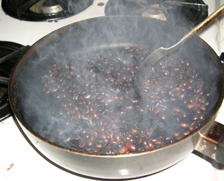
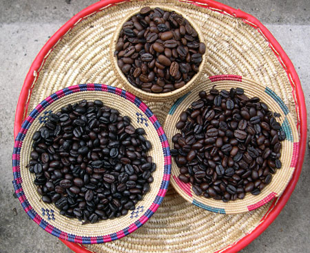
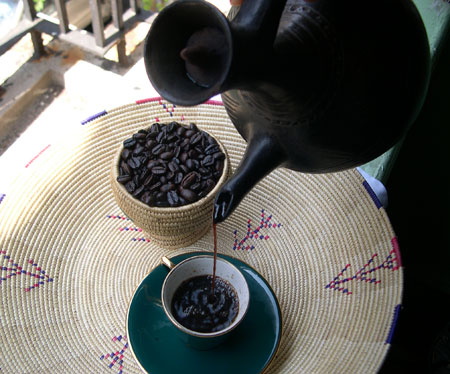

When I home roast coffee, I use a big frying pan. I buy my green coffee beans from different parts of the world and then deliver the roasted coffee each day to some of my clients.

### Equipment Needed

-   Large frying pan
-   Long spoon reserved for just roasting coffee
-   Gas stove
-   Spray bottle with fine mist setting
-   Tray for cooling beans

### Procedure

The way I roast coffee is very simple. Place the frying pan on the stove and use a temperature of at least 350F. Add the green coffee beans to the pan. Use the spoon by moving the beans around constantly from top to bottom. Doing this will prevent the beans from burning.

  
*Pan Roasting Coffee*

Roast as light or as dark as you like. The picture below shows beans roasted at 8 minutes (top), 12 minutes (bottom right), and 15 minutes (bottom left).

  
*Coffee Roasts Completed*

### Ventilation

Roasting coffee does produce smoke. The darker you roast, the more smoke. Make sure you have ventilation fans on and, in some cases, the windows open. If you have a sensitive smoke detector, you may wish to disable it during the roasting process. Just be sure to turn it back on afterward. Not every kitchen will be set up to remove the smoke produced by indoor coffee roasting. Use a smaller batch of coffee on your first roast.

### Cooling the Beans

When the beans have roasted as dark as you like, it is now time to cool the beans. Turn off the stove and then [spray a fine mist of cold water](http://ineedcoffee.com/popper-roasting-tips/) on top of the coffee beans. The water should immediately evaporate. Now, transfer the beans to your cooling tray. Place the cooling tray in an area that will allow it to cool quickly, such as near an open window in the kitchen.

  
*Serve Coffee*

### Resources

[Home Roasting Coffee in an Oven](http://ineedcoffee.com/home-roasting-coffee-in-an-oven/) – This tutorial covers listening to the roast as well as advice on cooling the beans quickly.

[Roasting Coffee in a Popcorn Popper](http://ineedcoffee.com/roasting-coffee-in-a-popcorn-popper/) – Another tutorial that guides you through the coffee roasting process.