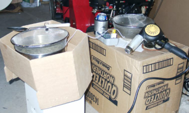
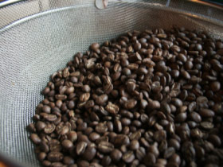

I first learned to roast coffee with the *FreshRoast Plus*. There are a lot of advantages to small purpose-built roasting appliances. I still recommend them to beginners. A desire to improve the roasting process led me through various phases of experimentation. By [adding a variac](/roasting-with-a-variac-controlled-freshroast-plus/ "Roasting with a Variac Controlled FreshRoast Plus") I was able to achieve an amazing level of control over the profile. After a while, however, I found I was spending too much time roasting due to the small batch sizes.

There are other home coffee roasting methods suited to larger batches. I tried a stovetop popper, which worked well, but the popper I got wasn’t very durable. I decided to try the heat gun, figuring if it didn’t work, a heat gun would still be useful. It turns out the heat gun is a viable way to roast up to a pound or so of green beans. The following is a how-to based on my experience.

### The Equipment

To get started, you need a heat gun, a vessel to contain the beans, and a stirring utensil. I use the Wagner HT775 heat gun, which is commonly available at hardware and home improvement stores. My current roasting vessel is a stainless mesh colander inside a metal mixing bowl. A large metal spoon serves as my stirring implement.

  
*Home coffee Roasting Area*

Michael Lloyd’s excellent primer provides a more comprehensive discussion of heat gun and roasting vessel choices. The primer is on Ed Needham’s home roasting site (June 2022: site offline). You can also see many discussion threads on *CoffeeGeek* and alt.coffee.

The early pioneers used stainless steel dog bowls to roast in. You may, in fact, hear heat gun roasting referred to as the dog bowl method. They are still the most common roasting vessels.

### The Method

Roasting with a heat gun is another variation of the fluid bed method used in most home roasting appliances. I’m told a Sivetz sample roaster actually uses a heat gun to blow air up through beans held in a metal tube. The method I’m going to talk about is throwing some beans into a bowl and blasting them with a heat gun. It sounds like something you would see on Tool Time, but it really works.

-   Choose a suitable roasting site. Due to chaff and smoke volume, I recommend doing this outdoors. The wind is the enemy. So is rain, for that matter. Earthquakes may help agitate the beans.
-   Put one pound of green beans (about three cups by volume) into a bowl or colander that holds at least two quarts. If the bowl is too small, vigorous stirring can send the beans into orbit. The colander-in-bowl method traps hot air below the beans. The jury is still out on what this means.
-   Preheat the gun for a minute or so. This also helps to clear out any dust or flaming cinders from the chaff. (Important safety tip: chaff that gets sucked into the heat gun may catch fire. Be mindful of anything flammable in the vicinity.)
-   Start with the lowest heat setting and the nozzle about one inch above the beans.
-   Move the heat gun in circles while stirring the beans. You can also vary the height above the beans. Stirring is crucial for even heat distribution.
-   Watch the beans for evenness of color. Adjust stirring or gun position as needed.
-   When the green color has disappeared you can increase the heat to drive 1st crack. If you just keep doing what you are doing, you will get 1st crack after about 10 to 11 minutes.
-   Depending on what sort of roast you are going for, you may want to back off the heat once 1st crack gets rolling. This batch size limits your profiling options. 2nd crack can start before 1st has finished.
-   When you reach your desired roast level, cool the beans using whatever technique you like. I use two mesh colanders and pour the beans from one to the other. That works best when it’s cool and breezy. For summer roasting, I’ll probably add water quenching to speed up the cooling.

That’s really all there is to it. It’s a surprisingly cheap and convenient way to roast a pound of coffee.

### Additional Notes

Home roasters like me are always looking for ways to improve the quality or quantity of the roast. The technique is a moving target since we learn something new from every batch. Environmental conditions also play a role. My experience involves five months of roasting outside through fall and winter in the Midwest. Your mileage may vary.

The choice of mesh strainers is about minimizing heat being conducted away from the beans. Other approaches might be to use an insulated roasting vessel or a supplemental heat source to mitigate the effect. The mixing bowl underneath traps heat. I measured this with a thermocouple. I suspect this adds stability to the temperature but don’t have enough data.

Flaming chaff is a real issue. It generally burns out pretty quickly, but you wouldn’t want someone to fuel up a lawn mower three feet away. It’s generally not an issue for roast quality.

I have yet to find a satisfactory way to measure bean temperatures directly. The readings were inconsistent because it’s hard to keep the thermocouple in the bean mass while stirring. Putting the thermocouple below the colander helps a little.

Without the benefit of temperature readings, you have to use your senses more. You can learn a lot from the smell. If you roast many different varieties, you’ll notice that some beans roast darker than others without being any more done. (i.e., darker at lower bean temperatures) When you are trying to stop before the second crack, the smell is the best guide. Your eyes can really trick you, especially on the light end.

  
*Completed Heat Gun Coffee Roast*

### Questions and Answers

*I looked online at the different heat guns. They all seem to have a different variable temperature range. When purchasing a heat gun, what temperature range should I look for?*

The model I use ranges from 500-750F. Some go higher. Another part of the equation is the CFM rating of the blower. Some heat guns put out plenty of heat but they can never get to the beans. I heard about one that had a ridiculously high airflow that blew the beans right out of the bowl. The best we’ve been able to come up with is a minimum of 500F and 14CFM. For a hotter gun, hold it farther away from the beans.

*What temperature do you set your heat gun at when roasting? You mention in the article using the “lowest heat setting”, but that seems to vary from gun to gun. How do you alter that temperature once the roasting begins?*

I start at 500F and kick it up to 750F to push 1st crack along. Otherwise, it basically stays at 500F. Heat is controlled by controlling the airflow. The fastest speed is the lowest heat setting. There isn’t a huge range of movement from one to the other. It’s just a dial on the side.

*When roasting less than a pound, I’m assuming the roast goes faster. Do you reduce the temperature to adjust for small batches? If so, do you have any guidelines?*

A one-cup batch usually reaches 1st crack around 7-8 minutes. I haven’t used the higher heat setting with small batches. Basically, you control the roast by how close the heat is to the beans. If I wanted to slow down a smaller batch, I’d back the heat gun off somewhat.

*Are there any safety concerns when using a heat gun? Are goggles or gloves necessary?*

Gloves may be desirable due to the heat coming off the beans, especially later in the roast. I don’t use gloves unless it’s cold out. Mainly just keep in mind that really hot air is coming out of the heat gun and not to grab the nozzle or anything like that. An oven mitt or similar can be useful immediately after the roast because the bowl is pretty hot. It actually depends on where you grab the bowl.

### Conclusion

Someone once said all you need to roast coffee are beans and a heat source. The heat gun method makes an excellent heat source. It allows for a good range of batch sizes and is at least an order of magnitude cheaper than most drum roasters. It’s probably not for everyone, but anyone can do it.

### Resources

[Why Home Roast Coffee?](/why-home-roast/) – INeedCoffee article.
