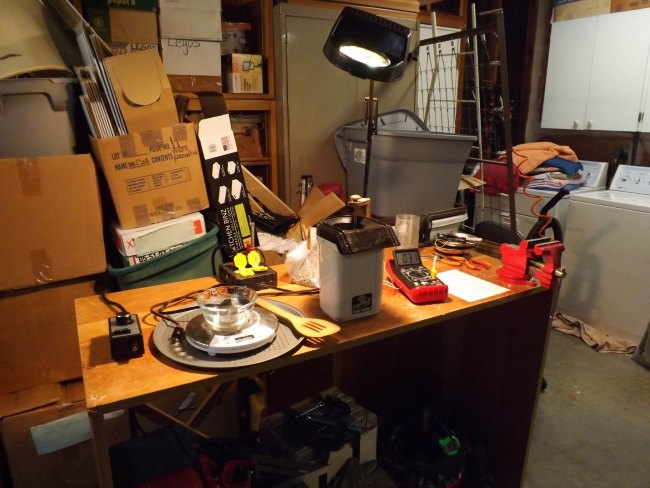
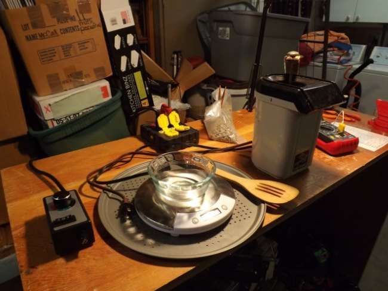
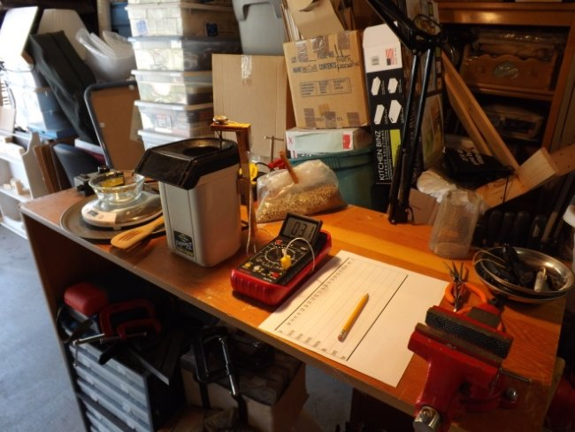

Learning to roast coffee had a long learning curve for me. I started out as an investigative reporter when I talked to the people who, when I could find them, roasted the coffee I was drinking. The discussion was a diatribe of roasting profiles and how much a good roaster costs. Never was I let in on the fact that the process took about fifteen to twenty minutes and usually was a formula (or roast profile) developed by someone else.

Over the years, I amassed information on profiles and roasting theory. Information on growing areas was a little easier to come by. It was not until the internet was unleashed that more information on the process of growing and brewing coffee was available to the average coffee drinker. The sharing of information on the internet, with blogs like ineedcoffee.com and others, has much improved the speed at which one can become knowledgeable and thereby educated in their areas of interest, such as brewing and drinking coffee.

Shortly after I first tried roasting a batch of green coffee beans with a dog bowl and [heat gun](http://ineedcoffee.com/roasting-coffee-with-a-heat-gun-a-top-down-approach/), it became apparent to me that a roasting profile did not mean much just by itself. When to turn up or down the heat and how long to hold the beans at a given temperature were just one part of the much bigger job of understanding the roasting process and getting set up to do it well.

Roasting with the best available hot air roaster presented a whole new area of skills to develop. Modifying sub-par poppers to perform the job expertly is a challenge, too. Then, what to do and why comes into play. Where to get green beans and which ones to buy is another area to explore. How fast or slow to roast and what are 1st and 2nd cracks and what do they sound like, and how soon after one or the other does one stop the roast and cool off the beans? How soon to drink the coffee after it is roasted, presents us with a quandary of questions.

This is where and why I started to develop a Roasting Routine for my little roasting operation.

The first consideration was which roaster. You have to make a choice within your budget and amass the other tools. I could not make up my mind and ended up with five different Poppers.

A colander for cooling, a timer for pacing, and a thermometer for helping gauge the roast degree are just a few of the essential props.

Controlling the speed of the roast can be as simple as turning the popper off and on to determine the length of the roast and a bamboo spoon for agitation.

Being able to repeat a given roast cycle that you like will depend on keeping good records of your roast profile (time, temperature, and degree of roast). The other factor will be the number of green beans you roast each time. I consider the number of beans being roasted each time (by weight) as important to roasting coffee as it is in measuring out flour when baking a cake. It is imperative to develop a routine for the number of beans, roast time, and temperature if you are to come out with a consistent roasting experience. Your routine will be built around the equipment you use and your own taste preferences.

The number of beans to roast in each batch was the first criterion I established in my routine. I decided to measure out 1/6th, 1/5th, 1/4th, and 1/3rd of a pound of green beans. This would determine how many roast cycles I would have to make to roast a pound of beans. I worked in metric and this amounted to 75 grams, 90 grams, 115 grams, and 150 grams of green beans. Weighing out the beans to these measurements can be as easy as taking a pound of beans and dividing them out evenly (by sight) into 6, 5, 4, or 3 portions. A small weight loss scale can facilitate this process and is usually available in thrift stores for as little as 99 cents (or a postage meter scale).

The determining factor in which portion to choose (how much to roast each time) depends on how much your popper can handle at one time, how fast it roasts, and how easily it suits your roasting style and environment. This is a balancing act. With an assembly of elements, you choose to make your roasting experience enjoyable and productive. This is the start of a standardization process for your Roasting Routine. Keeping good notes and making good observations will lead you to the roast you desire. Make a cup of coffee where you get every essential gram of goodness from each ounce of coffee you roast. That is the essence of why you are developing your Roasting Routine.

I settled on 90 grams per batch for me and my roaster in the beginning. Once you get more proficient at roasting you can change your routine if you so desire. Occasionally, I now roast 113 grams in four batches to produce fourteen ounces of coffee. When I started out, the standardization of my routine helped me to gain better skills and understanding of the green bean to the coffee roasting process.

The next step was to get the roasting time right. I used a router speed control to vary the power to the popper to prolong the roast. One roast at 50% power took me twenty minutes to roast to a City level roast. The roaster at 100% power took less than 4 minutes to produce a Full City roast level. The perfect roast for me lay in between these two settings.

I now start out at 100% power up to 200 degrees F and then go to 75% or 86% power to finish out to the roast I desire. Turning down the power too low can stall the roast, but a flick of the switch to full power for ten to twenty seconds can get the roast back on track. This is the art part of the roasting profile and the intricate part of the roasting routine. With more experience and good record keeping, you can learn to prolong the time between 1st and 2nd crack, so you zero in on a City or City + or Full City roast at your will. I really felt elated when I was able to roast two batches of Kenya AA beans, one to City and the other to City +, and tell, see, and taste the difference between the batches. That was the first time I felt I was a coffee bean roaster. I had started to master my Roasting Profile.

I learned to cool the beans with two screen wire colanders. I now use dried filtered compressed air to cool the beans. One blogger I read uses a pizza pan with perforated holes in the bottom to cool the beans in front of a fan. I found one at a thrift store for $1.25, so I tried it and it works very quickly.

My Check List on my roll-away (portable) workbench and roasting station

1.  A good light over the roasting popper
2.  Log for recording the roast
3.  Thermometer
4.  Popper Roaster, Green Beans
5.  Spoon, Scale, Cooling Pizza Pan
6.  Router Control, Power Box

With a heuristic approach (a hands-on, logical trial and error process) to your roasting, good record keeping, and due diligence, you can improve your coffee roasting and drinking experience by developing your own Roasting Profile.