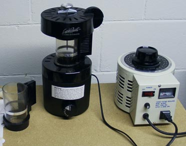

I began my adventure with coffee roasting last winter when I received a FreshRoast Plus for Christmas. The FreshRoast is known for being a bit fast but it is an excellent machine to learn with and is relatively quiet. The FR also has the advantage of being modifiable.

Most modifications are an effort to slow the roast down. Some examples are extending the roast chamber height with a Campbell’s soup can, propping up one side of the roaster with a coin or shim, adding a thermometer or heat probe, and changing the airflow. An excellent approach is to control the voltage going into the unit to vary the temperature. That’s where the variac comes in.

### What is a variac?

A variac is a voltage control device normally used in industrial applications. The model I will be discussing is the KRM 5 amp variac from The Coffee Bean Corral, over fused with a 20 amp fuse. It has a big dial on top that lets you select any voltage from 0 to 130 volts. It provides this voltage through a grounded outlet. See the right side of the attached photo.

  
*Variac*

There have been safety concerns raised about over fusing a variac. Over fusing is necessary because the five amp fuse would burn out trying to drive a 15 amp roaster. For home roasting purposes, the KRM model can handle the load. However, be advised that over-fusing may have risks including shock or electrical fires, and should be done at your own risk. Also, use of the variac will likely void the roaster’s warranty, and putting a 20 amp fuse in the variac will likely void its warranty. In other words, this article is for informational purposes only.

The variac can be used alone or with other electrical modifications. Some people have separated the fan from the heating element and used two variacs. This allows you to keep the fan speed up while lowering the heat or vice-versa. — You can see some discussion of this on the Sweet Maria’s homeroast list, the Coffee Geek website, and the alt.coffee newsgroup. — My approach is to work with just the variac and a thermometer. It’s good to have at least one spare roasting chamber if you roast several batches in a session.

### The Procedure

Typically I roast from four to six batches in a session. The roast type I use varies with the bean or blend I am roasting. For the purposes of this article, I will describe a moderately dark roast — early second crack. This roast is suitable for some East African coffees like Kenya AA and Ethiopian Harar among others. Lighter roasts for Bourbon beans like Galapagos Islands, Puerto Rico Yauco, and others are trickier. I’ll say more about this later.

Start with two slightly underfilled scoops of green beans. This is slightly less than the two rounded scoops recommended by Sweet Maria’s. The difference is that reducing the voltage also reduces the fan speed. A slightly smaller batch size gives better control. Half the battle is roasting the beans evenly so the inside of the bean is fully developed.

-   Start the roaster with the variac set to 115 volts. We want to get the beans moving. This will minimize scorching.
-   When the beans begin moving well, slowly begin to lower the voltage. We want to ramp up to the first crack as slowly as possible. We also want the beans to be as even as possible before the first crack.
-   Keep note of the time and temperature. By the time the temperature reaches 250 to 300, usually in about a minute, rest the beans for 30 seconds by shutting the roaster all the way off. This allows the heat trapped by the beans to equalize a bit.
-   As the beans approach a tan to light brown color, give the beans another 30-second rest. Usually, this helps get the beans pretty close to even.
-   Before reaching the first crack, ease the voltage down to 105. With that and the two rest periods, it’s usually four or five minutes to the first crack.
-   As the first crack starts, briefly raise the voltage to 115 got 15 to 30 seconds. Then lower it to 100 for another 15 to 30 seconds. Then take it back to 105 through the end of the first crack.
-   After the first crack, lower the voltage to about 100. This will basically keep the temperature constant and allow the heat to penetrate to the core of the beans. You may want to watch the thermometer to be sure the temperature is stable to slowly climb.
-   After stretching out the roast for 3-5 minutes, raise the voltage to 115 volts. This will drive the second crack.
-   As the second crack gets going but before reaching the rolling stage, shut the roaster completely off for 45 to 60 seconds. This allows the beans to heat each other. It also allows flavor complexities to develop.
-   Then raise the voltage to one thirty and turn the roaster dial to cool. Two cooling cycles will lower the temperature to less than 175F. From there the beans can be cooled in a metal colander.

Your mileage may vary when roasting with this procedure. Beans don’t like to follow scripts. Ambient temperature, pressure, and humidity can all affect the roasting process. You may also choose to stop the roast earlier or later than I do.

For a lighter roast, I walk a finer line from the start. I try to balance keeping the beans moving with keeping the temperature lower. The idea is to bring the beans to the first crack as slowly as possible. As the beans approach the desired roast level, a brief blast at 115 volts for 30 to 60 seconds can preserve acidity and fruit flavors. A slower finish will help develop more body.

Once you’ve done a few roasts like this, you will probably want to add your own refinements to the process. If you are inclined towards the technical approach to roasting, there is a lot of information on profiles posted on alt.coffee and the homeroast list. If you take a more intuitive approach, you may decide to lengthen or shorten different stages depending on how the beans look or smell.

### Conclusion

Using the variac with the FreshRoast will lengthen the roast times. Seven to ten minutes per batch is a common range. That means it may take more than an hour to roast a half-pound. However, you can get coffee that is better than what you can buy. And there is just no substitute for fresh coffee.
