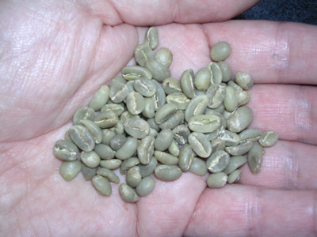

My coffee-drinking palate changed forever in early 2000. All in one mug I had my first taste of home-roasted coffee, as well as my first taste of French-pressed coffee. I won’t soon forget it. So rich, so intense, a one-of-a-kind taste.

Within days, I bought a French press and began buying premium beans. I was convinced that the press was the brewing method that delivered a bean’s truest taste. For the past eight years, whenever I buy the good stuff, I brew it in the French press.

But what about home-roasting?

More than seven years passed before I gave it a shot. Is it strange that a coffee connoisseur who [writes](/by/alex-scofield/) for a coffee website would go so long before attempting a home roast? Sure, but I had my excuses. For five of those years, I lived in a high-rise. Knowing that [indoor oven roasting](/home-roasting-coffee-in-an-oven/) is a smoky process, I feared that roasting in my fifth-floor apartment would set off the smoke detector and send hundreds of neighbors running outside.

On the eve of the summer solstice 2007, I was out of excuses. I lived in a townhouse, I had the beans, and I had the means of roasting them. I had detailed instructions on home-roasting courtesy of Sweet Maria’s and my INeedCoffee colleagues.

The following is a diary of my first-ever attempt at roasting coffee beans. As things turned out, it served as an anti-tutorial. Learn from my mistakes, laugh at my expense, but don’t try it at home – or rather, **do** try roasting at home, just don’t try it the way I did it. Here goes …

### Prelude

Many people play the lottery. I prefer going to the *Mayorga Coffee Roasters Warehouse* in Rockville, Md. Mayorga is one of my favorite roasters, and they sell overruns of each week’s roasts at the Warehouse. You never know what kind of beans they have on any given week, but nearly all their beans are good, and there’s a discount on the pound bags.

Mayorga also sells unroasted beans at this location. On this day, several types of beans are available, each $5/pound. A fan of many Ethiopian beans, I chose Ethiopian Yirgacheffe.

I take my first look at unroasted coffee beans. They’re pale green, and I could just say they’re smaller than a typical roasted bean. They have a faint aroma, a bit like dried peas.

  
*I hold unroasted coffee beans for the first time.*

So I have top-notch beans. This is good because, from this point forward, I break home-roasting rules in a near-criminal fashion.

### The Setup

I’m too cheap to buy a real roaster, too mechanically impaired to [build my own roaster](/building-your-own-coffee-roaster/), and too impatient to bid for a [Poppery](/roasting-coffee-in-a-popcorn-popper/) on eBay. My rookie roasting effort will be in an electric wok. Years ago, a friend who moved out of town unloaded the wok on me. For cooking pad thai, it has served me well.

How will it roast coffee? I have my doubts. Sweet Maria’s has a detailed [tutorial on wok-roasting](http://web.archive.org/web/20140806004941/http://www.sweetmarias.com:80/skilletmethod.php), but they give fair warning.

“These methods are not uniformly successful,” says the Sweet Maria’s site. Specifically, on wok roasting, they say, it’s “better as an experiment.”

The Sweet Maria’s instructions call for “any lightweight skillet with a good tight lid.” The lid to my wok is a bit warped; a tight seal will not be happening. Worse, the wok only goes up to 425 degrees Fahrenheit, and the Sweet Maria’s instructions call for 500-degree heat. But hey, what’s a degree Fahrenheit or two – or 75 – between friends?

It’s a chilly day. I’m out of roasted coffee. I have an electric wok that only goes up to 425, and a lid that doesn’t fit.

Hit it.

### Fire ’em Up

**\-10 minutes** — I plug the wok into an outdoor socket on my patio and preheat it, turning the dial to the maximum 425 degrees. I twist extra hard, in hopes that the dial will change its mind and decide it can cook at 500. No dice.

**0-5 minutes** — I pour a half-pound of beans into the wok. I cover the skillet with the lid, as tight as it will ever get. I don oven mitts and start shaking the wok. At 5 minutes, I’m supposed to hear the first crack. I hear nothing but the erratic rhythm of my wok-shaking.

**5-10 minutes** — Across the alleyway in the back of my house, my neighbor walks out on her patio. We say hello, and if she’s puzzled as to why I’m wearing potholders, shaking an electric wok, she gives no indication. At least she doesn’t call the police. Still no cracking sound.

**10-15 minutes** — I chose my location on the patio carefully, so I can watch the TV in our basement through the screen door. The Boston Red Sox are playing the Atlanta Braves, but the game’s suspense is over before I hear the first crack. At the top of the second, the Red Sox are up 7-0. My wok has no pop; neither do the Braves.

**16 minutes** — Crack! A popcorn-popping sound emerges from the wok. It’s finally happened. One down, several hundred to go.

**17 minutes** — I sneak a peek at the beans. An estimated 99 percent of them look indistinguishable from the way they looked 17 minutes ago.

**18-24 minutes** — There are occasional, isolated pops. Being in lousy wok-shaking shape, I’ve given up continuous shaking, and let the beans sit for a couple of minutes before resuming the shake.

**25-34 minutes** — At last, I hear a rapid succession of cracks.

**35 minutes** — I call it to a stop and pour the beans into a metal colander. Sweet Maria’s wasn’t kidding about the unevenness of a wok-roast, and this was hardly a by-the-book method. It looks like mixed jelly beans – some beans look like they’ve roasted sufficiently already; others are completely unchanged after more than half an hour in the wok.

  
*Sweet Maria’s gave a fair warning: wok-roasts produce uneven results.*

### Aftermath

Later that evening, I grind the beans and brew them in- what else? — a French press. Mysteriously, a creamy-colored head arises from the depths of the press. That doesn’t happen when I normally press coffee. Did I just home-roast coffee beans, or did I stumble on a recipe for brewing Guinness at home?

It smells decent, not great. Very similar to a can of generic, pre-ground coffee. After the plunge and the pour, the resulting brew is thin in color. It looks more like tea than coffee.

  
*My first home-roasted beans are pressed and ready to taste.*

The moment of truth — I drink the concoction. The predominant taste is familiar — a bit of a nutty/woody flavor that makes it recognizable as Ethiopian Yirgacheffe, but it lacks the balanced taste of Ethiopian coffee roasted by the pros. Just as it looks, it tastes weak and watery. It’s not terrible — I finish the mug — but it’s nowhere near as good as professionally roasted coffee.

In the following week, I brew up the home-roasted beans a few more times. I used more beans each time in hopes of brewing a stronger coffee, but it never came out very strong. There were simply too many under-roasted beans in the mix. Too watery, not “beany” enough.

### Conclusion

Well, what did I expect? I invested a mere $5 in my first home-roasting venture and broke nearly half the rules of the roast. Even under ideal circumstances, Sweet Maria’s warned that wok-roasting was essentially an experiment. My brewing conditions strayed far from the instructions, and mediocre coffee was the predictable outcome.

I will home-roast again. It was fun, and it’s enlightening to witness green beans crack and turn dark; I’m more in tune with what roasted beans have undergone before I buy them. But I won’t try to do it on the cheap again- I will invest in the Poppery before my next attempt.

Hopefully, the result will taste more like a professional roast and less like a failed experiment.

UPDATE 2010: [Home-Roasting Heretic: Happy Accidents](/home-roasting-heretic-happy-accidents/)
