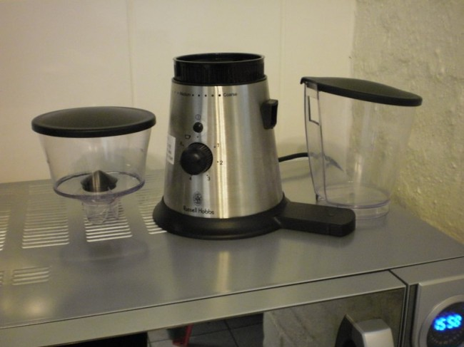
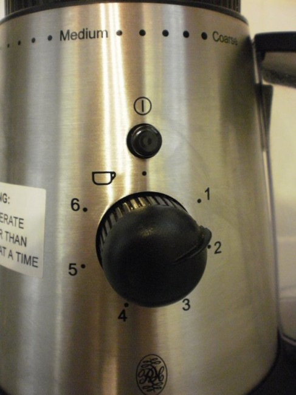
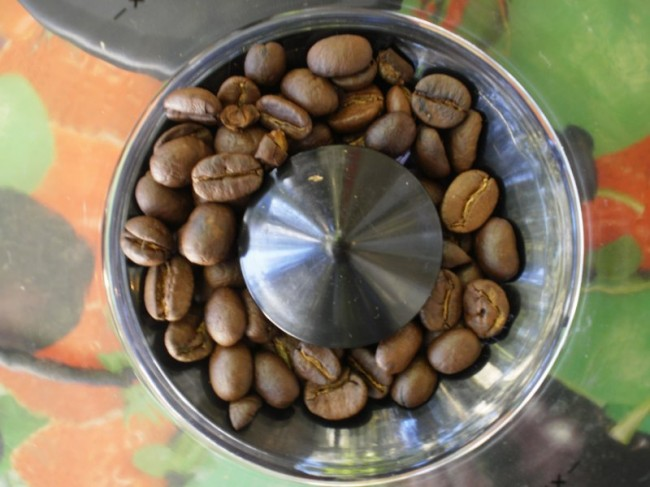
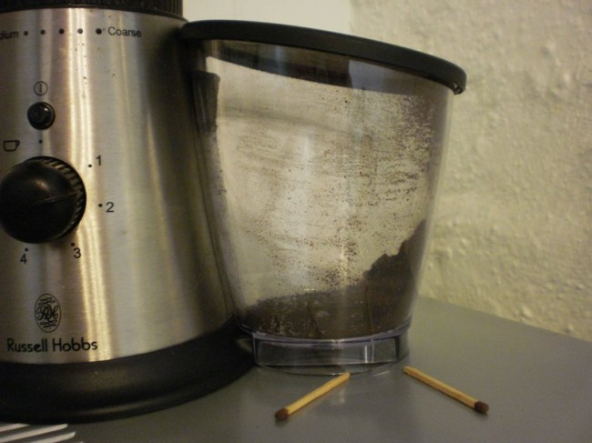

*The Russell Hobbs coffee grinder is not for sale in the USA. It is sold in South Africa. The dollar amounts in the article are in South African Rand (ZAR).*

There are lots of articles comparing the different sorts of grinders. Inevitably they end up recommending that we buy a slow-speed burr grinder. Unfortunately, these are expensive items to buy on a South African third-world budget. I was amazed to see an affordable but unusual-looking coffee grinder on the local supermarket shelves, especially in my home town proverbially 1000 miles up a 2000-mile dirt road. Closer inspection revealed that it was not a blade grinder and, thus, should be a burr grinder. I decided to buy this as in any case, it comes with a 1-year supermarket guarantee. Just as a price comparison:

-   Bosch rotary blade grinder local at around $30 (non-Bosch much less)
-   Rancilio Rocky on Amazon at $340 (heaven knows how much locally)
-   My ‘Russell Hobbs’ high-speed grinder local at around $45

This is a noisy, messy piece of equipment, but it is much better than the old blade grinder. It delivers a consistent-sized grind, stands on its own, and has some good and infuriating features.

*Coffee grinder parts out of the box.*

The bean hopper is on the left, the grinder proper is in the middle, and the ground coffee receiver is on the right. The bean hopper is marked with a ‘max’ level indicator that is less than halfway up to the top. I regularly operate it much fuller than that with no ill effects. This snaps into the top of the grinder properly.

The ground coffee receiver fits onto the right over a rubber outlet on the side of the grinder properly. This is a source of leaking coffee, particularly when removing the receiver. I find it necessary to remove the lid first, use the back end of a teaspoon to remove grinds at the edge of the rubber outlet, and give it a good whack with the spoon to ensure everything drops down into the receiver.

*Coffee grinder control panel.*

The large black knob lets you dial up to 6 cups worth of grinds. The graduations are approximate. This controls an electronic timer. Bearing in mind the size of the receiver and the adhesive notice warning you not to run the unit for longer than 100 seconds at a time, I have no idea whether you should use the higher settings, and in the event that you do where all that coffee would go.

The small black push button above the larger dial is pushed to start the grinding cycle. This is conveniently positioned so that if you hold it, depressing it, and having foolishly left the grinder plugged in, it will run. If the receiver is not attached you could have a lot of coffee all around you as it comes out at a really good rate.

Fortunately, a second touch will stop the machine. You will see above the push-button some markings like ‘Medium’ and ‘Coarse’. With that set halfway between ‘Medium’ and ‘Fine,’ the grind is amply fine enough to suit my espresso machine. That black ring around the bottom of the bean hopper is turned to set the type of grind that you need. Do not do this while the unit is plugged in.

*Inside of the bean hopper and the bean distributing central cone.*

The photo above shows the unit operating with a strong output of ground coffee. The unit generates a lot of static electricity as it runs. It is best to grind beans some short while before you need the coffee to allow the static to leak away from the insulating plastic receiver. This ensures you can remove coffee effectively from in and around the spout before removing the receiver – thus lessening the mess.

I don’t know about Chinese wiring standards (because, like everything else, it is ‘made in China’), but the unit is always warm. I suspect the electronic timer is wired before the switch and is always on. So, another reason is not to leave it plugged in. So maybe a Rocky will be next, but in the meantime, this little unit is messily and noisily but efficiently grinding my coffee. Don’t be put off by the push to a slow-speed direct drive grinder that perhaps you can’t afford. As with everything else, a little compromise can get you on the road quicker.

### Resources

[Choosing the Right Coffee Grinder](/choosing-the-right-coffee-grinder/) – INeedCoffee article by Malcolm Pang.
