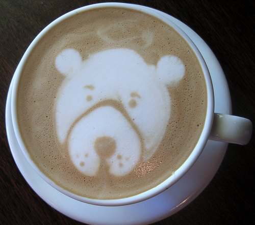

What would you give up for a cup-a-joe?

As reported by The Detroit News online, a recent survey by OnTech Operations, Inc. found what coffee drinkers are willing to sacrifice for a cup of brew. Their results show the following:

-   42 percent would trade in the morning paper, television, or radio for a cup of joe.
-   20 percent would swap lunch for coffee.
-   12 percent give up three hours of sleep for coffee.
-   10 percent would skip brushing their teeth for a cup.

  
*Bear Latte Art*

The survey also found that:

-   67 percent of Americans identify themselves as coffee drinkers.
-   Nearly 50 percent drink at least one cup every day.
-   Men drink more cups per day than women.
-   People in the Northeast consume more coffee than drinkers in any other region.
-   33 percent of coffee drinkers consider themselves social drinkers, who use coffee breaks as a time to catch up with family and friends.
-   Almost 25 percent like hot drinks because they warm their hands.
-   37 percent of coffee drinkers ages 18 to 24 drink the caffeine booster to help them accomplish tasks, presumably after a late night out on the town.

OnTech Operations Inc., a manufacturer of self-heating containers, surveyed 1,015 adults by telephone in January.

### Sources

Quick hits: Coffee sacrifices on The Detroit News (January 31, 2007)

Coffee Is More Important Than Lunch? Forbes.com
