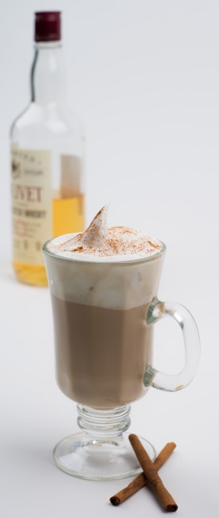

Why is it that when we add whisky to coffee we use Irish whiskey, never Scotch whisky?

I discovered recently that, historically, ‘Scotch Coffee’ had nothing to do with whisky or coffee. Scotch Coffee was drunk in times of hardship when supplies of coffee had run out. It consisted of hot water, milk, sugar, and a handful of burnt breadcrumbs. This foul concoction was “popular” from the time coffee was first introduced into the UK. The name is, obviously, derived from the supposed tight-fistedness of the Scots.

I would like to reclaim “Scotch Coffee”, and the honour of the Scots. The Irish may have invented whisky (that’s going to upset some people) but the Scots perfected the art of making it. Also, Scotch whisky regions are so varied that the potential exists for a unique coffee experience with every mug.

  
*Scotch Coffee*

### Scotch Coffee Ingredients

-   A mug
-   A shot of espresso
-   A shot of your favourite single malt Scotch whisky (e.g., Highland Park)
-   Sugar (if desired)
-   Milk – to steam and froth

### Directions

1.  Take your favourite mug and pour the shot of espresso and the shot of single malt Scotch whisky into the mug.
2.  Steam and froth the milk and pour over the coffee/whisky.
3.  Dust with your favourite topping.
4.  Enjoy.