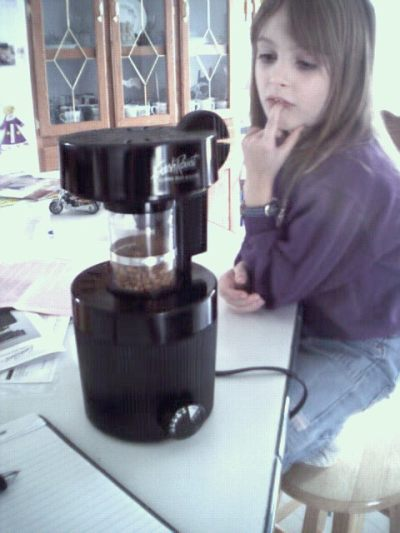

I am a user. I became dependent at the age of 17 when making a long commute to college on a bus. I knew that I need a little something to help me through the day and so I started using it. At first, I thought that I could handle it, but then it got out of control. I found myself using it between classes, before and after school, and often just before I went to bed. At one point I lost my head and started using right in class. No one noticed… I continued. I remember one day sitting wide-eyed in the quad and a guy came up to me and asked if I wanted some pot. I smiled and said that I had already had two that day. He didn’t get it, “Two what?”

“Two pots!” I smiled and he walked on.

Those days were easy. You could get it on nearly every corner (at least in Seattle and the Silicon Valley). I made it through college and as I began work I continued my daily doses in the morning. I began taking a supply with me. The habit became rather expensive so we got the basic equipment to make our own at home. Although this was the cheaper way to go I found that I was using it more and more.

Over the years my body has become totally immune to the effects. I can use it right before bed and not miss a wink. Nearly all my friends are users so there is no stigma to my habit. My office provides all that I need, our church has plenty at every gathering. I shop at stores that greet me with a fresh dose at the door.

However, a few years ago my wife and I became a bit bored with the regular and average batches that we were used to. My father (a long-time addict) introduced us to a way of using steam injection and increasing potency. This was good! At the same time, we added a few other things and created new concoctions that we served to our friends. Life returned to normal and our new equipment now became a permanent fixture in the kitchen, no longer hidden away when the company came to visit. The word was out and it was now expected when they came to visit. A shot here and there, and everyone was smiling.

  
*Caroline Watching the Fresh Roast*

The obsessive/compulsive gene flipped on to a new level this past month. While we have never been able to grow our own because of the climate where we live (we are considering moving to Bogota, Colombia) we have found a step in the process that we had been neglecting. Leave it to my favorite dealer (my father) to provide me with yet another piece of equipment for the process – a roaster. Now, we can order a few kilos of our favorite beans and roast them to the level of perfection that would make Juan Valdez cry with joy and envy.

Before you think that I have gone a little too far, you need to read some of the stuff that comes across the T-1 at work on the subject of roasting the perfect cup. First, my father purchased this amazing contraption for brewing a cup called a Cona. I can’t describe this other than to say that it looks like a bong. It actually took a lot of convincing on his part to assure me that they weren’t doing dope (they do live on the Mexican border). They talk of stalls, how long until they get their first crack (more drug terms), rolling crack (I thought this is what you did to smoke crack until I realized that it meant something else), and which beans are the best.

We now find ourselves sitting at the counter timing the cracks, looking at colors on a chart that we are keeping, and logging our roasts. Twenty-four hours later we are cupping to see how it turned out, sometimes tossing the batch because it just didn’t meet our standards. We find ourselves saying things like “Well, Tom said that we should roast it this way” or “Tom said that this will have a flavor like…” We really don’t know who Tom is, but we know that he knows. Everyone knows that he knows. Part of me longs for the days when I could whip into the local convenience store and buy 20 ounces of coffee (in a horrible Styrofoam cup) and not raise my nose in disgust. It was so simple then. But I’m a user in search of the perfect cup. Therefore, I roast!

### Resources

[Home Roasting Coffee with the Fresh Roast](/home-roasting-coffee-with-the-fresh-roast/) – INeedCoffee tutorial.
