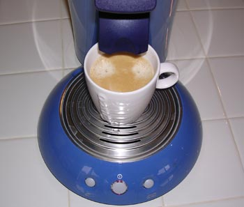
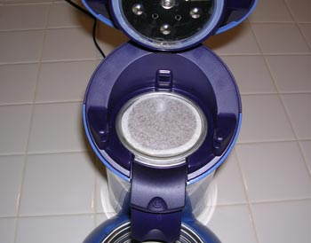
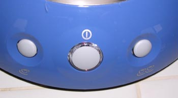
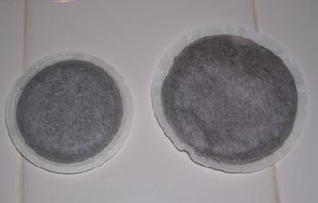

The two most important words when discussing coffee are quality and convenience. For the most part, we want both, but often, we must make choices. Some of us will go to any lengths to achieve quality, whereas others will gravitate towards convenience even at the expense of quality. The Senseo Coffee Machine is all about convenience.

If you enjoy the taste of richer brewed coffees, such as those made with French presses, espresso machines, or vac-pots, you can stop reading now. If you only drink freshly roasted coffee, you can stop reading now. You have already evolved further on your coffee journey; you will gain nothing from owning a Senseo.

The Senseo Coffee Machine will brew a weak, bitter cup of coffee more easily and quickly than any brewing method. If you prefer a weaker cup of coffee but find instant coffee too challenging to brew, you may like the Senseo.

  
*Senseo Coffee Maker*

### What is a Pod?

The Senseo is a pod-based brewing system. A pod is a coffee that is pre-packaged inside its filter. It is to coffee what a teabag is to tea. The benefit of the pod is that each one is perfectly measured out and requires no cleanup effort. The disadvantage to the pod is the coffee is only as fresh as when it was ground and placed into the pod. In other words, it violates one of the rules of quality coffee: grind your coffee as close to brewing as possible. And please don’t tell me how the bags are vacuum-sealed and the flavor is trapped. I know better.

### Step By Step Brewing

There is a water reservoir in the back of the machine. Fill it with water. The reservoir has easy-to-read minimum and maximum lines. As with any brewing method, use water of the quality you would normally drink.

There are two pod holders that come with Senseo: a single and a double. As you would expect, the single pod holder holds one pod, and the double holds two. Each pod will brew enough for one cup (more on this later). Load the pod and the correct pod holder.

  
*Load Pods*

Close the lid and lock the lever.

Press the middle button. It will start flashing. Once it stops flashing, it is ready. In my tests, it really isn’t ready until 30-60 seconds after the light stops flashing. Coffee brewed as soon as the flashing stops will come out at a lukewarm 140 F, but waiting 30-60 seconds will generate 160 F coffee.

Press one of the two brew buttons. Use the 1-cup button on the left if you have a single pod. If you use two pods, press the 2-cup button on the right.

  
*Senseo buttons*

### Cleanup and Maintenance

Because it is a pod system, there is no real cleanup. This is one clean brewing system that requires no maintenance.

### Cupping the Senseo

The Senseo is not only a brewing system but also a coffee line. The Senseo coffee pods come in four different *varietals*: Mild Roast, Medium Roast, Dark Roast, and Decaffeinated.

There is no dancing around this topic. The Senseo makes awful coffee. It’s weak and bitter. Granted, I’m a coffee snob who roasts his own coffee and brews espresso and French press every day, so consider the source. I’d put the Senseo higher than instant coffee and lower than canned drip on the coffee hierarchy.

I could have quit after trying several bitter cups, but I was determined to discover if the Senseo was salvageable. Sara Lee’s coffee for Senseo was low-grade. Maybe all this machine needed was some quality coffee? Unfortunately, I couldn’t grind up my home roast since this machine required pods.

I got in the car and drove to the nearest Starbucks. It sells a decent espresso blend that works as a drip coffee in pod form. When I returned home I discovered the Starbucks pod was much smaller than the Senseo pod, therefore it wouldn’t work. The Senseo has its custom pod size.

  
*Starbucks pod on left, Senseo on right*

I should have given up here, but I didn’t. I grabbed a pair of scissors and performed surgery on one of the Senseo pods. I removed all the stale, tasteless coffee from one pod and replaced it with some Ethiopian Sidamo that I had roasted two days ago. Then I brewed again. Most of the bitterness was gone, but the coffee was still too weak to drink.

### Hope for the Senseo?

As of this writing, the Senseo people are doing a full-court advertising blitz for this brewing system, including television ads. I even saw a half-page *review* in the May 2004 Wired magazine calling the Senso a “perfect cup of joe”. This poor choice of words will make me question every other *review* I read in that magazine.

I hoped this machine would be the fast brew solution for those who never brew more than one mug at a time. Sadly, the brewing system yields a very weak beverage that lacks the richness one should expect from a good cup of coffee. Regardless of my opinion, they will sell quite a few of these machines. If they unload a lot of these machines, the word will eventually get out that the coffee sucks. Hopefully, quality coffee roasters will offer Senseo-compatible pods of their own. How do we get around the weakness? Simple. Use two pods in the 2-pod holder and then press the 1-cup button.

Part 2 of this article is [Senseo Revisited](http://ineedcoffee.com/senseo-coffee-brewing-revisited/).