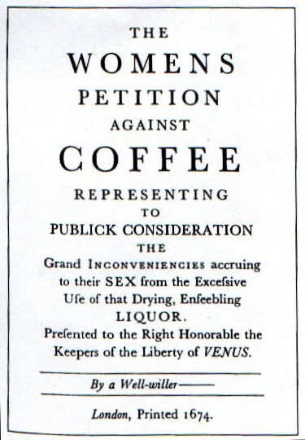

Coffee has supposedly been around since about 1200 A.D., and sex has been with us since we began procreating. So it only makes sense that there would be some link between coffee and sex. And there are in fact many links; some in ways you did not even imagine. It seems that women at one point blamed coffee for everything from homosexuality to lack of virility. Eventually, it was praised for its sexual performance-enhancing capabilities, among other benefits. These beliefs were held in times when medical and scientific practices were questionable at best. However, modern-day studies and surveys suggest that coffee and sex still are linked, and important in the minds of both young adults and the elderly alike. Even big-name coffee companies are getting in on the action. Read on for all the details.

### The 1500s

#### Venice and Turkey – Coffee Turns Men Homosexual?

A Venetian ambassador to Turkey back in 1571 wrote back home and basically said that coffee caused men to become homosexuals. He saw Turkish men going to bathhouses (where coffee was served), and into coffee houses absent of women. And soldiers were considered to be homosexual because of their coffee drinking habits. Along with that, there was an idea back then that you could actually change your sexuality, your body, and even your genitalia (a penis would slowly shrink and turn inside out, creating a vagina) by drinking or eating certain drinks or foods. So logically, coffee caused men to become homosexuals, and perhaps even turn into women if given enough time. Thankfully, to the delight of many coffee-drinking men, this never happened.

### The 1600s

#### London – Coffee Turns Men Off?

The “Maidens of London” blamed coffee for their husbands’ lack of sexual interest. Coffeehouses were really for men only (although pubs and taverns were for all). When brothels were moved above coffeehouses in the mid-1600s, many men would have coffee, a good political discussion, and then move upstairs to visit a prostitute for a final treat. When they would come home, they weren’t interested in having sex with their wives, and thus coffee was blamed for men’s lack of interest in the bedroom. Of course, the result was that women tended to be anti-coffee, and men were pro-coffee (and I don’t blame them).

In 1663 “The Maiden’s Complaint Against the Coffee House” was published by British women. In essence, they stated that their men were coming home late, did not want to have sex, and it was all due to coffee. Of course, the men did not tell them about all the features of the Coffee House.

In 1664 the “Women’s Petition against Coffee” was published by the women of London. Here are a few strong excerpts from that famous document:

> Coffee leads men to trifle away their time, scald their chops, and spend their money, all for a little base, black, thick, nasty, bitter, stinking nauseous puddle water.

> …excessive use of that newfangled, abominable, heathenish liquor called coffee, which riffling nature of her choicest treasures, and drying up the radical moisture, has so eunucht our husbands, and crippled our more kind gallants, that they are become as impotent as age, and as unfruitful as those deserts where that unhappy berry is said to be brought.

> …the coffee-house being in truth, only a pimp to the tavern, thus like tennis balls between two rackets, the fopps our husbands are bandied to and fro all day between the coffee-house and the tavern…for when people have swill’d their morning draught of more ale than a brewer’s horse can carry, hither they come for a pennyworth of settle-brain, where they are sure to meet enow lazy pragmatical companions, that resort here to prattle of news, that they neither understand, nor are concerned in; and after an hour’s impertinent chat, begin to consider a bottle of claret would do excellent well before dinner; whereupon to the Bush they all march again together, till every one of them is drunk as a drum, and then back again to the coffee-house to drink themselves sober.

The women were not successful. In fact, newspapers and mail began to be delivered to some coffeehouses instead of homes. Have you seen 17th-century British women? I would probably rather live at the coffee house too.

  
*Source: [Women’s Petition against Coffee](https://en.wikisource.org/wiki/Women's_Petition_against_Coffee) (Wikisource)*

### The 1700s

#### Cause of Divorce?

Coffee was used by “experts” to increase sexual pleasure, going way back to the 1700s. Wives unofficially outlawed coffee, because the men could now really think for themselves (as opposed to the beer or grog-induced stupor of the middle ages). Men resisted, women finally tried coffee themselves, and then did a 180. Now, they began using coffee as grounds for divorce! Now, if a man could not provide coffee for his lovely wife, he was gone (and she kept the coffee pot). These were legal precedents set at least 300 years ago. Those poor men couldn’t win.

#### Brothel Madams and Coffee Patents?

There are more international coffee patents held by brothel madams than men. In France, Germany, Italy, Spain, and Switzerland, brothel madams own more patents than men in each country. Why would brothel madams even go to the effort of patenting all these coffee-making apparatuses? They were coffee junkies, and that caffeine buzz motivated them to get busy with some really cool coffee inventions. They, of course, believed that coffee helped them (and their Johns) in the sexual performance area, as well as provided overall alertness. It was a match made, well, in a brothel.

### Modern Day

#### First Date Drink of Choice

What do most people drink on the first date? Coffee, of course! Regardless of how some may initially think that alcohol would be the best first-date primer, how many first-time meetings happen at coffee shops? The empirical evidence suggests about 90%. Coffee rules. Try having sex while drunk, and see if you enjoy it (or remember it for that matter)!

#### Would You Give Up Sex or Coffee?

The high-end coffeemaker and espresso machine company Capresso, did a survey in 2001 to see how serious people were about their coffee. They were all sexually active, coffee-drinking adults who had internet access, and enjoyed chocolate.

The question was: If you had to give up one of the following for a month, which would it be? Coffee, Sex, Excuses, Internet access at home, or Chocolate?

Coffee was only second to sex on the priority list for both men and women. Maybe Sex and Coffee are more related than we think? And for women and men to have some sort of agreement? Mark that down, it is one of the few things men and women have ever agreed on. This is one for the history books.

#### Scientific Evidence

Caffeine is a stimulant. The effects of caffeine on the body tend to be immediate. All the organs and tissues are stimulated. Caffeine interacts directly with cells by changing chemical reactions within the cells. Caffeine indirectly affects cells by increasing epinephrine/adrenaline in the adrenal glands, as well as norepinephrine/noradrenaline hormones. These in turn stimulate cell activity.

A small amount of caffeine can stimulate the brain cells, improving concentration and reaction times. It can also stimulate the heart, increasing the pumping action. Of course, the clitoris and penis are filled with blood vessels, so the logical conclusion is that these organs benefit from increased blood flow, and in turn, enhanced sexual pleasure and performance. OK, OK, can we please finish the article before you dash off to brew that pot of coffee? Almost done, I promise.

In a study of sexual activity in the elderly conducted by bio psychiatrists, the conclusion was that with at least one cup of coffee a day, elderly women had a much higher rate of sexual activity, and elderly men had a much higher potency rate. Source: [Sexual function in the elderly](https://www.biopsychiatry.com/coffeesex.htm).

### Conclusion

We know that based on other articles on [coffee and health](/section/coffee-health/), a moderate intake of coffee is probably not harmful, and may even be beneficial. So what about the tie-in to sex? Well, it seems that caffeine intake may help in the sexual energy and performance area. Will it replace your Viagra, Cialis, or Levitra? Probably not, but it will not cause blindness either. So if you have gotten into the habit of taking a nap instead of having sex, maybe coffee is your answer. Just make sure to brush your teeth after that triple shot. We all know coffee breath is not very sexy.
