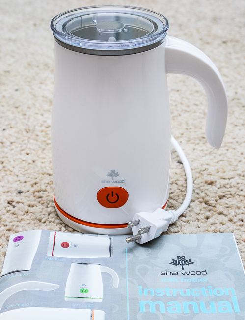
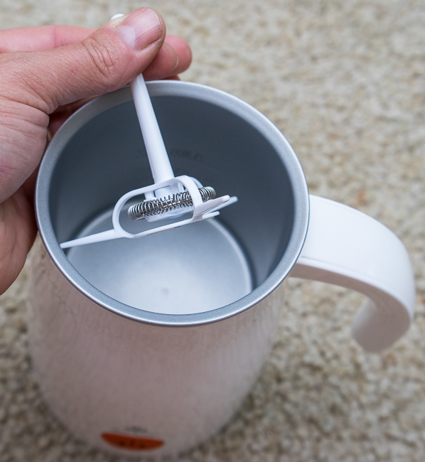
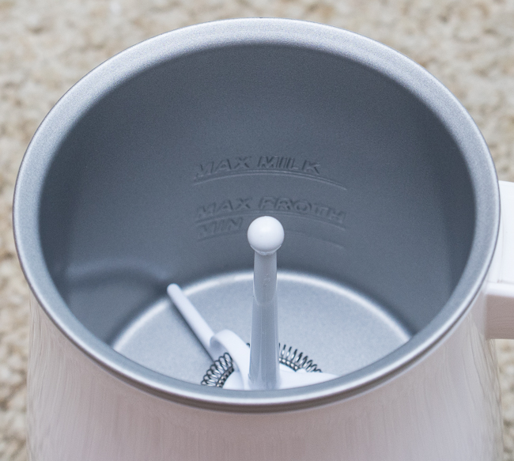
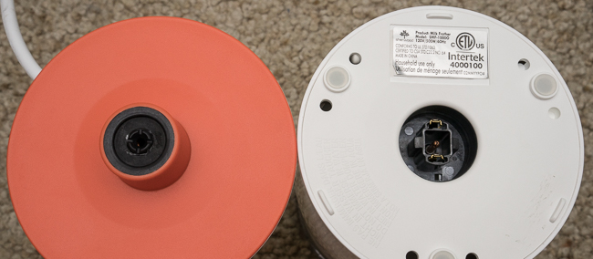
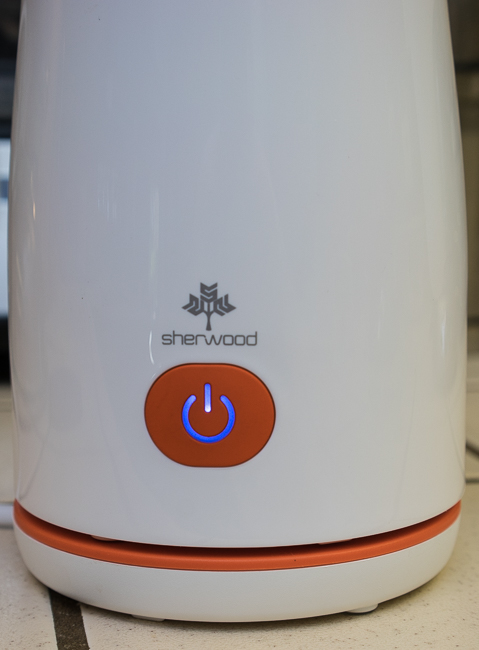
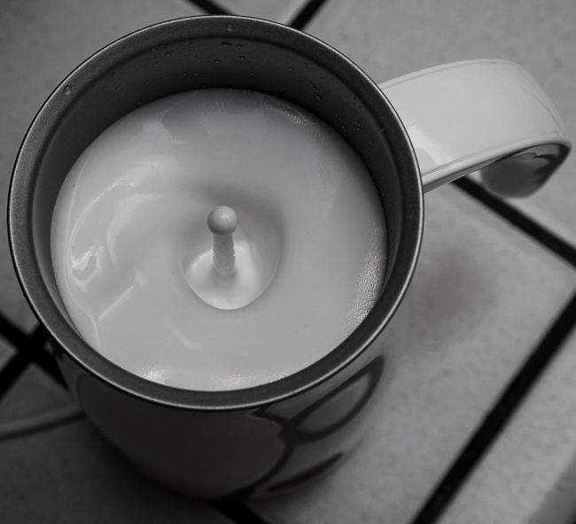
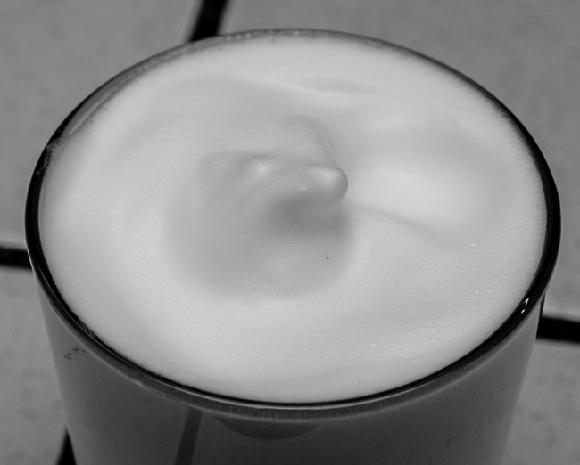

***UPDATE September 2020:** The Sherwood SMF-1000 Automatic Electric Milk Frother is no longer available for purchase.*

When I reviewed the LifStyl Milk Frother\*, I thought I had found the perfect solution to steamed milk, without having to resort to using my espresso machine to make an entire pitcher. It also allowed me to make hot milk without any foam, which is awesome for when you don’t want all that foam.

Enter the Sherwood SMF-1000 Automatic Electric Milk Frother and Warmer for Cappuccinos and Lattes. It is a white unit, with color accents available in Red, Orange, Green, and Purple. With its higher price tag, can it compete with the LifStyl Frother? What additional functionality does the Sherwood Milk Frother bring? Read on to find out.

The Sherwood milk frother consists of 4 parts:

-   Main pitcher with markings inside to help you not underfill or overfill
-   A removable magnetic whisk that leaves the entire inside open for obstruction-free cleaning
-   Lid
-   Base

The Sherwood milk frother has three lines on the inside (from the manual):

1.  **Max Milk** – Fill milk to this line for the “Hot Milk” function
2.  **Max Froth –** Fill milk to this line for both “Hot Froth” and “Cold Froth” functions.
3.  **Min –** Milk should always be filled to at least this line when in use.

The Sherwood milk frother has a single button with three functions and light indicators (from the manual):

### Press Once for Hot Froth

Heats and vigorously stirs milk to create a thick, hot froth ideal for cappuccinos.

Fill milk between the Min and Max Froth lines. Press the Power button once. The indicator light will illuminate in a solid red.

### Press Twice for Hot Milk

Heats with mild stirring for hot, airy milk, ideal for hot chocolates and lattes.

Fill milk between the Min and Max Milk lines. Press the Power button twice. The indicator light will blink on and off in red.

### Press and Hold for Cold Froth

Stir vigorously without heat to create a thick froth ideal for iced cappuccinos and lattes.

Fill milk between the Min and Max Froth lines. Hold the Power button down. The indicator light will illuminate in a solid blue.

### Usage

-   Decide if you want hot milk, hot milk with foam, or even cold milk with foam!
-   Add your favorite milk or half and half.
-   Put the pitcher on the base and put the lid on the pitcher
-   Press the button the correct number of times
-   About 2.5 to 3 minutes later, you have a superb result
-   Add coffee or espresso, or just add some caramel sauce for a wonderfully sweet, caffeine-free drink
-   Remove and rinse the whisk and then rinse and wipe inside (very easy due to having the entire whisk removable)

### Pros

-   3 options for your milk (Hot Froth, Hot Milk, Cold Froth)
-   Foam quality and consistency are great
-   Operation is very easy, with clear button light feedback
-   The pitcher is cordless and has a solid base
-   Very Quiet Operation
-   60-second cleanup is possible thanks to the non-stick interior and the ability to remove the whisk
-   1 Year Warranty for both the USA and Canada

### Cons

-   A little slow at 2.5 to 3 minutes to complete a cycle
-   It would be nice if the base had a cord holder
-   Color selection may not complement every kitchen. Would love to see a Stainless Steel model, or at least a grey or black model without the bright color accents.
-   A little pricey at around $79-$99 street price depending on color, but is now my favorite milk frother, especially for those summer days when you want iced coffee with cold foamy milk!

I really don’t think it gets much better than the Sherwood Electric Milk Frother. It does everything I could want, is well-built by a US-based company, and is relatively affordable. Highly recommended.

*\* 2016 UPDATE: The LifStyl Milk Frother was discontinued.* 

### Resources

*Sherwood SMF-1000 Automatic Electric Milk Frother and Warmer (no longer available)*

*Disclosure: INeedCoffee was sent this product at no cost, which did not affect its review.*
