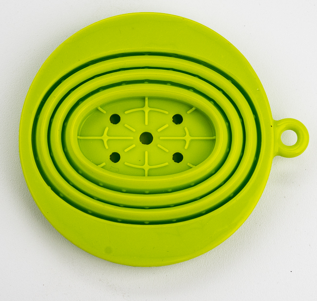
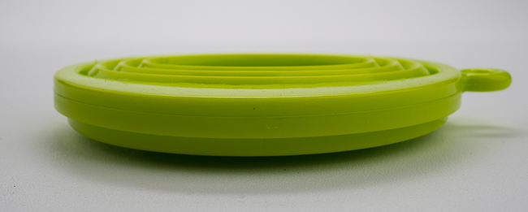
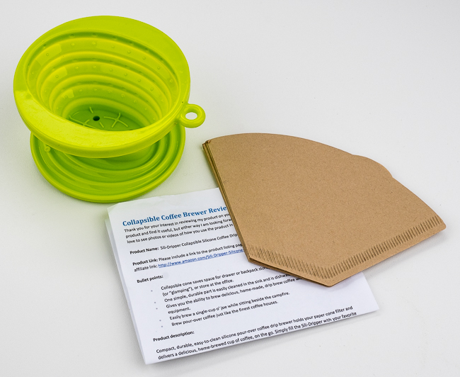
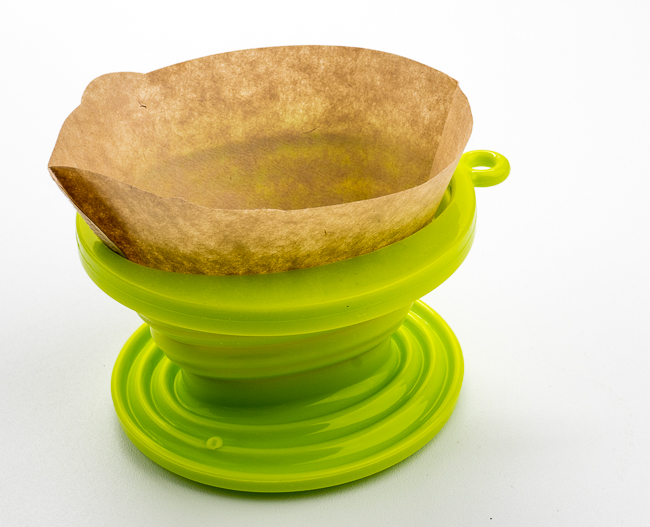

***UPDATE September 2020:** The Sili-Dripper is no longer available for sale. However, the GSI Outdoors Java Drip Collapsible mentioned is still available.  
*

If you have ever wanted to make your own drip coffee while on travel or for a hiking/camping trip, you know that keeping the size of all the bits and pieces down to a minimum is key.  Most opt for a cone filter, fashioned after the Melitta style.  But they take up a fair amount of room and don’t pack down well.

Enter the Sili-Dripper by OnticcoPD. It is an inexpensive, compact way to make coffee for one. It takes #2 size paper cone filters and collapses down into a little puck about 3/4 inches (2cm) thick by 4 inches (10cm) in diameter. The puck has a loop to attach a carabiner or keyring.

The kit comes with a collapsible silicone dripper and an instruction sheet. The instruction sheet recommends using “boiling water”. Please don’t follow that advice. Depending on the altitude where boiling points may change, boil your water, and wait 30 seconds before pouring. Ideal temps for coffee brewing are between 195F-205F (90C-96C) and will minimize the chances of a sour or bitter result. Tim Johnson at OnticcoPD informed me he will be updating the instruction sheet in the future.

There really isn’t much to the unit. You simply expand the unit, place it over a mug, put in your filter and coffee, and pour your hot water over and enjoy. I noticed that the filter tended to bunch up a bit once hot water was poured over the coffee grounds, but it wasn’t a big deal.

There are a few things about the Sili Dripper I would like to see improved:

-   More support for the cone filter at the top, and a little better fit so that the filter doesn’t bunch up.
-   Another version uses a #4 size paper cone filter for more than one person.
-   A way to keep it covered and clean, especially when out hiking or camping.
-   The ability to control the brew time (think of a portable version of the [Clever Coffee Dripper](/clever-coffee-dripper-review/ "Clever Coffee Dripper Review")).

At under $10, the Sili-Dripper is a good value. If you want something with a larger capacity and an included cover, consider the GSI Outdoors Collapsible Java Drip for just a couple of bucks more.

### Resources

*Sili-Dripper (No longer available for purchase)*

*GSI Outdoors Java Drip Collapsible Pourover Coffee Maker  
*
