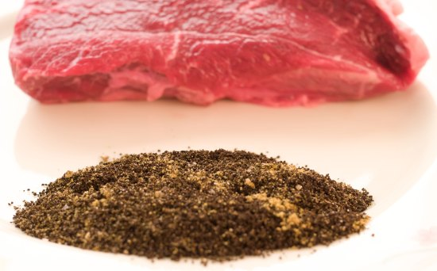
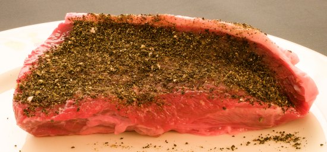
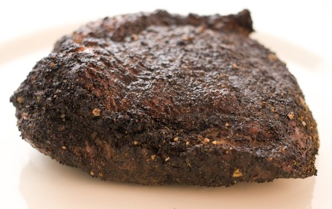

Got a little leftover coffee? Consider using it for a rub on a Steak or Porkchop.

Keep it simple and start with a decent cut of meat, and grind your coffee between espresso and drip. Just rub in the mixture right before throwing it on a hot grill. This will minimize moisture coming to the top, which can result in a soggy, rather than a dry crust.

  
*BBQ Coffee Rub*

  
*Coffee BBQ Rub on Meat*

Also, let your meat sit at room temperature for 20-30 minutes. Putting a cold steak from the refrigerator directly on the grill will result in a cooler red center than you probably want. Keep in mind that you won’t see those nice grill marks since the dark color of the coffee will cover them up.

Here are a couple of mixtures I use, but definitely feel free to experiment.

### Steak

-   2 Tbsp Coffee (grind between espresso and drip)
-   1 Tsp Cumin
-   2 Tsp Sea Salt
-   1 Tsp Coarsely Ground Black Pepper

### Pork

-   2 Tbsp Coffee (grind between espresso and drip)
-   1 Tbsp Brown Sugar
-   1 Tsp Cinnamon
-   2 Tsp Sea Salt
-   1 Tsp Coarsely Ground Black Pepper

  
*Grilled Top Sirloin with Coffee Rub*

### Resources

[Coffee and Barbecue](http://ineedcoffee.com/coffee-and-barbecue/) – Coffee barbecue recipes include Squealin’ Good Wake-Me-Up Java Rub and Brown Eye Piggy Sauce.

[Coffee Grind Chart](http://ineedcoffee.com/coffee-grind-chart/) – Photo article that shows you how fine to grind when making your coffee rub.