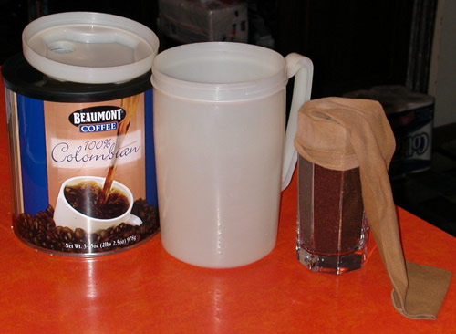

If you don’t have a [Toddy](/cold-brew-coffee-with-the-toddy-coffee-maker/), but would like an inexpensive way to make your own cold-brewed coffee, this simplified method may be perfect for you.

-   The coffee is measured into the glass.
-   A woman’s trouser sock is placed over the top, and the glass is inverted to fill the sock.
-   Tie the sock at the top; a simple loose half-knot works for me.
-   Place the sock in the pitcher and add water.
-   After brewing, remove the sock and put the pitcher in the refrigerator.
-   The sock does not contain that much coffee, so it doesn’t need to be wrung out. However, you can try brewing another batch with the same sock.

  
*Simplified Cold Coffee Brewing Method*

### Resources

[Cold Brew Coffee with the Toddy Coffee Maker](/cold-brew-coffee-with-the-toddy-coffee-maker/) – Tutorial on brewing with the Toddy brewer.

[Cold Brewed Coffee on the Cheap](/cold-brewed-coffee-on-the-cheap/) – Another low-budget method for cold brewing coffee.
